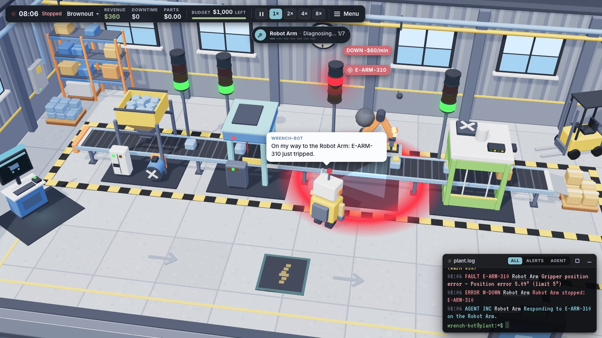
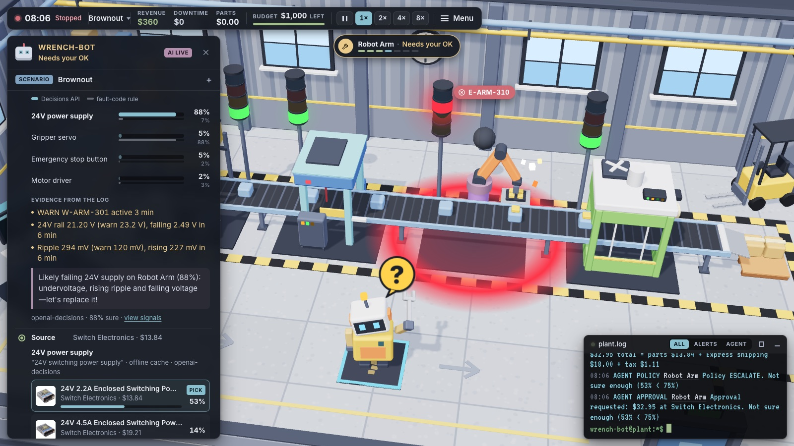
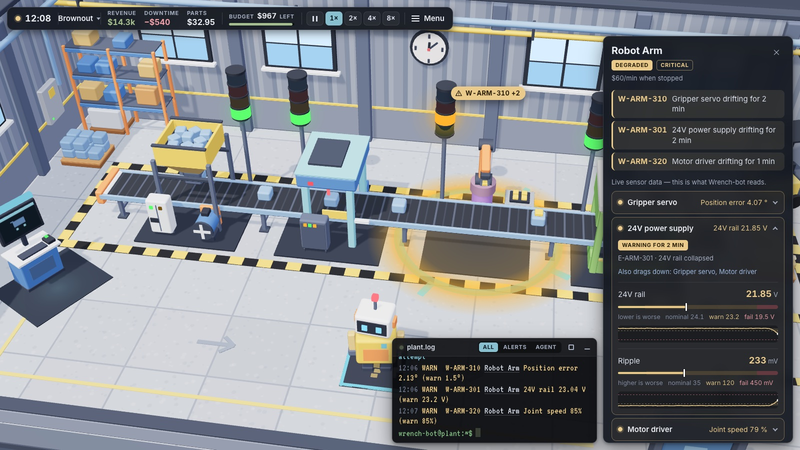
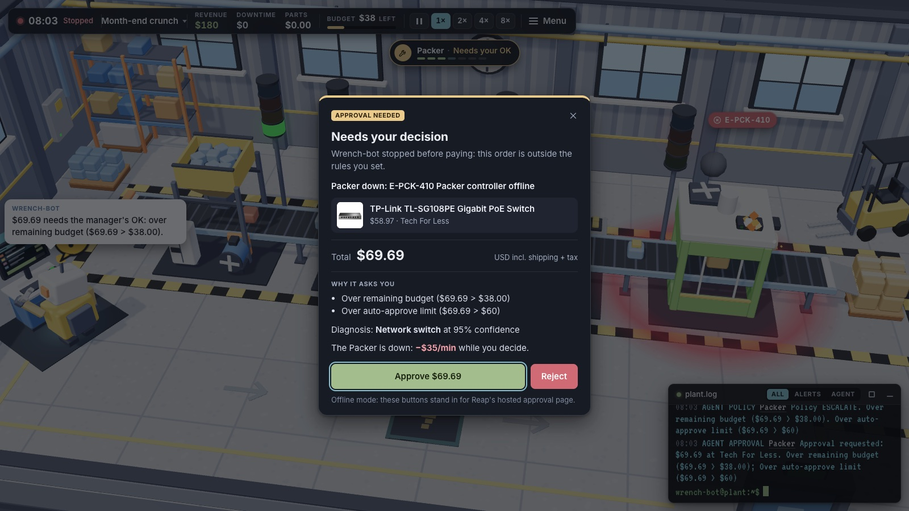
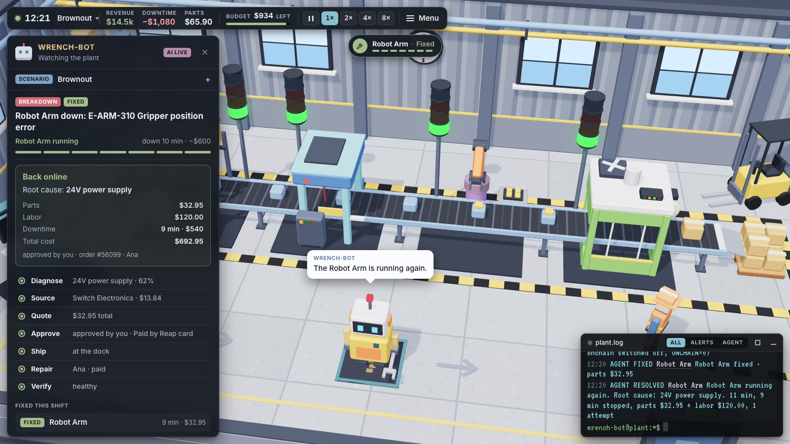
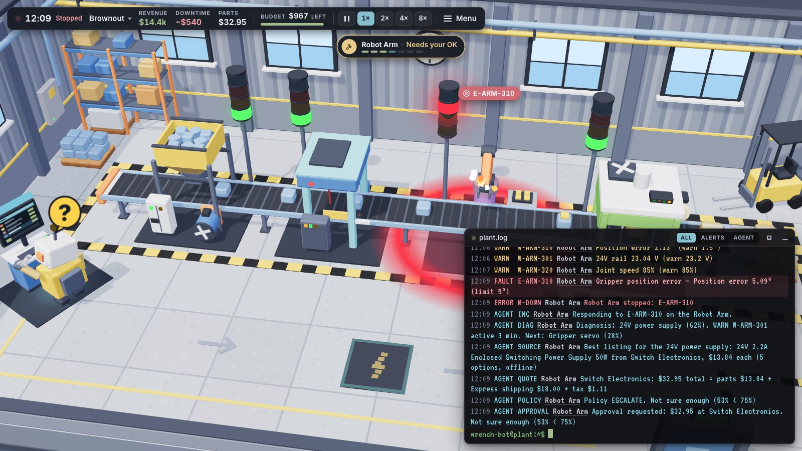
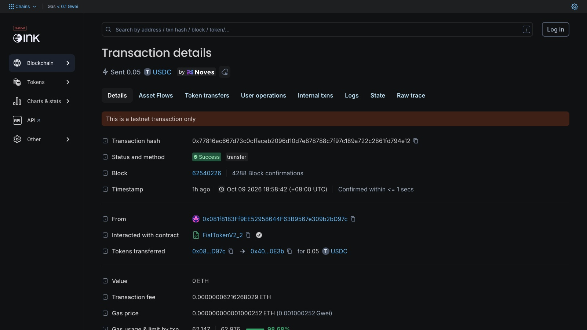
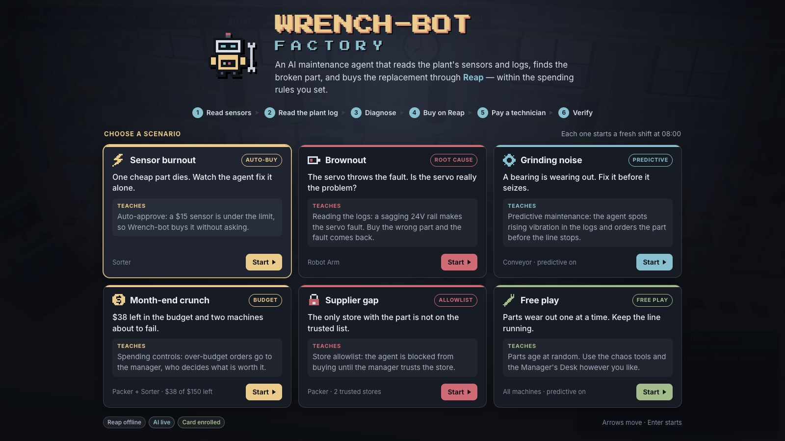
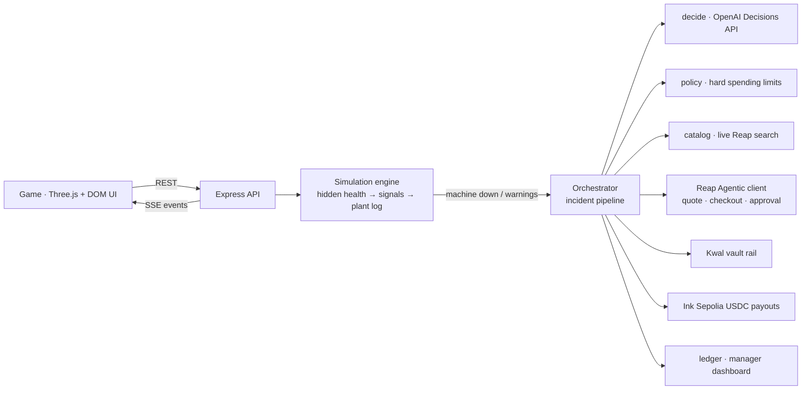

# Wrench-bot Factory

**An AI maintenance agent that reads a factory's sensor logs, works out which part actually failed, buys the replacement through Reap Agentic Payments, and pays the technician in USDC onchain only after the repair is verified, all within spending rules the manager controls.**

`Reap Agentic Payments (sandbox)` · `OpenAI Decisions API (gpt-6-luna)` · `Kwal USDC vault` · `Ink Sepolia USDC` · `Three.js` · `Node`

Reap × 65labs Agentic Buildathon · Singapore · 9 Oct 2026 · Team **Reapin' It In** · Track: **Most Worthwhile Problem**



---

## TL;DR for evaluators

| Claim | Where to verify |
|---|---|
| **Real agentic purchasing.** Live Reap catalog search, product → variant → quote → shipping → checkout → hosted approval → order status, against the Reap sandbox. | [`server/src/reap/client.js`](server/src/reap/client.js), [`server/src/reap/purchase.js`](server/src/reap/purchase.js), [docs/PAYMENTS.md](docs/PAYMENTS.md) |
| **Clear payment authority.** The model only recommends. Code enforces an auto-approve limit, a monthly budget, a confidence threshold and a trusted-store list (AUTO / ESCALATE / BLOCK), and Reap's hosted page holds the final approval. | [`server/src/agent/policy.js`](server/src/agent/policy.js), [docs/AGENT.md](docs/AGENT.md#payment-authority) |
| **A decision model that earns its place.** Diagnosis is a typed choice made by the **OpenAI Decisions API**. In *Brownout*, the fault code blames the servo; the model reads the sagging 24 V rail and blames the power supply. The game shows the naive "fault-code rule" next to it. | [`server/src/agent/decide.js`](server/src/agent/decide.js), [`server/src/sim/diagnostics.js`](server/src/sim/diagnostics.js) |
| **Closed loop with ground truth.** After the swap, the simulation's telemetry decides whether the fix worked. If it didn't, the agent rules that part out and re-diagnoses. | [`server/src/agent/orchestrator.js`](server/src/agent/orchestrator.js), [docs/SIMULATION.md](docs/SIMULATION.md) |
| **Onchain, for real.** The factory treasury owns a Kwal USDC vault on Ink Sepolia, deployed and funded onchain. Technicians are paid with real USDC transfers, released only after a verified repair. | [Vault deposit tx](https://explorer-sepolia.inkonchain.com/tx/0xda328aa274aa952f03e8dea01a9ac8e5a73802df5703edc56d02ea5fe763ca0d) · [Payout tx](https://explorer-sepolia.inkonchain.com/tx/0x77816ec667d73c0cffaceb2096d10d7e878788c7f97c189a722c2861fd794e12) · [`server/src/chain/usdc.js`](server/src/chain/usdc.js) |
| **Every state is designed.** Auto-buy, needs-your-decision, blocked store, quote expired, store can't fill, payment failed, fix didn't take, Kwal unavailable → card fallback. | [docs/PAYMENTS.md](docs/PAYMENTS.md#error-states) |
| **Full audit trail.** A manager dashboard lists every purchase, approval, block, payout and agent decision, kept across shifts. | [`server/src/agent/ledger.js`](server/src/agent/ledger.js), `GET /api/ledger` |

**→ Full evaluator guide with a criteria-to-evidence matrix and a 5-minute verification path: [docs/JUDGING.md](docs/JUDGING.md)**

---

## The problem

When a production line stops, every minute costs money. Getting it running again is slow and manual: someone reads the alarms, guesses the part, finds a supplier, gets purchasing approval, waits for delivery, books a technician and pays them. And **alarms mislead**: the part that throws the fault code is often not the part that failed (a sagging power supply makes a healthy servo lose position), so the wrong part gets ordered and the line stays down longer.

Wrench-bot runs that whole loop, diagnose → source → pay → repair → verify → settle, **inside spending rules the manager sets**, and asks the manager exactly when it should.

## What happens when a machine breaks

| | |
|---|---|
|  | **1. Diagnose from the logs.** The agent reads live sensor signals and the plant log (never the hidden part health) and asks the **OpenAI Decisions API** which part is the root cause. You see the model's probabilities next to the naive fault-code rule, plus the evidence lines it used. **2. Find the part live.** Reap catalog search, filtered by spec and price, with trusted stores ranked first. **3. Get a real quote** from the merchant: price, shipping, tax, expiry. |
|  | **What the agent sees.** Click any machine for its parts, each signal against its warn and fail thresholds, and a live sparkline. This is exactly the telemetry the decision model reads. |
|  | **4. Check the rules in code.** Within the limits and confident → the agent proceeds. Over the limit, over budget or not sure enough → **"Needs your decision"**, with the reasons and the cost of waiting (−$60/min). Untrusted store → **blocked**, with no checkout created. **5. Pay** through Reap's hosted approval. |
|  | **6. Ship, repair, verify.** A technician swaps the part; the simulation's telemetry decides whether it worked. In *Brownout* the servo swap doesn't take, so the agent rules it out, finds the **24 V power supply** and fixes it on try 2. **7. Settle onchain.** The technician's escrow is released as a **real USDC transfer on Ink Sepolia**, linked in the log. |
| 📊 | **Manager dashboard.** Every purchase (store, amount, rail, auto or manager approval, order id), every block, every onchain payout with its transaction link, and every agent decision with its confidence, kept across shifts and exportable as CSV. |

<p align="center"> </p>
<p align="center"><sub>Left: the plant log; WARN/FAULT lines from the machines, AGENT lines for every action Wrench-bot takes. Right: a real technician payout on the Ink Sepolia explorer.</sub></p>

## Payment authority, in one table

| Who | Can do | Enforced where |
|---|---|---|
| **Decision model** (OpenAI Decisions API) | Recommend a part, a listing, a technician, with probabilities | Nowhere near money: its output is an input to the policy |
| **Wrench-bot (code)** | Spend alone only if: total ≤ auto-approve limit **and** ≤ remaining monthly budget **and** confidence ≥ threshold **and** the store is trusted | [`policy.js` `evaluate()`](server/src/agent/policy.js), with reason strings shown to the manager |
| **Manager** | Approve or reject anything escalated; change limits, budget, confidence bar and trusted stores live (Manager's Desk) | Reap's hosted approval page (passkey); `PUT /api/policy` |
| **Onchain treasury** | Hold the vault funds (hard cap) and pay technicians after a verified fix | Kwal vault contract; [`chain/usdc.js`](server/src/chain/usdc.js); payouts are idempotent per escrow |

## Real integrations (what's live, what's simulated)

| System | Status | Proof |
|---|---|---|
| **Reap Agentic Payments** (sandbox) | **Live**: catalog search (~1,750 products found), quotes, checkouts, hosted approval, card enrollment (VISA ending 1811) | Observed live quotes: proximity sensor $35.68, 2× servo $93.15, PoE switch $64.06 |
| **OpenAI Decisions API** (`gpt-6-luna`) | **Live**: typed choice / yes-no decisions with per-option probabilities | Brownout: picks the 24 V PSU while the fault code says servo ([docs/AGENT.md](docs/AGENT.md)) |
| **Kwal vault** (Payward) | **Live onchain**: vault `0x1473…572f` deployed and funded with 8 USDC, "ready for checkout" | [deployment tx](https://explorer-sepolia.inkonchain.com/tx/0xc28251e4874776152944eb12827b43dea9866ca9fc2acf5ab3dadc4a0915ac64) · [deposit tx](https://explorer-sepolia.inkonchain.com/tx/0xda328aa274aa952f03e8dea01a9ac8e5a73802df5703edc56d02ea5fe763ca0d). Vault-paid parts fall back to the Reap card while Kwal's quote endpoint returns `400 ParticipantBadRequest` |
| **Ink Sepolia USDC** | **Live**: technician payouts from the treasury | [payout tx](https://explorer-sepolia.inkonchain.com/tx/0x77816ec667d73c0cffaceb2096d10d7e878788c7f97c189a722c2861fd794e12) (amounts scaled 1:100 so testnet funds last) |
| Factory, technicians, deliveries | Simulated | [docs/SIMULATION.md](docs/SIMULATION.md) |

## Scenarios (each demonstrates one idea)

| Scenario | What you'll see |
|---|---|
| **Sensor burnout** | A $15 sensor dies; within the limit → the agent handles the whole loop |
| **Brownout** | Misleading fault code; model vs fault-code rule; escalation; wrong part → re-diagnosis → right part |
| **Grinding noise** | Predictive maintenance: rising vibration → part ordered before the line stops |
| **Month-end crunch** | $38 left in the budget; over-budget orders escalate to the manager |
| **Supplier gap** | The only listing is from an untrusted store → blocked until the manager trusts it → retry |
| **Free play** | Parts fail one at a time; chaos tools and the Manager's Desk |



## Architecture



Details: [docs/ARCHITECTURE.md](docs/ARCHITECTURE.md) · [docs/AGENT.md](docs/AGENT.md) · [docs/PAYMENTS.md](docs/PAYMENTS.md) · [docs/SIMULATION.md](docs/SIMULATION.md) · [docs/API.md](docs/API.md) · [docs/JUDGING.md](docs/JUDGING.md)

## Run it

```bash
npm install
cp .env.example .env      # REAP_API_KEY, OPENAI_API_KEY (+ optional onchain / card settings)
npm run dev               # server :8787 · game http://localhost:5173
```

No keys? `npm run dev:mock` runs everything offline with simulated payments.

- **Card for Reap checkouts:** `npm run reap:enroll -w server`, enter the card on Reap's hosted page, then set `REAP_ENROLLMENT_ID`.
- **Onchain:** `TREASURY_PRIVATE_KEY` (an Ink Sepolia wallet with test USDC) enables real technician payouts. The Kwal vault is created with the [Kwal agent skill](https://github.com/payward/kwal-skill).
- **Public demo ("Judge mode"):** `JUDGE_MODE=1` keeps the AI, catalog and quotes live, completes checkouts as clearly labelled demos (visitors can't tap our card's passkey), caps tiny onchain payouts, and resets the factory when idle. Deploys as one Render web service (`render.yaml`).

## What we learned about Reap's sandbox

- `Reap-Version: 2025-02-14` is required, and the only way to discover it is the validation error.
- Checkout `returnUrl` must be public HTTPS; `localhost` is rejected.
- One quote per merchant; mixed carts are rejected (`AGENTIC_REQUEST_REJECTED`).
- Every sandbox checkout needs a one-tap approval on the hosted page, even with `X-Simulate-Checkout: COMPLETED`. Mandates (pre-approved terms) aren't live yet, so the app's own policy decides when the agent may ask, and Reap's page stays the final human check.

## Honest limits

- The factory, technicians and deliveries are simulated; the catalog, quotes, checkouts, vault and payouts are real sandbox/testnet systems.
- Vault-paid parts fall back to the Reap card while Kwal's quote endpoint fails.
- Technician payouts are testnet USDC, scaled 1:100.

---

<sub>Built in one evening at the Reap × 65labs Agentic Buildathon by Team Reapin' It In. Docs index: [docs/](docs/).</sub>
