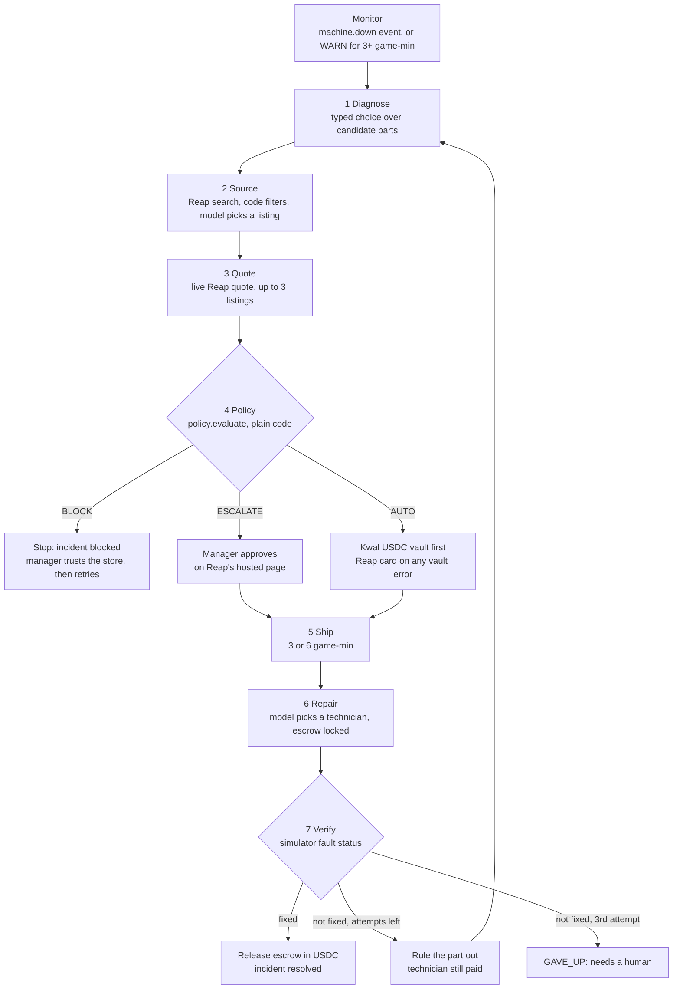
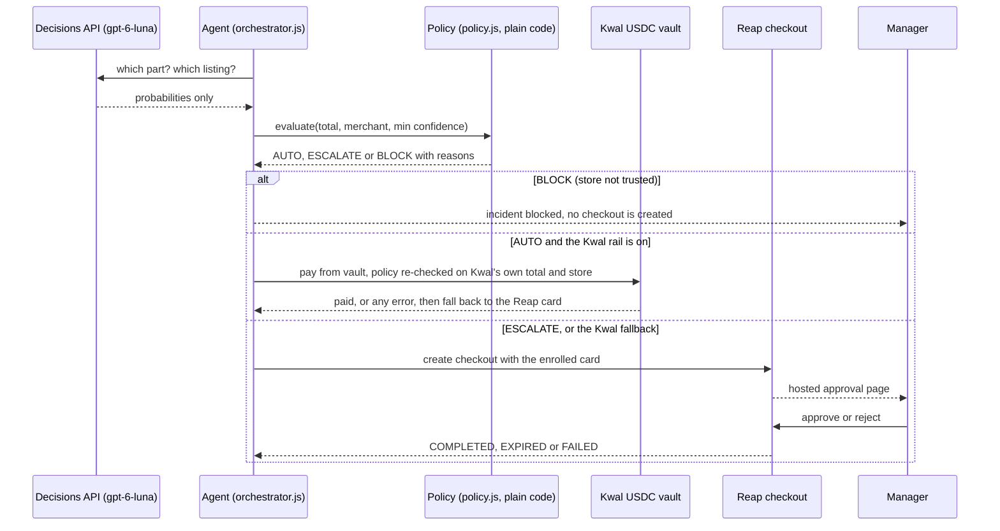

# Wrench-bot: the maintenance agent

Wrench-bot is the agent in Wrench-bot Factory. When a machine stops or a part starts wearing out, it works out which part is actually at fault from sensor telemetry and the plant log. It then finds the replacement in Reap's live catalog, gets a real quote and checks the manager's spending rules. Finally it pays, hires and pays a technician, and checks the fix against the simulator. This page explains how each of those decisions is made, who has the final say on each one, and where it happens in the code.

> **Docs:** [README](../README.md) · [Architecture](ARCHITECTURE.md) · **Agent** · [Payments](PAYMENTS.md) · [API](API.md) · [Simulation](SIMULATION.md) · [Judging guide](JUDGING.md)

**Source of truth:** the code. Every claim below names a file and a function (paths are relative to the repository root). Function names are given instead of line numbers because the files are still being edited.

---

## Summary for evaluators

| Claim | Where to verify |
|---|---|
| The agent sees only what a real plant shows: signal readings and log lines. It never reads hidden part health. | `server/src/sim/engine.js` `telemetryContext()`, `snapshot()` (no `health` field). `grep -rn health server/src/agent` matches only `sim.isHealthy` (a fault-status check), the local variable holding its result, and prompt text. |
| Diagnosis is a **typed decision**. The options are the candidate parts, and the answer comes back as a probability for each one. | `server/src/agent/orchestrator.js` `diagnose()` → `server/src/agent/decide.js` `decide({ kind: 'choice' })` → `openaiDecisions()` (`POST /v1/decisions`, `gpt-6-luna`) |
| A naive fault-code heuristic is computed, shown to the user next to the model's answer, and **withheld from the model**. Measured: when the model was given the heuristic's numbers, it copied them (servo 0.95). | `server/src/sim/diagnostics.js` `scoreComponents()`. The withholding is in `decide.js` `openaiDecisions()` (`prior: undefined`). The side-by-side display is in `game/src/ui/agentpanel.js` `#diagnosis()`. |
| The model only recommends. Spending limits are plain code, not a model. | `server/src/agent/policy.js` `evaluate()`: trusted store → BLOCK, budget / auto-approve limit / confidence threshold → ESCALATE |
| A fix counts as done only when the simulator says so, not when the model says so. | `orchestrator.js` `verify()`: `fixed = sim.isHealthy(...) && no lingering warned part` |
| If a fix does not take, the agent rules that part out and diagnoses again, up to 3 attempts. | `orchestrator.js` `MAX_ATTEMPTS = 3`, `rt.ruledOut`, `verify()`, `run()` |
| Brownout scenario: the fault code blames the servo, but the live model picked the 24 V supply at 0.59. That is below the 75% bar, so the order goes to the manager instead of the wrong part being bought automatically. | [Worked example](#12-worked-example-the-brownout-scenario) below |

---

## 1. Key parameters

| Parameter | Value | Defined in |
|---|---|---|
| Attempts per incident | 3 | `orchestrator.js` `MAX_ATTEMPTS` |
| Predictive trigger | a part in WARN for ≥ 3 game-minutes on a running machine | `orchestrator.js` `PREDICTIVE_AFTER_MIN`, `checkWarnings()` |
| Confidence needed to buy without asking | 0.75 | `policy.js` `DEFAULT_POLICY.confidenceThreshold` |
| Auto-approve limit per order | $60 | `policy.js` `DEFAULT_POLICY.autoApproveLimit` |
| Monthly budget | $1,000 (the "Month-end crunch" scenario starts at $150 with $112 spent) | `policy.js`, `shared/contract.js` `PRESETS` |
| Trusted stores (default) | Switch Electronics, Digitmakers.ca, Tech For Less | `policy.js` `DEFAULT_POLICY.allowedMerchants` |
| Listings the model chooses between | ≤ 5 (after the code filters) | `server/src/catalog/catalog.js` `shortlistOf()` |
| Listings tried for a quote | ≤ 3 | `orchestrator.js` `quoteWithFallback()` |
| Timeout per model call | 20 s | `decide.js` `TIMEOUT_MS` |
| Manager approval timeout | 10 min (real time) | `orchestrator.js` `APPROVAL_TIMEOUT_MS` |
| Game-minutes for shipping (express / standard), technician travel, repair, test run | 3 / 6, 2, 4, 2 | `orchestrator.js` `MINUTES` |
| Diagnosis latency (live Decisions API) | ~0.6–3 s measured | live testing, 9 Oct 2026 |

---

## 2. The loop

Each incident runs one pipeline (`orchestrator.js` `run()`). The step names match `incident.step` and the step tracker in the agent panel.



Every step emits a server-sent event (`EVENTS` in `shared/contract.js`) that the game animates. Every step also writes an `AGENT`-level line to the plant log (`orchestrator.js` `agentLog()`), so the log reads as an audit trail in time order. The [manager ledger](PAYMENTS.md) records every diagnosis, approval, block, purchase and payout from the same events (`server/src/agent/ledger.js`, `GET /api/ledger`).

---

## 3. What the agent observes, and what it never sees

The simulator gives each part a hidden `health` value between 0 and 1. That value drives the sensor signals, the signals drive part status, and status changes write the plant log (`engine.js` `signalFrac()` → `evaluate()` → `partTransition()`). **Health never leaves `engine.js`.** The agent reads the same two things a maintenance engineer would:

| Input | Source | What it contains |
|---|---|---|
| Telemetry | `sim.telemetryContext(machineId)` | Machine status and active fault codes. For each part: status (ok / warn / fault), how many minutes it has been in WARN, and every signal's value, nominal / warn / fail thresholds, `severity` = (value − nominal) / (fail − nominal), and `trend10m` (the change over the last 10 game-minutes) |
| Plant log | `sim.recentLogs({ machineId, limit: 20 })`, formatted by `orchestrator.js` `logLines()` | The last 20 lines for that machine, e.g. `[08:06] FAULT E-ARM-310 Gripper position error — …` |
| Ruled-out parts | `rt.ruledOut` | Parts already replaced in this incident without fixing it |
| Machine and incident kind | incident | `breakdown` or `predictive` |

**What it never sees:** part health, health-decline ramps, scripted scenario events, and chaos-tool injections. `sim.injectFault()` deliberately writes no log line ("chaos is invisible, the plant only shows the symptoms"), so a fault injected from the chaos panel reaches the agent only through its symptoms.

### The exact model input

`decide.js` `compactContext()` and `contextText()` turn the context into plain lines. This is the input text sent to the Decisions API at the moment the Robot Arm stops in the Brownout scenario. It was generated by the same code path, offline, with seed 7.

```text
machine: Robot Arm

kind: breakdown

telemetry:
Robot Arm: down, active codes E-ARM-310
Gripper servo [fault]: Position error 5.08° (nominal 0.4, warn 1.5, fail 5, severity 1.017, trend +3.97); Servo temp 42°C (nominal 42, warn 58, fail 80, severity 0, trend -1)
24V power supply [warn 3m]: 24V rail 21.2V (nominal 24.1, warn 23.2, fail 19.5, severity 0.63, trend -2.52); Ripple 301mV (nominal 35, warn 120, fail 450, severity 0.641, trend +230)
Emergency stop button [ok]: Safety loop 99% (nominal 100, warn 92, fail 0, severity 0.01)
Motor driver [warn 2m]: Driver temp 41°C (nominal 41, warn 60, fail 88, severity 0); Joint speed 73% (nominal 100, warn 85, fail 15, severity 0.318, trend -23)

log:
[08:02] WARN W-ARM-310 Position error 1.61° (warn 1.5°)
[08:03] WARN W-ARM-301 24V rail 22.97 V (warn 23.2 V)
[08:04] WARN W-ARM-320 Joint speed 85% (warn 85%)
[08:06] FAULT E-ARM-310 Gripper position error — Position error 5.02° (limit 5°)
[08:06] ERROR M-DOWN Robot Arm stopped: E-ARM-310
[08:06] AGENT INC Responding to E-ARM-310 on the Robot Arm.
```

The input contains no part health, no scenario name and no heuristic prior. `compactContext()` drops empty arrays and the mock-only fields `hint` and `forceUncertain`, and `openaiDecisions()` sets `prior: undefined` before the call.

---

## 4. The monitor: when an incident opens

Incidents are opened only by the monitor (`orchestrator.js` `startMonitor()`), never by hand. No HTTP route creates an incident: `POST /api/incidents/:id/retry` only restarts one the monitor already opened.

| Trigger | Rule | Code |
|---|---|---|
| **Breakdown** | The simulator emits `machine.down` (any part reaches FAULT). The incident's codes are the machine's active fault codes. | `onMachineDown()` → `startIncident({ kind: 'breakdown' })` |
| **Predictive** | `policy.predictiveMaintenance` is on (a manager toggle), a part on a *running* machine has been in WARN for ≥ 3 game-minutes, and that machine has no open incident. | `onMinute()` → `checkWarnings()` → `startIncident({ kind: 'predictive', componentIds })` |

Guards against duplicate or tangled incidents:

- **One incident per machine.** `activeIncident()` treats `open`, `blocked` and `error` as active, so a second incident is never opened for the same machine.
- **A breakdown during an open incident.** If the machine already has an `open` incident, the new fault codes are merged into it. A predictive job that has not reached the repair step yet is also marked `overtaken`. If the existing incident was stuck as `blocked` or `error`, it is cancelled and replaced by a breakdown incident (`onMachineDown()`).
- **One failure at a time.** The orchestrator registers a busy check (`sim.addBusyCheck`), so scripted failures, the Free-play scheduler and the chaos button all wait while an incident is open (`engine.js` `busy()`, `injectFault()` returns `409 BUSY`).
- **The clock stands still while the agent thinks.** While the agent works in real time (model calls, quotes, payment, waiting for the manager), the game clock is held (`holdClock()` → `sim.hold()`). Only waits that stand for real-world time, such as shipping, travel, repair and the test run, let game minutes pass (`ctx.minutes()`). Downtime figures therefore measure the physical process, not network latency.
- **Cancellable.** Each incident has its own `AbortController`. Every `await` goes through `guard()`, `sleep()` or `minutes()`, so loading a new scenario stops the pipeline at once (`cancelAll()`, `resetIncidents()`).

---

## 5. Diagnosis as a typed decision

### 5.1 The request

`orchestrator.js` `diagnose()` builds one `decide()` call:

```js
decide({
  kind: 'choice',
  question: 'Which part is the root cause of the fault on the Robot Arm?',   // predictive: "…is wearing out…"
  options: ['Gripper servo', '24V power supply', 'Emergency stop button', 'Motor driver'],
  context: { machine, kind, telemetry, log, prior, ruledOut },
})
// → { answer, probabilities: { [part]: p }, confidence, provider }
```

- **Options** are the machine's parts minus those already ruled out. For a predictive incident on a machine that is still running, the options are only the parts in WARN.
- **Wire format** (`decide.js` `openaiDecisions()`): the request is `POST https://api.openai.com/v1/decisions` with `model: 'gpt-6-luna'`. Each option is sent as `{ value: 'o1', description: '<part name>' }` and mapped back to the part name, so any part name is a safe option. Every choice question (not yes/no ones) gets a fixed piece of guidance appended, `DECISIONS_GUIDANCE`: a FAULT code names the part whose signal tripped, which is not always the root cause, so check which signals moved first and whether a part's own readings are abnormal. The API shape was checked with a live call and is recorded in [DECISIONS_API.md](DECISIONS_API.md).
- **Normalisation** (`decide.js` `finish()`): probabilities are clamped at ≥ 0 and renormalised to sum to 1. The answer is the option with the highest probability. A `refusal` answer type throws, and the next provider is tried.

**Provider chain** (`decide.js` `decide()`). The first provider that returns an answer wins.

| # | Provider | Status | Receives the heuristic prior? |
|---|---|---|---|
| 1 | `openaiDecisions`: OpenAI Decisions API, `gpt-6-luna` (public beta since 6 Oct 2026) | live, verified 9 Oct 2026 | **No** (`prior: undefined`) |
| 2 | `jev`: TypeSafe Jev | stub, returns `null` | n/a |
| 3 | `gptStructured`: Chat Completions with a strict JSON schema of one probability per option, model `config.openai.model` (default `gpt-5-mini`) | used only if #1 fails | Yes, with a system instruction to override it when the signals disagree |
| 4 | `mock`: offline, deterministic | used when `MOCK_AI=1`, when there is no API key, or when every provider above fails | Returns the prior unchanged |

### 5.2 The naive prior (shown to the user, not to the model)

`server/src/sim/diagnostics.js` `scoreComponents()` is a fast, deliberately naive rule computed only from telemetry:

```
score(part) = 0.6 × max severity of the part's own signals + 0.4 × (part has an active FAULT code ? 1 : 0)
p(part)     = softmax(score / 0.25) over parts not ruled out
```

It trusts fault codes. At 08:06 in Brownout the scores are: servo 0.6 × 1.017 + 0.4 = **1.010**; supply 0.6 × 0.641 = **0.385**; driver 0.6 × 0.318 = **0.191**; e-stop **0.006**. That gives **servo 0.879, supply 0.072, driver 0.033, e-stop 0.016**. This matches the offline trace to three decimals, and across eight seeds the servo probability stayed between 0.872 and 0.881.

The prior has three uses:
1. **The comparison the user sees.** `AGENT_DIAGNOSIS` carries both `probabilities` (the model's) and `prior` (the rule's). The agent panel draws two bars per part, labelled with the provider name and "fault-code rule" (`agentpanel.js` `#diagnosis()`).
2. **Offline behaviour.** The mock provider returns the prior, so `npm run dev:mock` plays the naive agent end to end ([section 12](#124-path-b-trust-the-fault-code-offline-recorded-run)).
3. **The evidence lines** (section 5.4).

### 5.3 Why the prior is kept from the model

The team measured three inputs on the Brownout case with the live Decisions API (9 Oct 2026):

| What `gpt-6-luna` received | Top pick | Probability |
|---|---|---|
| Raw plant log only | 24V power supply | 0.98 |
| **Full context: telemetry lines + log + root-cause guidance, prior withheld (what ships)** | **24V power supply** | **0.59** |
| Full context **plus** the heuristic prior | Gripper servo | 0.95 |

With the prior in the input, the model followed it. Shown "servo 0.88", it returned servo at 0.95, a confident wrong answer that is *more* confident than the rule itself. The prior is a summary of the fault code, and the fault code is the misleading signal in this case. Including the prior means the model reads the alarm twice and treats it as independent evidence.

The code therefore withholds it (`decide.js` `openaiDecisions()`, with the comment "sending the prior made it copy the fault code"), and the user sees it as the second bar. The user can then see where the model disagrees with the alarm.

The 0.59 is the useful result. The model reads the falling rail and the rising ripple, and it reports that it is unsure. Because 0.59 is below the 0.75 threshold, `policy.evaluate()` sends the order to the manager instead of buying automatically ([section 11](#11-payment-authority-the-model-only-recommends)). Model uncertainty becomes a human approval, not a wrong purchase.

### 5.4 Evidence lines and the explanation

- **Evidence is computed in code, not written by the model.** `diagnostics.js` `partEvidence()` builds up to 4 lines for the chosen part. The fault or warn code comes first, then abnormal signals by severity (with a trend if the 10-minute change is ≥ 4% of the nominal-to-fail span), then normal signals. For the supply at 08:06:
  `WARN W-ARM-301 active 3 min` · `Ripple 301 mV (warn 120 mV), rising 230 mV in 6 min` · `24V rail 21.20 V (warn 23.2 V), falling 2.52 V in 6 min`.
  If the heuristic has no evidence for a part, `orchestrator.js` `fallbackEvidence()` lists its two most severe signals.
- **Explanation:** one sentence from `decide.js` `say()` (Chat Completions, max 18 words), built from the chosen part, its confidence and the evidence. If the call fails or AI is mocked, a fixed sentence is used instead, for example `Not the Gripper servo. Now the 24V power supply looks likeliest (65%): WARN W-ARM-301 active 14 min.` The explanation is display text only and feeds no decision.
- **Plant-log line:** `Diagnosis: <part> (<p>%). <first evidence line>. Next: <runner-up> (<p>%)`.

### 5.5 Confidence

The diagnosis confidence is the model's probability for the chosen part (`d.probabilities[component.name]`). The policy receives `min(diagnosis confidence, listing-choice confidence)` (`orchestrator.js` `run()`), so the agent must be sure about both the part and the listing. The UI flags any value under the manager's bar with "(below your 75% bar)".

---

## 6. Re-diagnosis when a fix does not take

After every swap, `verify()` checks the simulator (section 10). If the machine is not fixed:

1. The replaced part is added to `rt.ruledOut` and to `incident.ruledOut` (part names, shown struck through in the agent panel).
2. The plant log says which of two cases it hit:
   - **The new part trips the same way.** Something upstream is pushing it: `Still faulting: E-ARM-310. Not the root cause. Re-diagnosing.`
   - **The new part reads OK, but another code is still active:** `New <part> reads OK, but <codes> still active. Re-diagnosing.` (the speech bubble says "Next one.")
3. The technician is still paid, because the work was done. The payout runs in the background while the agent diagnoses again (`run()`, `payTechnician(..., fixed=false)`).
4. The next attempt calls `scoreComponents(machineId, { ruledOut })` and `decide()` with the ruled-out part removed from the options and listed in `context.ruledOut`.
5. After `MAX_ATTEMPTS = 3`, or when every part has been ruled out, the incident stops with `GAVE_UP` ("I need a human"). The manager can restart it with `POST /api/incidents/:id/retry` (`retryIncident()`). A retry resets the attempt counter and clears the ruled-out list only if every part was ruled out.

---

## 7. Sourcing: from part spec to one listing

`server/src/catalog/catalog.js` `findReplacement(component, { trusted, context })`:

| Stage | Rule | Owner |
|---|---|---|
| **Search** | `POST /agentic/products/search` on Reap with `filters.availability = AVAILABLE_ONLY`, `limit: 20`. The part's `query` is tried first, then its `name` if fewer than 3 listings survive the filters. | code, `searchOffers()` |
| **Cache** | 10-minute in-memory cache plus a disk cache (`server/.cache/catalog.json`). If search fails, the last cached result is used. | code |
| **Hard filters** | `available` and `price ≤ maxPrice` and the **spec keywords** match. `keywords` is a list of groups: every group must have at least one word in the listing name. For example, `[['power supply','psu'], ['24v']]` requires "power supply" or "psu" *and* "24v". | code, `shortlistOf()`, `matchesSpec()` |
| **Ranking** | `relevance = query-token overlap + 0.4 if the store is trusted − 0.15 × price / maxPrice`, keep the top 5 | code, `relevance()` |
| **Choice** | If more than one listing survives, the model picks among opaque ids `option_1 … option_5`, given each listing's name, store, price and whether the store is trusted (`decide({ kind: 'choice' })`) | model, within the code-filtered shortlist |
| **Fallback** | If nothing survives, a listing verified against the Reap sandbox on 9 Oct 2026 is used (12 of the 15 parts have one, in `server/src/catalog/fallback.js`), so the demo never dead-ends | code |

Each part's spec lives in `shared/contract.js` `MACHINES[].components[]` (`query`, `keywords`, `maxPrice`, `qty`). For example, the 24V power supply has `maxPrice` 120 and `qty` 1, and the gripper servo has `maxPrice` 120 and `qty` 2.

Catalog coverage (live testing, 9 Oct 2026): a sweep of about 80 queries over Reap search found about 1,750 purchasable products. **All 15 machine parts resolve to live listings**, mostly at Switch Electronics (relays, proximity sensors, limit switches, servos, 24 V supplies, fuses, e-stops), Tech For Less (PoE switches, Zebra scanners) and Digitmakers (steppers, bearings).

You can check what the agent would buy right now, without starting an incident: `GET /api/catalog/replacement/arm/arm-psu?model=1` (see [API.md](API.md)).

---

## 8. Quoting, with fallback across listings

`orchestrator.js` `quoteWithFallback()` asks for a live quote from the chosen listing, then from up to two more listings in ranking order:

- **One store per quote.** `server/src/reap/purchase.js` `quoteParts()` rejects mixed carts, because Reap returns `AGENTIC_REQUEST_REJECTED` for them.
- **Errors that move on to the next listing:** `QUOTE_UNFULFILLABLE`, `CARD_PAYMENT_UNAVAILABLE`, `AGENTIC_REQUEST_REJECTED`, `CHECKOUT_URL_INVALID`. Any other error stops the incident with a retryable error. If all three listings fail, the incident stops with `NO_QUOTE`.
- **Express shipping** is chosen only when the machine is stopped *and* (it is critical *or* the manager turned off `expressForCriticalOnly`) (`wantsExpress()`). The Robot Arm and the Sorter are critical (`MACHINES[].critical`).
- **Reap sandbox facts** (live testing, 9 Oct 2026): requests need the header `Reap-Version: 2025-02-14`, and quotes need a full `shippingAddress` (phone in E.164 format). A quote takes about 10 s and expires after about 15 min. Observed live totals: proximity sensor **$35.68** (including $24.98 shipping), 2× servo **$93.15**, PoE switch **$64.06**, stepper **$30.00**.

The quote's `total` and `merchant` (the store that actually quoted, not just the first-choice listing) are what the policy checks.

---

## 9. Technician selection

`orchestrator.js` `repair()` makes a second typed decision:

```js
decide({ kind: 'choice', question: 'Which technician should replace the 24V power supply on the Robot Arm?',
         options: ['tech-ana', 'tech-raj', 'tech-mei'],
         context: { part, machine, technicians: [{ id, name, skills, rating, rateUSDC }] } })
```

| Technician | Skills | Rating | Job rate | Onchain payout (× `TECH_PAYOUT_SCALE`, default 0.01) |
|---|---|---|---|---|
| Ana | sensors, electrical | 4.9 | $120 | 1.20 USDC |
| Raj | motors, servos | 4.7 | $110 | 1.10 USDC |
| Mei | networking, electrical | 4.8 | $100 | 1.00 USDC |

`server/src/agent/technicians.js` `TECHNICIANS`. The model chooses *who*. The amount is fixed in code (`rate × scale`). An escrow is locked when the technician is dispatched (`lockEscrow()`) and released after the test run (`releaseEscrow()`). Release is a real USDC transfer on Ink Sepolia from the factory treasury, is idempotent for each escrow id, and falls back to a simulated payout (with a reason) if the chain is off, the treasury is short, or a payout cap is reached. In offline mode a skills-matching hint (`techFor()`) drives the mock; `compactContext()` strips that hint, so the live model never sees it. Payout details, transaction hashes and caps are in [PAYMENTS.md](PAYMENTS.md).

---

## 10. Verification against the simulator

`orchestrator.js` `verify()` waits a 2-game-minute test run, then:

```js
const healthy  = sim.isHealthy(machine.id);                  // no part in FAULT
const lingering = predictive ? warnedParts.filter(status !== 'ok') : [];
const fixed    = healthy && !lingering.length;               // this decides
```

The model is also asked a yes/no question ("After replacing the X, is the Y working again?"), and its probability appears in the log line (`Verified (95%): Robot Arm running, all signals within limits`). **It cannot overrule the result.** The machine's real state decides whether the job is done, the money is released and the incident closes. The model never gets to mark its own work as complete. `sim.isHealthy()` reads part status, which the simulator computes from the noise-free signal values, the same role a PLC's fault bit plays in a real plant.

---

## 11. Payment authority: the model only recommends

The model produces probabilities. Whether money moves, and how much, is decided by code the manager configures, then by the payment rails' own controls, and for anything outside the rules, by the manager in person.



### 11.1 Hard limits in code: `server/src/agent/policy.js`

| Setting | Default | Manager's Desk range | Effect in `evaluate()` |
|---|---|---|---|
| `allowedMerchants` | Switch Electronics, Digitmakers.ca, Tech For Less | checkboxes for every store seen in the catalog | Store not on the list → **BLOCK** (checked first, ends the evaluation) |
| `monthlyBudget` − `spent` | $1,000 − $0 | $100–$3,000 | `total > remaining` → **ESCALATE**, "Over remaining budget ($X > $Y)" |
| `autoApproveLimit` | $60 | $0–$300 | `total > limit` → **ESCALATE**, "Over auto-approve limit ($X > $60)" |
| `confidenceThreshold` | 0.75 | 0.50–0.95 | `confidence < threshold` → **ESCALATE**, "Not sure enough (59% < 75%)" |
| `predictiveMaintenance` | off (on in "Grinding noise" and "Free play") | toggle | Lets the monitor open predictive incidents |
| `expressForCriticalOnly` | true | not on the desk (`PUT /api/policy` only) | Limits express shipping to critical machines |

No reasons → **AUTO**, "Within limits: $X ≤ $60, 81% sure". All reasons are collected, so the manager sees every rule an order breaks. Going over budget escalates rather than blocks, because whether an urgent repair is worth breaking the budget is the manager's call. `recordSpend()` adds the final paid amount to `spent` only after a checkout completes. The desk UI is `game/src/ui/desk.js` (`SLIDERS`). Edits go through `PUT /api/policy` and are validated by `clean()`: unknown keys and invalid values (negative amounts, non-numbers, non-boolean toggles) are ignored, and the confidence threshold is clamped to 0–1.

### 11.2 What the model cannot do

- **Spend outside the rules.** `evaluate()` has no model input except a confidence number. A confident model still hits the price, budget and store checks.
- **Buy from a store the manager has not trusted.** The policy checks the merchant on the *quote*, so a fallback listing from another store is checked too.
- **Pick a listing outside the shortlist,** or one that fails the spec or `maxPrice` filters. Its options are opaque ids into a list the code already filtered.
- **Set a price or a payout amount.** Prices come from Reap's quote and payouts from `rate × scale`.
- **Change the policy.** The agent code never calls `updatePolicy()`. Only `PUT /api/policy` (the Manager's Desk) and scenario loading do.
- **See card details.** The card is enrolled on Reap's hosted page (`server/scripts/enroll.js`). The agent holds only an enrollment id.
- **Mark a repair as done** (section 10).

### 11.3 Controls outside our code

| Layer | Control | Verified behaviour (9 Oct 2026) |
|---|---|---|
| Reap card | Every checkout needs a one-tap approval on Reap's hosted page | In the sandbox, even `X-Simulate-Checkout: COMPLETED` returned `REQUIRES_ACTION`. The orchestrator therefore emits `APPROVAL_REQUIRED` whenever Reap returns an approval URL, AUTO or not (`pay()`). An unapproved test checkout went `EXPIRED`, and the agent reports "The manager did not approve the order". |
| Reap mandates | Pre-approved recurring terms | Documented as "not available yet", which is why `policy.js` decides AUTO vs ESCALATE itself |
| Kwal vault | An onchain USDC deposit backs a card. The deposit is the spending cap. | Vault `0x14735b01eD166F386EFE0aD27A2791498b44572f` funded with 8 USDC. Kwal's variant and quote endpoints return `400 ParticipantBadRequest`, so AUTO orders fall back to the Reap card automatically (`payFromVault()` → `null`, with a 120 s cooldown in `server/src/kwal/rail.js`) |
| Treasury | Technician payouts cannot exceed the wallet balance | `technicians.js` `transfer()` checks the USDC and ETH balances before sending |

**Judge mode** (`JUDGE_MODE=1`, `config.judge`; the live demo linked in the README): search, quotes and the model are live, but the Reap checkout is simulated (`orchestrator.js` `payDemo()`), because a public visitor cannot confirm the team's passkey. **The policy is unchanged.** AUTO orders complete after a short pause (1.2 s ÷ √speed), and ESCALATE orders wait for the game's Approve / Reject buttons (`POST /api/mock/approve/:checkoutId` → `approveDemo()`), with the same 10-minute timeout. With the demo settings in `render.yaml` (`TECH_PAYOUT_SCALE=0.0001`, `ONCHAIN_MAX_PAYOUTS=200`), onchain payouts are tiny and capped. Simulated entries are flagged `simulated: true` in the ledger and shown with a "demo" badge.

---

## 12. Worked example: the Brownout scenario

**Setup** (`shared/contract.js` `PRESETS`, `id: 'brownout'`): the 24V power supply starts at hidden health 0.55, then declines linearly to 0.10 over 6 game-minutes starting at 08:01. Policy: $60 auto-approve limit, $1,000 budget, 75% confidence threshold.

**The trap** (`MACHINES` → `arm-psu.effects`): a sagging supply pushes the servo's position error toward its fault limit with weight **1.6**, and the motor driver's joint speed with weight 0.5. The servo's position error therefore crosses WARN before the supply's own rail voltage does. At health 0.10 the supply's own signals reach only 78% of the way to their fault limits, so **the broken part never raises a FAULT code.** Only the servo does. (This follows from `engine.js` `degradation()`: d(0.10) = (0.6/0.7)^1.6 = 0.78 < 0.97.)

### 12.1 Minute by minute: what the log shows and what the rule concludes

Recorded offline with `server/src/sim/engine.js` and `diagnostics.js`, seed 7. Readings shift slightly between seeds (over eight seeds the 08:06 ripple ranged from 292 to 305 mV), but the time of every log event stayed the same.

| Clock | New plant-log lines | 24V rail | Ripple | Servo position error | Servo temp | Fault-code rule's top pick |
|---|---|---|---|---|---|---|
| 08:00 | `INFO SHIFT Shift started: Brownout` | 23.72 V | 71 mV | 1.11° | 43 °C | servo 0.30 (nearly flat) |
| 08:01 | none (the supply's decline starts, hidden) | 23.67 V | 68 mV | 1.03° | 42 °C | servo 0.29 |
| 08:02 | `WARN W-ARM-310 Position error 1.61° (warn 1.5°)` | 23.34 V | 100 mV | 1.61° | 42 °C | servo 0.34 |
| 08:03 | `WARN W-ARM-301 24V rail 22.97 V (warn 23.2 V)` | 22.94 V | 147 mV | 2.36° | 42 °C | servo 0.39 |
| 08:04 | `WARN W-ARM-320 Joint speed 85% (warn 85%)` | 22.39 V | 187 mV | 3.05° | 42 °C | servo 0.45 |
| 08:05 | none | 21.83 V | 234 mV | 4.07° | 42 °C | servo 0.53 |
| 08:06 | `FAULT E-ARM-310 Gripper position error — Position error 5.02° (limit 5°)`<br/>`ERROR M-DOWN Robot Arm stopped: E-ARM-310` | 21.20 V | 301 mV | 5.08° | 42 °C | **servo 0.879** |

The telemetry columns are the sample the agent reads at the end of each minute. Log lines record the reading at the moment of each change, so 5.02° and 5.08° are two noisy samples of the same signal.

What a careful reader notices: the servo is the *first* part to warn, but its temperature stays at nominal (42 °C) the whole time, so it is not straining. Meanwhile the supply's rail falls 2.52 V and its ripple rises from 71 to 301 mV, and the motor driver, the other part fed by the same supply, also slows (joint speed falls to 73% against a nominal 100%). One upstream cause explains every symptom.

### 12.2 What each actor concludes at 08:06

| Actor | Conclusion | Source |
|---|---|---|
| Fault-code rule (`scoreComponents`) | Gripper servo **0.879**, supply 0.072 | computed, section 5.2 |
| `gpt-6-luna` given the rule's prior | Gripper servo **0.95** (copied the prior) | live measurement, 9 Oct 2026 |
| **`gpt-6-luna` as shipped (prior withheld)** | **24V power supply 0.59** | live measurement, 9 Oct 2026 |
| `policy.evaluate()` | **ESCALATE**: `Not sure enough (59% < 75%)`, plus `Over auto-approve limit` if the live total is over $60 | `policy.js` |

### 12.3 Path A: read the signals (live model, as shipped)

This is what the code does with the measured model output. Times come from the `MINUTES` constants, because the clock is held during real-time steps.

1. **08:06, diagnose.** `AGENT_DIAGNOSIS { component: '24V power supply', confidence: 0.59, provider: 'openai-decisions', prior: { 'Gripper servo': 0.879, … } }`. The panel shows the model's bar for the supply next to the rule's bar for the servo. The evidence lines are the three supply lines from section 5.4, and the panel adds "(below your 75% bar)".
2. **Source.** Search for `24V switching power supply`, filtered by the keywords `power supply|psu` and `24v` and by price ≤ $120, with trusted stores ranked first. For example, Switch Electronics' "24V 4.5A Enclosed Switching Power Supply 100W" (item price $19.23, verified 9 Oct 2026, in `fallback.js`).
3. **Quote.** A live Reap quote with express shipping, because the Robot Arm is critical and stopped.
4. **Policy → ESCALATE.** `POLICY_DECISION { action: 'ESCALATE', reasons: ['Not sure enough (59% < 75%)'] }`.
5. **Manager.** `APPROVAL_REQUIRED` opens a modal with a link to Reap's hosted approval page. In Judge mode, Approve / Reject buttons appear instead. The manager approves once.
6. **Ship, repair.** Express delivery takes 3 game-min, then the technician's 2 min travel and 4 min swap. `engine.js` `replaceComponent()` resets the supply, and on that same tick the log clears every alarm the supply caused. In the recorded run below the same swap produced:
   `E-ARM-310 cleared — Position error 0.37°` · `W-ARM-301 cleared — 24V rail 24.06 V` · `W-ARM-320 cleared — Joint speed 99%` · `M-UP Robot Arm running`.
7. **Verify.** After the 2-min test run, `sim.isHealthy('arm')` is true. The escrow is released (1.20 USDC if Ana is chosen) and the incident resolves in **1 attempt**, with the arm stopped for about **9 game-min** (3 + 2 + 4).

### 12.4 Path B: trust the fault code (offline, recorded run)

With `MOCK_AI=1 MOCK_REAP=1` (`npm run dev:mock`), the mock provider returns the rule's prior, so the agent behaves like a naive maintenance bot. This is the recorded plant log of that run (seed 7, offline catalog and mock quotes; abridged, only `AGENT` lines and the key plant lines):

```text
[08:06] AGENT DIAG     Diagnosis: Gripper servo (88%). FAULT E-ARM-310 Gripper position error. Next: 24V power supply (7%)
[08:06] AGENT QUOTE    Switch Electronics: $69.84 total = parts $48.00 + Express shipping $18.00 + tax $3.84
[08:06] AGENT POLICY   Policy ESCALATE. Over auto-approve limit ($69.84 > $60)
[08:06] AGENT ORDER    Ordered 2× FT5320M High Torque 67g 20Kg/cm Digital 180… from Switch Electronics ($69.84), order #92371
[08:09] AGENT TECH     Dispatched Raj (motors, servos). $110.00 job …
[08:15] INFO  MAINT    Replaced Gripper servo
[08:15] FAULT E-ARM-310 Gripper position error — Position error 5.63° (limit 5°)
[08:17] AGENT VERIFY   Still faulting: E-ARM-310. Not the root cause. Re-diagnosing.
[08:17] AGENT PAYOUT   Fix didn't take, but Raj did the work. Released $110.00 to Raj …
[08:17] AGENT DIAG     Diagnosis: 24V power supply (65%). WARN W-ARM-301 active 14 min. Next: Motor driver (25%)
[08:17] AGENT POLICY   Policy ESCALATE. Not sure enough (65% < 75%)
[08:17] AGENT ORDER    Ordered 1× 24V 2.2A Enclosed Switching Power Supply 50W from Switch Electronics ($32.95), order #72809
[08:26] INFO  MAINT    Replaced 24V power supply
[08:26] INFO  E-ARM-310 E-ARM-310 cleared — Position error 0.37°
[08:26] INFO  M-UP     Robot Arm running
[08:28] AGENT VERIFY   Verified (95%): Robot Arm running, all signals within limits
[08:28] AGENT RESOLVED Robot Arm running again. Root cause: 24V power supply. 22 min, 20 min stopped, parts $102.79 + labor $230.00, 2 attempts
```

Re-diagnosis recovers. With the servo ruled out, the same rule puts the supply at 0.65, because the supply is now the part with the most severe signals. But the recovery costs a wrong order, a second technician visit and eleven more minutes of downtime.

### 12.5 Comparison

| | Path B: trust the fault code (offline run, mock prices) | Path A: read the signals (live model; costs at the same mock prices) |
|---|---|---|
| Attempts | 2 | 1 |
| Parts | $69.84 wrong servos + $32.95 supply = **$102.79** | **$32.95** |
| Labor | $110 + $120 = **$230** | one job, $100–$120 |
| Robot Arm stopped | **20 game-min** | **≈ 9 game-min** (derived from `MINUTES`) |
| Downtime cost at $60/min (`downtimeCostPerMin`) | $1,200 | ≈ $540 |
| Manager approvals | 2 (over the limit, then "not sure enough 65%") | 1 ("not sure enough 59%") |

At live Reap prices, the wrong servo order alone was quoted at **$93.15** (2× servo, observed 9 Oct 2026).

The policy caught the wrong servo order only because of its price, not because the diagnosis was wrong: at 88% the rule was confident. **Spending limits alone do not catch a confident misdiagnosis.** That needs a model that reads the signals instead of the alarm, plus the verify-and-re-diagnose loop as a backstop.

---

## 13. Every decision the agent makes

| # | Decision | Type | Options | Made by | Final authority | Code |
|---|---|---|---|---|---|---|
| 1 | Open a breakdown incident | rule | n/a | monitor | code (`machine.down` from the simulator) | `orchestrator.js` `onMachineDown()` |
| 2 | Open a predictive incident | rule | n/a | monitor | **manager** turns it on (`predictiveMaintenance`), then code (WARN ≥ 3 game-min) | `checkWarnings()` |
| 3 | Which part is the root cause / is wearing out | **choice** | candidate part names (not ruled out; predictive: parts in WARN) | Decisions API (`gpt-6-luna`) | recommendation only: confidence feeds #7, the result is checked by #12 | `diagnose()` → `decide()` |
| 4 | Which listing to buy | **choice** | `option_1…option_5` from the code-filtered shortlist | model (skipped if ≤ 1 listing) | code sets the shortlist (spec keywords, `maxPrice`, availability, trusted ranking) | `catalog.js` `findReplacement()` |
| 5 | Express or standard shipping | rule | express / standard | code | **manager** setting `expressForCriticalOnly` | `wantsExpress()` |
| 6 | Which listing to quote next after a store error | rule | up to 3 listings in ranking order | code | code | `quoteWithFallback()` |
| 7 | Buy alone, ask, or refuse | rule | AUTO / ESCALATE / BLOCK | `policy.evaluate()` | **manager-set limits in code** | `policy.js` `evaluate()` |
| 8 | Approve an escalated order | yes / no | approve / reject | **manager** | **manager** on Reap's hosted page (Judge mode: in-game buttons), 10-min timeout | `pay()`, `payDemo()` |
| 9 | Payment rail | rule | Kwal vault / Reap card | code | code + rail controls (vault balance; Reap hosted approval) | `pay()`, `payFromVault()` |
| 10 | Which Kwal product matches the Reap listing | rule | Kwal search results | code (token overlap, same-store bonus) | policy re-checked on Kwal's own total and store before paying | `kwal/rail.js` `bestMatch()`, `approve` callback |
| 11 | Which technician | **choice** | `tech-ana`, `tech-raj`, `tech-mei` | model | amount fixed in code (`rate × TECH_PAYOUT_SCALE`) | `repair()` |
| 12 | Is the machine fixed | **yes / no** | yes / no | model (recorded only) | **simulator** (`sim.isHealthy` + the warned parts are back to `ok`) | `verify()` |
| 13 | Release the technician's escrow | rule | n/a | code, after the test run (paid whether or not the fix took) | code + treasury balance + payout cap | `payTechnician()`, `technicians.js` `releaseEscrow()` |
| 14 | Diagnose again or give up | rule | next attempt / `GAVE_UP` | code (`ruledOut`, `MAX_ATTEMPTS = 3`) | code; **manager** can retry | `run()`, `verify()`, `retryIncident()` |
| 15 | Explain the diagnosis | free text | n/a | `say()` (one sentence) | none: display only | `decide.js` `say()` |

A model is involved in five of the fifteen decisions: #3, #4, #11, #12 and the display-only #15. None of them can move money on its own.

---

## 14. Failure handling

| Failure | What happens | Code |
|---|---|---|
| Decisions API error, timeout or refusal | Next provider: `gptStructured`, then `mock` (the heuristic) | `decide.js` `decide()` |
| Reap search down | Last cached result, then the offline cache and verified fallback listings | `catalog.js` `searchOffers()`, `offlineSearch()` |
| A store cannot fill the order | Next listing (up to 3), with a WARN line explaining why | `quoteWithFallback()` |
| Kwal vault error (currently `400 ParticipantBadRequest`) | Logged, then the Reap card. The rail rests for 120 s. | `payFromVault()`, `kwalCooldown()` |
| Checkout `EXPIRED` / `FAILED` / no answer in 10 min | `CHECKOUT_FAILED`, incident `error` (retryable) | `pay()`, `pollCheckout()` |
| Untrusted store | Incident `blocked`. Once the manager trusts the store, `POST /api/incidents/:id/retry` resumes it. | `run()`, `retryIncident()` |
| No card enrolled | `NO_CARD` with the command to enroll | `pay()` |
| Payout transfer fails or the treasury is short | Simulated payout with a stated reason. The incident still resolves. | `technicians.js` `settle()`, `transfer()` |
| A new scenario is loaded mid-incident | All incidents are aborted. Nothing is emitted afterwards. | `cancelAll()`, `guard()` |

---

## 15. Known limitations

- **One part per order.** A diagnosis picks one part, and quotes are per store. Splitting a mixed cart into one quote per store is marked `TODO` in `purchase.js` `quoteParts()`.
- **Labor is not policy-gated.** Technician jobs use fixed rates ($100–$120) and pay testnet USDC scaled 1:100, bounded by the treasury balance and the payout cap, but `policy.evaluate()` checks parts orders only.
- **`DECISIONS_GUIDANCE` is appended to every choice question,** including the listing and technician choices, where the root-cause advice does not apply (`decide.js` `openaiDecisions()`). It is harmless but unnecessary there.
- **`jev` is a stub** that returns `null`, so the effective chain is Decisions API → GPT structured output → heuristic.
- **The fallback provider still sees the prior.** `gptStructured` receives it, with an instruction to override it. That provider runs only if the Decisions API call fails.
- **The measured probabilities (0.98 / 0.59 / 0.95) come from single live runs** on 9 Oct 2026. The model is a public beta, and its numbers can drift.
- **Verification uses the simulator's fault status.** In a real plant that would be the PLC's fault bits, plus a longer test run.
- **Offline mode plays the naive agent.** Without an OpenAI key, the mock returns the heuristic, so Brownout takes two attempts (Path B). That is useful as an A/B comparison, but it is not the shipped behaviour.

---

## 16. Reproduce it

```bash
npm install
npm run dev:mock          # offline: naive heuristic agent, mock Reap. Pick "Brownout": Path B above
# with OPENAI_API_KEY and REAP_API_KEY in .env:
npm run dev               # live Decisions API + live Reap sandbox: Path A above
```

Inspect the agent's inputs and outputs while it runs:

- `GET /api/sim/logs?machineId=arm&minLevel=WARN`: the plant log the agent reads
- `GET /api/incidents`: incident state, step, attempts and ruled-out parts
- `GET /api/catalog/replacement/arm/arm-psu?model=1`: what it would buy now, with listing probabilities
- `GET /api/ledger`: every decision, approval, block, purchase and payout with totals
- `GET /api/events`: the live event stream, including `agent.diagnosis` with both `probabilities` and `prior`

Full endpoint list: [API.md](API.md). Simulation model: [SIMULATION.md](SIMULATION.md). Payment rails and onchain transactions: [PAYMENTS.md](PAYMENTS.md).
