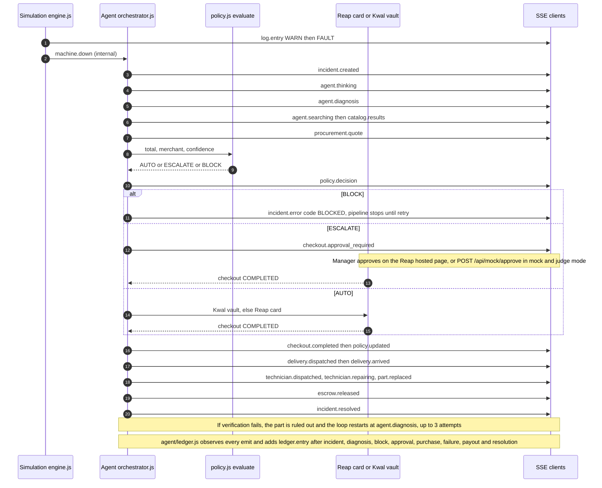
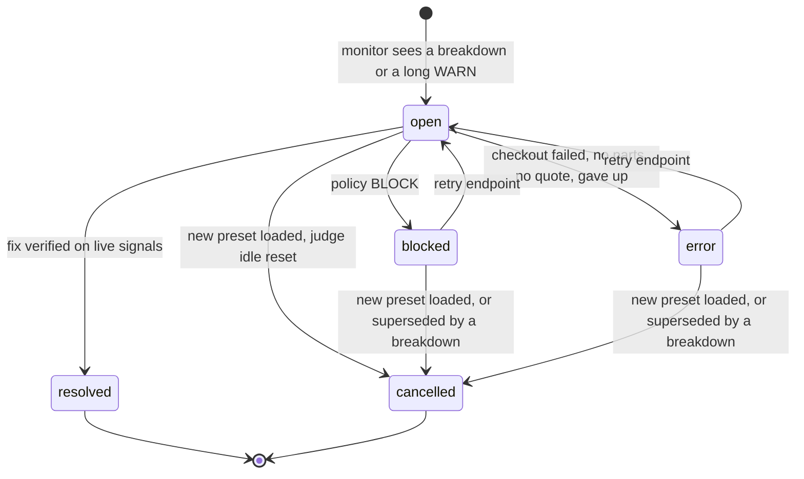

# API reference: HTTP + Server-Sent Events

One Node process, [`server/src/index.js`](../server/src/index.js) (Express 4), serves the whole backend. It exposes **22 routes under `/api`**: 21 JSON routes and 1 Server-Sent Events stream that carries **28 event types** (27 declared in `EVENTS` plus the server-only `ledger.cleared`). The browser game in `game/src` is only a client of this API. Everything it draws comes from these routes and events, so anything the game does can also be done from a terminal with `curl` ([walkthrough below](#drive-a-scenario-from-the-terminal)).

> **Source of truth.** Event names and payload shapes are declared once in [`shared/contract.js`](../shared/contract.js) (`EVENTS`, `LOG_LEVELS`, the treasury comment and the `LEDGER` section), and both the server and the game import that file. Where this page and the code disagree, the code wins. All example payloads below were **captured from a real run** of this server on 9 Oct 2026 in offline mode (`MOCK_REAP=1 MOCK_AI=1`). In that mode the catalog is the on-disk cache of live Reap search results and the decision provider is `mock`. Long arrays are trimmed.

Related docs: [README](../README.md) · [ARCHITECTURE.md](ARCHITECTURE.md) · [AGENT.md](AGENT.md) · [PAYMENTS.md](PAYMENTS.md) · [SIMULATION.md](SIMULATION.md) · [JUDGING.md](JUDGING.md)

---

## Contents

1. [What this API guarantees](#what-this-api-guarantees)
2. [Conventions](#conventions)
3. [Run modes and how they change the API](#run-modes-and-how-they-change-the-api)
4. [Route index](#route-index)
5. [Routes in detail](#routes-in-detail)
6. [The `STATE` payload](#the-state-payload)
7. [Server-Sent Events](#server-sent-events)
8. [Event catalogue](#event-catalogue)
9. [Payload examples for the key events](#payload-examples-for-the-key-events)
10. [Shared data shapes](#shared-data-shapes)
11. [Errors](#errors)
12. [Drive a scenario from the terminal](#drive-a-scenario-from-the-terminal)
13. [Where each thing lives in the code](#where-each-thing-lives-in-the-code)

---

## What this API guarantees

These four properties follow from how the routes are wired. Each can be checked in the linked code.

| # | Property | Why it holds |
|---|---|---|
| 1 | **No route spends money directly.** No endpoint calls a checkout or an onchain transfer. A purchase or payout can only start inside an incident's pipeline, and that pipeline always passes through `evaluate()` first. | Checkouts start only in `pay()`, `payDemo()` and `payFromVault()`, and payouts only in `payTechnician()`. All four live in [`agent/orchestrator.js`](../server/src/agent/orchestrator.js) and are called from `run()` after `evaluate()` in [`agent/policy.js`](../server/src/agent/policy.js). None is exported to `index.js`. |
| 2 | **Spending authority is plain code, never the model.** `evaluate({ total, merchant, confidence })` returns `AUTO`, `ESCALATE` or `BLOCK`. The model only supplies `confidence`. | [`agent/policy.js`](../server/src/agent/policy.js), `evaluate()`. The header comment reads: "HARD spending limits. Plain code, never a model." |
| 3 | **The manager controls spending through three routes:** set limits (`PUT /api/policy`), approve or reject an escalated order (Reap's hosted page when live, `POST /api/mock/approve/:checkoutId` in mock and judge mode), and resume a stopped job (`POST /api/incidents/:id/retry`). Loading a scenario (`POST /api/sim/preset`) also resets the policy to that scenario's starting values. | [Route index](#route-index). No route creates incidents: the monitor opens them from simulated sensor data (`startMonitor()` in `orchestrator.js`). |
| 4 | **Every step is observable and money events are kept.** Each pipeline step emits an SSE event. Every purchase, approval, block, payout and diagnosis also becomes a persisted ledger entry, served by `GET /api/ledger`. | `emit()` in [`events.js`](../server/src/events.js). `observe()` in [`agent/ledger.js`](../server/src/agent/ledger.js) listens through `onEmit()` and writes `server/.cache/ledger.json`. |

---

## Conventions

| Topic | Behaviour | Code |
|---|---|---|
| Base URL | `http://localhost:8787` (`PORT`, default `8787`). In development the Vite game on `:5173` proxies `/api` to `:8787`. In production (the live demo, link in the README) one service serves both the API and the built game. | [`config.js`](../server/src/config.js) `port`; [`game/vite.config.js`](../game/vite.config.js) `proxy` |
| Format | JSON request and response bodies. Request bodies are capped at 1 MB. Send `Content-Type: application/json` on POST and PUT. | `express.json({ limit: '1mb' })` in `index.js` |
| Errors | Always JSON: `{ "error": string, "code"?: string, ... }`, including malformed JSON (`400 Invalid JSON body`) and unknown `/api` paths (`404 No route GET /api/...`). No `/api` route returns Express's HTML error page. | Error middleware and the `/api` 404 handler at the end of `index.js` |
| Auth | **None.** The server holds one shared factory, so every viewer sees and controls the same simulation, and loading a scenario resets it for everyone. Public judge mode limits what a visitor can trigger: checkouts are simulated, onchain payouts are tiny and capped (the `render.yaml` settings), and an idle factory resets itself ([run modes](#run-modes-and-how-they-change-the-api)). | Module-level state in `sim/engine.js`, `agent/orchestrator.js` and `agent/policy.js` |
| Time | `at` in events is epoch milliseconds (`Date.now()`). `t` is game minutes since the shift started, and `clock` is the in-game `HH:MM` (the shift starts at `08:00`). Ledger `at` is an ISO 8601 string. | `emit()` in `events.js`; `clockAt()` in `sim/engine.js` |
| Game speed | One real second moves the game clock forward by `speed` minutes (1, 2, 4 or 8). The clock is held (`sim.held: true`) while the agent works in real time: model calls, store quotes, payment and the manager's approval. | `TICK_MS = 1000` and `hold()` in `sim/engine.js` |
| Money | USD as decimal numbers (`21.24`). The Kwal rail and technician payouts use USDC numbers with up to 6 decimals. | `quoteParts()` in `reap/purchase.js`; `lockEscrow()` in `agent/technicians.js` |
| Identifiers | Machines: `conveyor`, `sorter`, `arm`, `packer`. Part ids such as `prox-sensor` and `arm-psu` are listed in `MACHINES` in `shared/contract.js`. Incident ids look like `inc_4c3a3d`, escrow ids `esc_60f5f91c`, ledger ids `led_<time>_<seq>`. | `shared/contract.js`; `startIncident()`; `lockEscrow()`; `add()` in `ledger.js` |

---

## Run modes and how they change the API

The route list is the same in every mode. What changes is what sits behind the payment steps. `GET /api/health` reports the active mode.

| | **Live** | **Mock (offline)** | **Judge** (public demo) |
|---|---|---|---|
| Enabled by | `REAP_API_KEY`, `OPENAI_API_KEY`, optionally `TREASURY_PRIVATE_KEY` | `MOCK_REAP=1` / `MOCK_AI=1`, or the key is missing | `JUDGE_MODE=1` (set in [`render.yaml`](../render.yaml)) |
| Catalog search | Live Reap search, cached for 10 min in memory and on disk | `server/.cache/catalog.json` (cached live results) plus `catalog/fallback.js` | Live Reap search |
| Quotes | Live Reap quotes | `reap/mock.js`: Standard $6 or Express $18 shipping, 8% tax | Live Reap quotes |
| Diagnosis provider | `openai-decisions` (`gpt-6-luna`), with `gpt-structured` as fallback | `mock`, which returns the heuristic prior | Live when `OPENAI_API_KEY` is set |
| Checkout, `AUTO` | Kwal USDC vault first, then the Reap card (`X-Simulate-Checkout: COMPLETED`) | Mock checkout completes in about 1.5 s | Simulated by `payDemo()` after a short pause (1.2 s at 1×, scaled by 1/√speed), order id `DEMO-xxxxx` |
| Checkout, `ESCALATE` | Manager approves on **Reap's hosted page** (`approvalUrl`). The server polls every 2.5 s for up to 10 min. | Waits for `POST /api/mock/approve/:checkoutId` | Waits for `POST /api/mock/approve/:checkoutId` (`approvalUrl: null`, `demo: true`) |
| Technician payout | Real USDC transfer on Ink Sepolia (chain 763373) | Simulated (`chainActive()` is false under `MOCK_REAP`) | Real USDC but tiny: `TECH_PAYOUT_SCALE=0.0001`, so a $120 job pays 0.012 USDC. Capped at `ONCHAIN_MAX_PAYOUTS=200`, after which payouts are simulated. |
| `POST /api/mock/approve/:id` | `400 Only available in mock or judge mode` | Enabled | Enabled |
| Idle reset | No | No | After 10 min with no requests and no open SSE stream: back to `first-failure`, paused (`JUDGE_IDLE_MS` overrides) |

Live-sandbox caveat: Reap's sandbox returns `REQUIRES_ACTION` with a hosted-page URL **even for simulated checkouts** (verified 9 Oct 2026). `pay()` emits `checkout.approval_required` whenever Reap returns that URL, so in live mode the manager can be asked to tap once even for an `AUTO` order. Public visitors cannot complete that step, so judge mode simulates the checkout. See [PAYMENTS.md](PAYMENTS.md).

---

## Route index

Line numbers refer to [`server/src/index.js`](../server/src/index.js).

| Method | Path | Purpose | Side effects / events | Handler |
|---|---|---|---|---|
| GET | `/api/events` | SSE stream. The first message is the full `STATE`. | — | [L80](../server/src/index.js#L80) → `sseHandler` |
| GET | `/api/state` | Full snapshot, the same object as the SSE `state` event | — | [L81](../server/src/index.js#L81) |
| GET | `/api/health` | Liveness + run mode (Render health check) | Not counted as activity for the judge-mode idle reset | [L82](../server/src/index.js#L82) |
| GET | `/api/treasury` | Onchain treasury + Kwal vault. `?refresh=1` reads the chain now. | `treasury.updated` on refresh | [L86](../server/src/index.js#L86) |
| POST | `/api/sim/preset` | Load a scenario, which resets the factory, policy and incidents | `incident.cancelled`, `log.entry`, `sim.preset`, `policy.updated` | [L106](../server/src/index.js#L106) |
| POST | `/api/sim/speed` | Set speed 1, 2, 4 or 8 and resume | next `sim.tick` | [L114](../server/src/index.js#L114) |
| POST | `/api/sim/pause` | Pause the game clock (the agent freezes too) | next `sim.tick` has `paused: true` | [L122](../server/src/index.js#L122) |
| POST | `/api/sim/resume` | Resume | — | [L127](../server/src/index.js#L127) |
| POST | `/api/sim/fault` | Chaos: break a part. Writes no log line; only symptoms show. | Later: `log.entry` WARN/FAULT, then an incident | [L133](../server/src/index.js#L133) |
| GET | `/api/sim/history/:machineId` | Last ≤ 120 per-game-minute sensor samples | — | [L146](../server/src/index.js#L146) |
| GET | `/api/sim/logs` | Plant log with filters | — | [L152](../server/src/index.js#L152) |
| GET | `/api/incidents` | All incidents of the current shift | — | [L161](../server/src/index.js#L161) |
| POST | `/api/incidents/:id/retry` | Re-run an `error` or `blocked` incident | Pipeline events from `diagnosing` on | [L162](../server/src/index.js#L162) |
| GET | `/api/policy` | Current spending policy | — | [L171](../server/src/index.js#L171) |
| PUT | `/api/policy` | Manager's Desk edit (partial patch) | `policy.updated` | [L172](../server/src/index.js#L172) |
| GET | `/api/catalog` | Best live listing for each of the 15 parts | — | [L198](../server/src/index.js#L198) |
| POST | `/api/catalog/refresh` | Rebuild the catalog in the background | `catalog.updated` (×6) | [L199](../server/src/index.js#L199) |
| GET | `/api/catalog/search` | Raw offer search (`q`, `merchant`) | — | [L204](../server/src/index.js#L204) |
| GET | `/api/catalog/replacement/:machineId/:componentId` | What the agent would buy right now | With `?model=1`, one decision-model call | [L212](../server/src/index.js#L212) |
| GET | `/api/ledger` | Manager dashboard history + totals (all scenarios) | — | [L223](../server/src/index.js#L223) |
| POST | `/api/ledger/clear` | Wipe the ledger | Persists an empty ledger, emits `ledger.cleared` | [L224](../server/src/index.js#L224) |
| POST | `/api/mock/approve/:checkoutId` | Mock and judge mode stand-in for Reap's approval page | Unblocks the waiting checkout | [L231](../server/src/index.js#L231) |
| ANY | `/api/*` (anything else) | JSON 404 | — | [L239](../server/src/index.js#L239) |
| GET | `*` (non-API) | Built game (`game/dist`) with SPA fallback, when it exists | — | [L242](../server/src/index.js#L242) |

There is deliberately **no `POST /api/incidents`**. Incidents are opened only by the monitor, which reacts to `machine.down` (breakdowns) or to parts that stay in WARN for ≥ 3 game minutes when `predictiveMaintenance` is on. See `onMachineDown()` and `checkWarnings()` in `orchestrator.js`.

---

## Routes in detail

### System

#### `GET /api/health`

```json
{ "ok": true, "mockReap": true, "mockAi": true, "enrolled": true, "onchain": false, "kwal": false, "judge": false }
```

| Field | Meaning | Source |
|---|---|---|
| `mockReap` | Reap calls are served by `reap/mock.js` | `config.mockReap` |
| `mockAi` | Decisions come from the offline mock | `config.mockAi` |
| `enrolled` | A card is on file (`REAP_ENROLLMENT_ID`), or no card is needed (mock or judge mode) | `mode()` in `index.js` |
| `onchain` | Technician payouts are real USDC transfers | `chainActive()` in `chain/treasury.js` |
| `kwal` | The Kwal vault rail is active. It is off in mock and judge mode and with `KWAL=0`. | `kwalRailEnabled()` in `kwal/rail.js` |
| `judge` | Judge mode: checkout simulated, approve and reject buttons shown | `config.judge` |

#### `GET /api/state`

Returns the [`STATE` payload](#the-state-payload). Clients call it once on load (`director.js` does) or rely on the first SSE message.

#### `GET /api/treasury`

Returns the [treasury object](#treasury). Add `?refresh=1` to read balances from the chain now. That call also emits `treasury.updated`, and if the read fails the last known state is returned. Without it you get the cached state. The cache is refreshed every 20 s (`TREASURY_POLL_MS`) and after every payout, with a second read about 6 s later (`refreshAfterPayout()`).

### Simulation

#### `POST /api/sim/preset`

Body: `{ "id": "first-failure" | "brownout" | "predictive" | "budget-crunch" | "untrusted" | "sandbox" }`

Effects, in order (`loadPreset()` in `index.js`):

1. `resetIncidents()` cancels every active incident (`incident.cancelled`, aborts in-flight work) and clears the board.
2. `resetPolicy(preset.policy)` restores the defaults, then applies the preset's overrides, **including `spent`**.
3. `sim.loadPreset(id)` resets the clock to `08:00`, speed to 1× and paused to `false`, writes the `SHIFT` log line, and emits `sim.preset`.
4. Emits `policy.updated`.

```json
{ "ok": true, "preset": { "id": "first-failure", "name": "Sensor burnout",
  "tagline": "One cheap part dies. Watch the agent fix it alone.",
  "teaches": "Auto-approve: a $15 sensor is under the limit, so Wrench-bot buys it without asking." } }
```

Error: `400 {"error":"Unknown preset \"nope\"","presets":["first-failure","brownout","predictive","budget-crunch","untrusted","sandbox"]}`

The six presets and what each one shows are in `PRESETS` in [`shared/contract.js`](../shared/contract.js) and in [SIMULATION.md](SIMULATION.md).

#### `POST /api/sim/speed`

Body: `{ "speed": 1 | 2 | 4 | 8 }`. Sets the speed **and resumes**. Response: `{ "ok": true, "speed": 8, "paused": false }`.
Error: `400 {"error":"speed must be one of 1, 2, 4, 8"}`.

#### `POST /api/sim/pause` · `POST /api/sim/resume`

No body. Responses: `{ "ok": true, "paused": true }` and `{ "ok": true, "paused": false }`. While paused, `sim.tick` still arrives once per second with `t` frozen, and the agent's pipeline waits at its next step boundary (`ctx.step()` in `orchestrator.js`).

#### `POST /api/sim/fault`

Chaos tool. Body: `{ "machineId": "arm", "componentId": "arm-psu", "mode": "sudden" | "gradual" }`. `mode` defaults to `sudden`.

- `sudden` sets the part's hidden health to 0. `gradual` ramps it to 0 over 12 game minutes (`GRADUAL_FAULT_MIN`), so WARN lines show first.
- **No log line is written.** The plant only shows symptoms (signals → WARN/FAULT → `machine.down`), and the monitor opens the incident.

Response: `{ "ok": true, "machineId": "arm", "componentId": "arm-psu", "mode": "gradual" }`

| Status | Body | When |
|---|---|---|
| 400 | `{"error":"Unknown machine \"oven\""}` | bad `machineId` |
| 400 | `{"error":"Unknown part \"x\" on the Robot Arm"}` | bad `componentId` |
| 400 | `{"error":"mode must be \"sudden\" or \"gradual\""}` | bad `mode` |
| 409 | `{"error":"One failure at a time: wait until the current repair is finished.","code":"BUSY"}` | A machine is down or in maintenance, a part is faulted or degrading, or an incident is open (`busy()` in `sim/engine.js`) |

#### `GET /api/sim/history/:machineId`

Up to 120 samples (`MAX_HISTORY`), one per simulated game minute, oldest first. These are readings only; hidden health is never exposed.

```json
[ { "t": 132, "readings": { "gripper-servo": { "posError": 0.39, "servoTemp": 42 }, "arm-psu": { "railVoltage": 24.11, "ripple": 38 },
                             "estop": { "safetyLoop": 99 }, "arm-driver": { "armDriverTemp": 41, "jointSpeed": 100 } } } ]
```

Error: `404 {"error":"unknown machine"}`.

#### `GET /api/sim/logs?machineId=&limit=&minLevel=`

| Query | Default | Rule |
|---|---|---|
| `machineId` | all machines | unknown → `404 {"error":"unknown machine"}` |
| `limit` | 100 | clamped to 1..500 (the engine keeps the last 500 lines, `MAX_LOGS`) |
| `minLevel` | none | one of `INFO`, `AGENT`, `WARN`, `ERROR`, `FAULT` (`LOG_LEVELS`). Unknown values are ignored. |

```bash
curl -s "localhost:8787/api/sim/logs?machineId=arm&limit=3&minLevel=WARN"
```

```json
[ { "id": 137, "t": 15, "clock": "08:15", "level": "ERROR", "machineId": "arm", "componentId": null, "code": "M-DOWN", "message": "Robot Arm down after maintenance: E-ARM-310" },
  { "id": 154, "t": 23, "clock": "08:23", "level": "WARN",  "machineId": "arm", "componentId": "arm-psu",    "code": "W-ARM-301", "message": "24V rail 20.57 V, steady for 15 min" },
  { "id": 155, "t": 24, "clock": "08:24", "level": "WARN",  "machineId": "arm", "componentId": "arm-driver", "code": "W-ARM-320", "message": "Joint speed 66%, steady for 15 min" } ]
```

### Incidents

#### `GET /api/incidents`

An array of [Incident](#incident) objects for the current shift. Loading a preset clears it.

#### `POST /api/incidents/:id/retry`

Restarts an incident whose `status` is `error` or `blocked`, typically after the manager has changed the policy. It sets `status` back to `open`, resets `attempts`, clears `error`, clears `ruledOut` if every part had been ruled out, then relaunches the pipeline. **The policy is evaluated again on retry**, so a store the manager has just trusted is no longer blocked. See `retryIncident()` in `orchestrator.js`.

Response: the incident, already relaunched:

```json
{ "id": "inc_e33a1e", "kind": "breakdown", "machineId": "sorter", "title": "Sorter down: E-SRT-220 Diverter relay not switching",
  "codes": ["E-SRT-220"], "componentIds": ["relay-board"], "status": "open", "step": "diagnosing", "attempts": 1,
  "spent": 0, "startedAt": 20, "endedAt": null, "downtimeMin": 88, "ruledOut": [], "error": null }
```

| Status | Body |
|---|---|
| 409 | `{"error":"Unknown incident inc_zzz"}` |
| 409 | `{"error":"Incident is resolved"}` (also `open` or `cancelled`) |

### Policy (Manager's Desk)

#### `GET /api/policy`

```json
{ "autoApproveLimit": 60, "monthlyBudget": 1000, "spent": 0, "confidenceThreshold": 0.75,
  "allowedMerchants": ["Switch Electronics", "Digitmakers.ca", "Tech For Less"],
  "expressForCriticalOnly": true, "predictiveMaintenance": false, "remaining": 1000 }
```

| Field | Type | Default | Used by |
|---|---|---|---|
| `autoApproveLimit` | USD ≥ 0 | 60 | `evaluate()`: above it → `ESCALATE` |
| `monthlyBudget` | USD ≥ 0 | 1000 | `evaluate()`: `total > monthlyBudget − spent` → `ESCALATE` |
| `spent` | USD, **read-only via API** | 0 (presets can seed it, e.g. 112 in `budget-crunch`) | `recordSpend()` after each completed checkout |
| `confidenceThreshold` | 0..1 | 0.75 | `evaluate()`: `confidence < threshold` → `ESCALATE` |
| `allowedMerchants` | string[] | 3 stores | `evaluate()`: store not listed → `BLOCK` |
| `expressForCriticalOnly` | boolean | `true` | `wantsExpress()`: express shipping only for critical machines that are down |
| `predictiveMaintenance` | boolean | `false` | Monitor opens `predictive` incidents for parts in WARN ≥ 3 game minutes |
| `remaining` | derived | — | `max(0, monthlyBudget − spent)` |

#### `PUT /api/policy`

Partial patch. Only the six editable keys are applied: `autoApproveLimit`, `monthlyBudget`, `confidenceThreshold`, `allowedMerchants`, `expressForCriticalOnly`, `predictiveMaintenance` (`EDITABLE` in `policy.js`). **Unknown keys and invalid values are silently ignored, and the response always returns `200` with the resulting policy.** Normalisation rules (`clean()`):

- Numbers must be finite and ≥ 0. `confidenceThreshold` is clamped to 0..1, so `2` becomes `1`.
- Booleans accept `true`/`false` or the strings `"true"`/`"false"`.
- `allowedMerchants` must be an array. Non-strings are dropped, entries are trimmed, empties dropped and duplicates removed.
- `spent` cannot be set through the API. Only a preset can seed it.

Emits `policy.updated { policy }`.

```bash
curl -s -X PUT localhost:8787/api/policy -H 'Content-Type: application/json' -d '{"monthlyBudget":500,"bogus":1,"confidenceThreshold":2}'
# → {"autoApproveLimit":60,"monthlyBudget":500,"spent":181.69,"confidenceThreshold":1, ... ,"remaining":318.31}
```

### Catalog

#### `GET /api/catalog`

The warm catalog holds the best usable listing for each of the 15 parts. It is built at boot by `warmCatalog()` and rebuilt by `POST /api/catalog/refresh`.

```json
{ "warming": false, "updatedAt": "2026-10-09T11:42:01.153Z",
  "machines": [ { "id": "sorter", "name": "Sorter", "components": [
    { "id": "prox-sensor", "name": "Inductive proximity sensor", "qty": 1, "status": "ok", "optionCount": 5, "source": "offline",
      "best": { "productId": "prd_0a85565ceecf466db2ac719299f2b45f", "variantId": "var_049ece969d544c12a15925140749c33e",
                "name": "Auto-Leveling NPN Inductive Approach Proximity Sensor Switch PS-05N", "merchant": "Digitmakers.ca",
                "price": 3, "currency": "USD", "image": "https://cdn.shopify.com/...", "available": true, "qty": 1 } } ] } ] }
```

Component `status` is `pending` (not searched yet), `ok`, or `none` (no usable listing). `source` is `live`, `offline`, `fallback` or `none`.

#### `POST /api/catalog/refresh`

Returns `{ "ok": true }` at once. The rebuild runs in the background and emits `catalog.updated { catalog }` when it starts, after each of the 4 machines, and when it finishes. A refresh requested while one is already running is a no-op.

#### `GET /api/catalog/search?q=&merchant=`

Raw normalised offers. Live mode calls Reap product search with `availability: AVAILABLE_ONLY` and limit 20. Results are cached for 10 minutes in memory and also on disk. If the live search fails, the server answers from the disk cache, then from the offline index (`searchOffers()` in `catalog/catalog.js`).

**Known gap in `merchant`:** `searchOffers()` builds a `merchantPreference: { mode: 'ONLY', merchantName }` option, but `reapLive.search()` in `reap/client.js` forwards only `filters`, so in live mode the store filter never reaches Reap and results from every store come back (the cache key still includes the store). The offline index does filter by store.

```bash
curl -s "localhost:8787/api/catalog/search?q=relay&merchant=Switch%20Electronics" | jq '.[0]'
```

```json
{ "productId": "prd_01bf7eb3696e4a7f9eec2e11e821c36f", "variantId": "var_3c749997f2154af88103a1a7444aaeb8",
  "name": "24V 1-Channel Relay Board Module", "merchant": "Switch Electronics", "price": 1.96, "currency": "USD",
  "image": "https://cdn.shopify.com/...", "available": true }
```

A failed upstream search is not an error here: the route falls back to the disk cache and then to the offline index, which can return `[]`. `500 { error, code }` is returned only if something unexpected throws.

#### `GET /api/catalog/replacement/:machineId/:componentId?model=1`

Runs exactly what the agent runs in its sourcing step (`findReplacement()`): search, filter by spec keywords and `maxPrice`, rank (trusted-store bonus, price penalty), shortlist ≤ 5. With `model=1`, the decision model picks from the shortlist. Without it, the top heuristic match is used.

```json
{ "component": { "id": "barcode-scanner", "name": "Barcode scanner", "query": "barcode scanner", "maxPrice": 400, "qty": 1, "...": "full MACHINES entry" },
  "query": "barcode scanner",
  "offers": [ { "productId": "prd_eb55e93e…", "merchant": "bashfashion", "price": 63, "qty": 1, "...": "offer fields" } ],
  "chosen": { "productId": "prd_eb55e93e…", "merchant": "bashfashion", "price": 63, "qty": 1 },
  "probabilities": { "prd_eb55e93e…": 1, "prd_ed568afb…": 0 },
  "confidence": 1, "provider": "heuristic", "source": "offline" }
```

`probabilities` is keyed by `productId`. Without `model=1` the heuristic picks the top-ranked listing, so it gets probability 1 and `confidence: 1`. With `model=1`, or inside an incident, the decision model spreads probability across the shortlist. In the captured incident on this part, the `mock` provider gave the top listing 0.8095 and each of the other four 0.0476. `source` is `live`, `offline`, `fallback` (verified fallback listing from `catalog/fallback.js`) or `none` (`chosen: null`). Errors: `404 {"error":"unknown part"}`, `500 { error, code }`.

### Ledger (manager dashboard)

The ledger records every purchase, payout, approval request, block, failure and diagnosis **across scenarios and server restarts**. It is built by observing emitted events, so the agent pipeline does not know it exists (`agent/ledger.js`). It is persisted to `server/.cache/ledger.json` (`LEDGER_FILE` overrides the path), written at most once per second through a temp file and rename (`persist()`), and capped at 1,000 entries (`MAX_ENTRIES`).

#### `GET /api/ledger`

```jsonc
{ "entries": [ /* LedgerEntry, oldest first, newest last, ≤ 1000 */ ],
  "totals": { "partsSpend": 287.88, "laborUsd": 670, "laborUsdc": 6.7, "orders": 6, "autoApproved": 1, "managerApproved": 5,
              "blocked": 1, "failed": 1, "incidents": 6, "resolved": 5, "avgMinutesToFix": 64 } }
```

`totals` is recomputed from all entries on every call (`totals()` in `ledger.js`). Entry shape: [LedgerEntry](#ledgerentry). `STATE.ledger` carries the same object but with only the last 200 entries.

#### `POST /api/ledger/clear`

Response: `{ "ok": true, "entries": [], "totals": { "partsSpend": 0, ..., "avgMinutesToFix": null } }`. It also emits `ledger.cleared {}` so that dashboards open in other tabs empty their list (`director.js` handles it).

### Approvals in mock and judge mode

#### `POST /api/mock/approve/:checkoutId`

This route stands in for Reap's hosted approval page when no human can tap it: offline development (`MOCK_REAP`) and the public judge demo (`JUDGE_MODE`). Body: `{ "approve": true | false }`. **Only a literal `false` rejects.** A missing body approves.

| Mode | Behaviour | Response |
|---|---|---|
| Judge | Resolves the waiting demo checkout (`approveDemo()` in `orchestrator.js`) | `{ "id": "chk_demo_36048eae", "status": "PROCESSING" \| "EXPIRED", "demo": true }` |
| Mock | Moves the mock checkout to `PROCESSING` (then `COMPLETED` about 1.5 s later) or `EXPIRED` (`reapMock.approve()`) | the mock checkout object |
| Live | Not available | `400 {"error":"Only available in mock or judge mode"}` |

Unknown id (and, in judge mode, a checkout that was already answered): `404 {"error":"unknown checkout"}`. A rejection leads to `checkout.failed { status: "EXPIRED" }` and then `incident.error { code: "CHECKOUT_EXPIRED" }`. If nobody answers within 10 minutes of real time (`APPROVAL_TIMEOUT_MS`), the result is `CHECKOUT_TIMEOUT`.

---

## The `STATE` payload

`GET /api/state` and the first SSE message (`type: "state"`) carry the same object, built by `state()` in `index.js`:

| Key | Type | Content |
|---|---|---|
| `sim` | object | [Sim snapshot](#sim-snapshot) |
| `presets` | array (6) | `{ id, name, tagline, teaches }` per scenario |
| `machines` | array (4) | `MACHINES` from `shared/contract.js`: parts, signals with nominal/warn/fail thresholds, fault codes, effects, catalog queries |
| `technicians` | array (3) | `{ id, name, skills, rating, rate, color }`: Ana $120, Raj $110, Mei $100 (`TECHNICIANS`) |
| `policy` | object | [Policy](#get-apipolicy), including `remaining` |
| `incidents` | array | [Incident](#incident) objects, current shift |
| `logs` | array (≤ 200) | Last 200 plant-log lines, same shape as `log.entry.data.entry` |
| `catalog` | object | Same as `GET /api/catalog` |
| `mode` | object | Same fields as `GET /api/health` minus `ok` |
| `merchants` | string[] | Sorted union of the default and current allowed stores, every store with a usable listing in the catalog, and every store that appeared in the agent's search results (`merchants()` in `index.js`). The Manager's Desk store picker uses this list. |
| `treasury` | object | [Treasury](#treasury) |
| `ledger` | object | `{ entries (last 200), totals }` |

### Sim snapshot

Sent as `STATE.sim`, in every `sim.tick` and in `sim.preset`. Built by `snapshot()` in `sim/engine.js`. Captured during Brownout, while the arm was down and the agent was working (`held: true`):

```jsonc
{
  "t": 6, "clock": "08:06", "speed": 8, "paused": false,
  "held": true,                         // game clock held while Wrench-bot works in real time
  "preset": { "id": "brownout", "name": "Brownout" },
  "lineRunning": false,                 // false if ANY machine is not running
  "machines": {
    "arm": {
      "status": "down",                 // running | down | maintenance
      "degraded": false,                // some part in WARN while the machine still runs
      "activeCodes": ["E-ARM-310"],
      "components": {
        "gripper-servo": { "status": "fault", "readings": { "posError": 5, "servoTemp": 42 } },
        "arm-psu":       { "status": "warn",  "readings": { "railVoltage": 21.16, "ripple": 295 } },
        "estop":         { "status": "ok",    "readings": { "safetyLoop": 100 } },
        "arm-driver":    { "status": "warn",  "readings": { "armDriverTemp": 41, "jointSpeed": 75 } }
      }
    }
    // "conveyor", "sorter", "packer": same shape (omitted)
  },
  "kpis": { "unitsProduced": 72, "revenue": 360, "downtimeCost": 0, "partsSpend": 0, "laborSpend": 0, "uptimePct": 100, "incidentsResolved": 0 }
}
```

This snapshot shows the diagnosis problem the agent has to solve. The **servo** throws the FAULT code (`E-ARM-310`), but the **power supply** is the part failing: its rail is at 21.16 V against 24.1 V nominal and its ripple is at 295 mV. Hidden part health never leaves `sim/engine.js`. Clients and the model see readings, statuses and log lines only. See [SIMULATION.md](SIMULATION.md).

---

## Server-Sent Events

### Wire format

```
GET /api/events
Content-Type: text/event-stream
Cache-Control: no-cache
Connection: keep-alive

data: {"type":"state","data":{...STATE...},"at":1791546131000}

data: {"type":"sim.tick","data":{"sim":{...}},"at":1791546132000}

: ping
```

- Every event is a single `data:` line holding the JSON envelope, followed by a blank line (`write()` in `events.js`).
- **There is no SSE `event:` field.** Listen with `onmessage` and switch on `evt.type`. `addEventListener('sim.tick', …)` will never fire.
- On connect the server immediately sends one `state` message with the full snapshot. There are no event ids and no `Last-Event-ID` replay. A reconnecting client gets a fresh `state` instead, which is everything it needs to rebuild.
- A `: ping` comment is sent every 15 s to keep proxies from closing the stream.
- `sim.tick` arrives every second (`TICK_MS = 1000`), **also while paused**.
- An open stream counts as activity for the judge-mode idle reset (`clientCount()`).

### Envelope

```ts
{ type: string,          // one of EVENTS in shared/contract.js, or 'ledger.cleared'
  incidentId?: string,   // set on every event that belongs to an incident
  data: object,          // payload, see the catalogue
  at: number }           // epoch ms
```

### Minimal clients

Browser (the same pattern as `connectEvents()` in [`game/src/net.js`](../game/src/net.js)):

```js
const es = new EventSource('/api/events');
es.onmessage = (m) => {
  const evt = JSON.parse(m.data);               // { type, incidentId, data, at }
  if (evt.type === 'state') renderAll(evt.data);
  else if (evt.type === 'policy.decision') showVerdict(evt.incidentId, evt.data);
};
```

Terminal (drops the 1 Hz noise):

```bash
curl -sN localhost:8787/api/events \
  | grep --line-buffered '^data: ' \
  | jq -c --unbuffered -R 'ltrimstr("data: ") | fromjson
        | select(.type != "sim.tick" and .type != "log.entry")
        | {type, incidentId, data}'
```

### One incident, end to end

The order in which events arrive for one breakdown. Each arrow is a real `emit()` in `orchestrator.js`, except where marked as coming from the simulation, the policy module or the ledger.



Incident `status` transitions (`startIncident()`, `fail()`, `resolve()`, `cancel()`, `retryIncident()`):



`step` moves through `diagnosing → sourcing → quoting → approval → shipping → repairing → verifying → done`.

---

## Event catalogue

All 27 types in `EVENTS` ([`shared/contract.js`](../shared/contract.js)) plus `ledger.cleared`, which `index.js` emits as a plain string. Unless another file is named, the emitter is in `server/src/agent/orchestrator.js`.

| `type` | When | Emitted by | `data` |
|---|---|---|---|
| `state` | Once, on SSE connect | `sseHandler()` in `events.js` | Full [`STATE`](#the-state-payload) |
| `sim.tick` | Every 1 s, also while paused | `step()` in `sim/engine.js` | `{ sim }` [snapshot](#sim-snapshot) |
| `sim.preset` | A preset was loaded (factory reset) | `loadPreset()` in `sim/engine.js` | `{ preset: { id, name, tagline, teaches }, sim }` |
| `log.entry` | Every plant-log line (sim and agent) | `addLog()` in `sim/engine.js` | `{ entry: { id, t, clock, level, machineId, componentId, code, message } }` |
| `catalog.updated` | Catalog warm-up start, per machine, end | `warm()` in `index.js` → `warmCatalog()` | `{ catalog }` |
| `incident.created` | Monitor opens a job | `startIncident()` | `{ incident }` |
| `incident.cancelled` | Job aborted (a new preset was loaded, or a new breakdown replaced a `blocked`/`error` job on the same machine) | `cancel()` | `{}` |
| `agent.thinking` | Speech-bubble text for the robot | `ctx.think()` | `{ text }` |
| `agent.diagnosis` | Root cause chosen | `diagnose()` | `{ componentId, component, probabilities, prior, confidence, provider, attempt, evidence[], explanation }` |
| `agent.searching` | Catalog search starts | `searchCatalog()` | `{ query, part }` |
| `catalog.results` | Shortlist + chosen listing | `searchCatalog()` | `{ part: { id, name, qty }, query, offers[], chosen, probabilities, confidence, provider, source }` |
| `procurement.quote` | A store priced the order | `quoteWithFallback()` | `{ quote }` ([Quote](#quote)) |
| `policy.decision` | Spending verdict | `run()` → `evaluate()` | `{ action: 'AUTO'\|'ESCALATE'\|'BLOCK', reasons[], total, confidence }` |
| `checkout.approval_required` | Manager must approve | `pay()` / `payDemo()` | `{ checkoutId, approvalUrl, total, reasons[], demo? }` |
| `checkout.completed` | Order placed and paid | `pay()` / `payDemo()` / `payFromVault()` | `{ checkoutId, orderId, finalAmount: { amount, currency }, rail: 'reap'\|'kwal', merchant?, demo? }` |
| `checkout.failed` | Rejected, expired, failed or timed out | `pay()` / `payDemo()` | `{ checkoutId, status: 'EXPIRED'\|'FAILED'\|'TIMEOUT', reason, demo? }` |
| `delivery.dispatched` | Shipping started | `deliver()` | `{ etaMinutes: 3\|6, shipping: { name, amount } }` |
| `delivery.arrived` | Part at the dock | `deliver()` | `{}` |
| `technician.dispatched` | Technician hired, escrow locked | `repair()` | `{ technician, escrow }` ([Escrow](#escrow), `status: 'LOCKED'`) |
| `technician.repairing` | Machine locked out, swap in progress | `repair()` | `{ minutes: 4, componentId }` |
| `part.replaced` | Swap done | `repair()` | `{ machineId, componentId }` |
| `escrow.released` | Technician paid (onchain or simulated) | `payTechnician()` | `{ escrow }` ([Escrow](#escrow), `status: 'RELEASED'`) |
| `incident.resolved` | Fix verified on live signals | `resolve()` | `{ summary }` ([Resolution summary](#resolution-summary)) |
| `incident.error` | Pipeline stopped | `fail()` | `{ code, message, retryable: true }` ([codes](#incidenterror-codes)) |
| `policy.updated` | Policy changed or money spent | `index.js` (preset, `PUT /api/policy`), `pay*()` after a checkout | `{ policy }` |
| `treasury.updated` | Treasury polled | `refreshTreasury()` in `chain/treasury.js` (every 20 s, after payouts, on `?refresh=1`) | `{ treasury }` ([Treasury](#treasury)) |
| `ledger.entry` | A dashboard row was added | `add()` in `agent/ledger.js` | `{ entry }` ([LedgerEntry](#ledgerentry)) |
| `ledger.cleared` | `POST /api/ledger/clear` (from any tab) | `index.js` (not in `EVENTS`) | `{}`. Open dashboards empty their list. |

---

## Payload examples for the key events

All examples are from the captured offline run. Field order may be rearranged, image URLs and long arrays are trimmed, and some `at` timestamps are omitted.

### `agent.diagnosis`

Brownout, **attempt 2**. Attempt 1 replaced the servo, the fault came back, and the servo was ruled out, so it is missing from `probabilities`:

```json
{ "type": "agent.diagnosis", "incidentId": "inc_574ef4", "at": 1791546268077,
  "data": {
    "componentId": "arm-psu", "component": "24V power supply",
    "probabilities": { "24V power supply": 0.65, "Emergency stop button": 0.099, "Motor driver": 0.251 },
    "prior":         { "24V power supply": 0.65, "Emergency stop button": 0.099, "Motor driver": 0.251 },
    "confidence": 0.65, "provider": "mock", "attempt": 2,
    "evidence": ["WARN W-ARM-301 active 14 min", "24V rail 20.49 V (warn 23.2 V)", "Ripple 353 mV (warn 120 mV)"],
    "explanation": "Not the Gripper servo. Now the 24V power supply looks likeliest (65%): WARN W-ARM-301 active 14 min." } }
```

- `probabilities` is the decision model's answer over the remaining candidates. `prior` is the naive fault-code heuristic from `sim/diagnostics.js`, sent so the UI can show it next to the model's read. The primary provider (`openai-decisions`) is deliberately **not** given the prior (`contextText({ ...req.context, prior: undefined })` in `openaiDecisions()`, `agent/decide.js`), because in the team's live test on 9 Oct 2026 the model copied the prior when it was included in the input (servo at 0.95). The `gpt-structured` fallback does receive the prior, with a system instruction to override it when the signals point elsewhere. In offline mode the `mock` provider returns the prior, which is why the two maps match above.
- `provider` is one of `openai-decisions`, `gpt-structured` or `mock` (`decide()` in `agent/decide.js`).
- In the same live test of the Decisions API on this case, the model given the full context picked the 24V power supply at **0.59**. That is below the 0.75 bar, so the order escalates to the manager. See [AGENT.md](AGENT.md).

### `procurement.quote`

```json
{ "type": "procurement.quote", "incidentId": "inc_4c3a3d", "at": 1791546135057,
  "data": { "quote": {
    "quoteId": "quo_mock_c19af62b", "merchant": "Digitmakers.ca",
    "items": [ { "name": "Auto-Leveling NPN Inductive Approach Proximity Sensor Switch PS-05N", "qty": 1, "image": "https://cdn.shopify.com/...", "price": 3 } ],
    "shipping": { "name": "Express", "amount": 18 },
    "shippingOptions": [ { "id": "ship_mock_287b4b57", "name": "Standard", "amount": 6, "selected": false },
                         { "id": "ship_mock_65422df3", "name": "Express",  "amount": 18, "selected": true } ],
    "subtotal": 3, "tax": 0.24, "total": 21.24, "currency": "USD", "expiresAt": "2026-10-09T11:57:14.556Z" } } }
```

Express was selected because the Sorter is `critical` and was down (`wantsExpress()`). For comparison, live sandbox quotes observed on 9 Oct 2026 included a proximity sensor at $35.68 ($24.98 of it shipping), 2× servo at $93.15, a PoE switch at $64.06 and a stepper at $30.00. If a store cannot fill the order (`QUOTE_UNFULFILLABLE`, `CARD_PAYMENT_UNAVAILABLE`, `AGENTIC_REQUEST_REJECTED`, `CHECKOUT_URL_INVALID`), the agent tries the next listing, up to 3 (`quoteWithFallback()`).

### `policy.decision`

All three outcomes, captured:

```json
{ "type": "policy.decision", "incidentId": "inc_4c3a3d", "data": { "action": "AUTO",
  "reasons": ["Within limits: $21.24 ≤ $60, 81% sure"], "total": 21.24, "confidence": 0.8095 } }
```

```json
{ "type": "policy.decision", "incidentId": "inc_6448e3", "data": { "action": "ESCALATE",
  "reasons": ["Over remaining budget ($69.69 > $38.00)", "Over auto-approve limit ($69.69 > $60)"], "total": 69.69, "confidence": 0.8095 } }
```

```json
{ "type": "policy.decision", "incidentId": "inc_4ac45f", "data": { "action": "BLOCK",
  "reasons": ["bashfashion is not an approved store"], "total": 74.04, "confidence": 0.8095 } }
```

`confidence` is `min(diagnosis confidence, listing-choice confidence)` (`run()` in `orchestrator.js`). In the AUTO example the diagnosis was 0.949 and the listing choice was 0.8095, so the policy saw 0.8095. `evaluate()` checks the store allowlist first and returns `BLOCK` with that single reason. Otherwise it collects every reason that applies (over budget, over the auto-approve limit, below the confidence threshold), and **any reason means `ESCALATE`**.

### `checkout.approval_required`

Mock mode. `approvalUrl` points to the game's offline approve page. In live mode it is Reap's hosted approval page (`nextAction.url` from Reap's checkout):

```json
{ "type": "checkout.approval_required", "incidentId": "inc_6448e3", "at": 1791546157379,
  "data": { "checkoutId": "chk_mock_86b1255b", "approvalUrl": "http://localhost:5173/?mockApprove=1", "total": 69.69,
            "reasons": ["Over remaining budget ($69.69 > $38.00)", "Over auto-approve limit ($69.69 > $60)"] } }
```

Judge mode. No hosted page, and `demo: true` tells the game to show its approve and reject buttons, which call `POST /api/mock/approve/:checkoutId`:

```json
{ "type": "checkout.approval_required", "incidentId": "inc_c980fd", "at": 1791546332504,
  "data": { "checkoutId": "chk_demo_36048eae", "approvalUrl": null, "total": 69.69,
            "reasons": ["Over remaining budget ($69.69 > $38.00)", "Over auto-approve limit ($69.69 > $60)"], "demo": true } }
```

After approval:

```json
{ "type": "checkout.completed", "incidentId": "inc_c980fd",
  "data": { "checkoutId": "chk_demo_36048eae", "orderId": "DEMO-67597", "finalAmount": { "amount": 69.69, "currency": "USD" },
            "rail": "reap", "merchant": "Tech For Less", "demo": true } }
```

After a rejection (`{"approve": false}`):

```json
{ "type": "checkout.failed", "incidentId": "inc_e33a1e", "data": { "checkoutId": "chk_mock_d2a642c1", "status": "EXPIRED", "reason": "The manager did not approve the order" } }
```

```json
{ "type": "incident.error",  "incidentId": "inc_e33a1e", "data": { "code": "CHECKOUT_EXPIRED", "message": "The manager did not approve the order", "retryable": true } }
```

### `escrow.released`

Offline run, where the payout is simulated and `simulatedReason` says why:

```json
{ "type": "escrow.released", "incidentId": "inc_4c3a3d", "at": 1791546141174,
  "data": { "escrow": {
    "id": "esc_60f5f91c", "incidentId": "inc_4c3a3d", "technicianId": "tech-ana", "technicianName": "Ana",
    "amount": 120, "currency": "USD",
    "amountUsdc": 1.2, "payoutCurrency": "USDC", "scale": 0.01,
    "to": "0x4034E929372b8c422EdE4026AD4788Bc88470E3b", "network": "Ink Sepolia", "reservation": "offchain",
    "status": "RELEASED", "onchain": false, "simulated": true,
    "lockedAt": "2026-10-09T11:42:18.703Z", "releasedAt": "2026-10-09T11:42:21.173Z",
    "simulatedReason": "no treasury key configured" } } }
```

When the payout goes onchain (`releaseEscrow()` → `transfer()` in `agent/technicians.js`), the same object instead carries `onchain: true`, `simulated: false`, `txHash`, `txUrl` (`https://explorer-sepolia.inkonchain.com/tx/<hash>`), `blockNumber` and `confirmed`. If the transfer was broadcast but not yet mined within 45 s, it carries `confirmed: false` and `pending`. The release is **idempotent per escrow id**, so a second call returns the first call's promise and never pays twice. Payouts go out one at a time so two transfers never race for a nonce (`serial()`). A real technician payout test from the treasury (0.05 USDC) can be checked on the explorer: [`0x77816ec6…4e12`](https://explorer-sepolia.inkonchain.com/tx/0x77816ec667d73c0cffaceb2096d10d7e878788c7f97c189a722c2861fd794e12).

The technician is paid even when the fix does not take, because the work was done. A failed fix pays in the background while the agent re-diagnoses (`run()` in `orchestrator.js`).

### `ledger.entry`

```json
{ "type": "ledger.entry", "incidentId": "inc_4c3a3d", "at": 1791546137963,
  "data": { "entry": {
    "id": "led_mv0wbb6z_2", "at": "2026-10-09T11:42:17.963Z", "t": 3, "clock": "08:03",
    "preset": { "id": "first-failure", "name": "Sensor burnout" }, "incidentId": "inc_4c3a3d", "machineId": "sorter",
    "type": "purchase", "title": "Bought 1× Auto-Leveling NPN Inductive Approach Proximity… from Digitmakers.ca",
    "detail": "Auto-approved within policy", "amount": 21.24, "currency": "USD", "rail": "reap", "approval": "auto",
    "orderId": "#92045", "merchant": "Digitmakers.ca", "part": "Inductive proximity sensor", "qty": 1, "simulated": true } } }
```

### `treasury.updated`

Offline run, where no treasury key is set so balances are `null`:

```json
{ "type": "treasury.updated", "data": { "treasury": {
  "onchain": false, "network": "Ink Sepolia", "chainId": 763373, "address": null,
  "vaultAddress": "0x14735b01eD166F386EFE0aD27A2791498b44572f",
  "usdc": null, "vaultUsdc": null, "eth": null,
  "explorer": { "treasury": null, "vault": "https://explorer-sepolia.inkonchain.com/address/0x14735b01eD166F386EFE0aD27A2791498b44572f" },
  "kwal": { "enabled": false, "step": null, "state": null, "cardStatus": null, "availableUsdc": null },
  "updatedAt": "2026-10-09T11:42:01.145Z", "error": null } } }
```

With `TREASURY_PRIVATE_KEY` set, `address` is the treasury wallet (`0x081f8183Ff9EE52958644F63B9567e309b2bD97c` in our deployment), and `usdc`, `vaultUsdc` and `eth` are live reads from Ink Sepolia. The Kwal vault was funded with 8 USDC ([tx `0xda328aa2…0d`](https://explorer-sepolia.inkonchain.com/tx/0xda328aa274aa952f03e8dea01a9ac8e5a73802df5703edc56d02ea5fe763ca0d)).

### `sim.tick`, `incident.created`, `incident.resolved`

`sim.tick` is `{ "sim": <snapshot> }` (see [Sim snapshot](#sim-snapshot)).

```json
{ "type": "incident.created", "incidentId": "inc_4c3a3d",
  "data": { "incident": { "id": "inc_4c3a3d", "kind": "breakdown", "machineId": "sorter", "title": "Sorter down: E-SRT-201 Item sensor: no signal",
    "codes": ["E-SRT-201"], "componentIds": ["prox-sensor"], "status": "open", "step": "diagnosing", "attempts": 0, "spent": 0,
    "startedAt": 3, "endedAt": null, "downtimeMin": 0, "ruledOut": [], "error": null } } }
```

```json
{ "type": "incident.resolved", "incidentId": "inc_574ef4",
  "data": { "summary": { "kind": "breakdown", "component": "24V power supply", "componentId": "arm-psu",
    "spent": 102.79, "labor": 230, "totalCost": 332.79, "orderId": "#45532", "technician": "Ana", "attempts": 2,
    "downtimeMin": 20, "durationMin": 22, "approval": "ESCALATE", "rail": "reap",
    "payout":  { "technicianId": "tech-ana", "amount": 120, "amountUsdc": 1.2, "onchain": false, "to": "0x4034…0E3b", "txHash": null, "txUrl": null, "simulatedReason": "no treasury key configured" },
    "payouts": [ { "technicianId": "tech-raj", "amount": 110, "amountUsdc": 1.1, "onchain": false, "...": "first (wrong-part) job" },
                 { "technicianId": "tech-ana", "amount": 120, "amountUsdc": 1.2, "onchain": false, "...": "second (root-cause) job" } ] } } }
```

This Brownout run cost two parts orders ($69.84 for 2× servo, then $32.95 for the power supply) and two technician jobs. It shows the price of the misdiagnosis that the fault-code heuristic makes on this case.

---

## Shared data shapes

### Incident

Built by `startIncident()` in `orchestrator.js`.

| Field | Type | Notes |
|---|---|---|
| `id` | string | `inc_` + 6 hex |
| `kind` | `breakdown` \| `predictive` | Predictive = a part in WARN ≥ 3 game minutes on a running machine, with `predictiveMaintenance` on |
| `machineId` | string | |
| `title` | string | `Sorter down: E-SRT-201 Item sensor: no signal` or `Conveyor: Roller bearing wearing (vibration …)` |
| `codes` | string[] | FAULT codes (`E-…`); WARN codes (`W-…`) for predictive |
| `componentIds` | string[] | Parts named by the codes. **These are what the plant shows, not the agent's diagnosis.** |
| `status` | `open` \| `blocked` \| `error` \| `resolved` \| `cancelled` | At most one `open`/`blocked`/`error` incident per machine |
| `step` | `diagnosing` … `done` | Current pipeline step |
| `attempts` | 0..3 | `MAX_ATTEMPTS = 3` |
| `spent` | USD | Parts paid on this incident |
| `startedAt` / `endedAt` | game minutes | |
| `downtimeMin` | game minutes | Time the machine was not `running` while the incident was active |
| `ruledOut` | string[] | Part **names** replaced without effect |
| `error` | `{ code, message }` \| null | Set when `status` is `error` or `blocked` |

### Quote

Returned by `quoteParts()` in `reap/purchase.js`: `{ quoteId, merchant, items: [{ name, qty, image, price }], shipping: { name, amount } | null, shippingOptions: [{ id, name, amount, selected }], subtotal, tax, total, currency, expiresAt }`. Each quote covers a single store, because Reap rejects mixed carts (`MIXED_MERCHANTS` guard).

### Escrow

Built by `lockEscrow()` and released by `releaseEscrow()` in `agent/technicians.js`.

| Field | Notes |
|---|---|
| `amount`, `currency: "USD"` | Job price (technician `rate`). This value feeds the `laborSpend` KPI. |
| `amountUsdc`, `payoutCurrency: "USDC"`, `scale` | What is actually transferred: `rate × TECH_PAYOUT_SCALE` (default 0.01, so $120 → 1.20 USDC; the judge deploy uses 0.0001, so $120 → 0.012 USDC) |
| `to`, `network` | Technician's public wallet on Ink Sepolia |
| `reservation: "offchain"` | The lock is a server-side reservation. The release is the onchain transfer. |
| `status` | `LOCKED` → `RELEASED` |
| `onchain`, `simulated`, `simulatedReason` | What really happened. Typical reasons: chain off (`no treasury key configured`, `offline mode, MOCK_REAP`), treasury short of USDC or ETH, transfer failed or reverted, or `demo payout cap reached` |
| `txHash`, `txUrl`, `blockNumber`, `confirmed`, `pending` | Present for onchain payouts |

### Resolution summary

`incident.resolved.data.summary` (`resolve()` in `orchestrator.js`): `{ kind, component, componentId, spent, labor, totalCost, orderId, technician, attempts, downtimeMin, durationMin, approval: 'AUTO'|'ESCALATE'|null, rail: 'reap'|'kwal'|null, payout, payouts[] }`. `payout` is the last payout and `payouts` lists every job on this incident, including wrong-part attempts.

### Treasury

`getTreasury()` in `chain/treasury.js`; documented in `shared/contract.js`.

| Field | Meaning |
|---|---|
| `onchain` | A treasury key is configured and the chain is on |
| `network`, `chainId` | `Ink Sepolia`, `763373` |
| `address` | Treasury wallet (owns the Kwal vault, pays technicians) |
| `vaultAddress` | Kwal vault contract. Defaults to `0x14735b01eD166F386EFE0aD27A2791498b44572f`; Kwal's status can override it. |
| `usdc`, `vaultUsdc`, `eth` | Live balances (USDC token `0xFabab97dCE620294D2B0b0e46C68964e326300Ac`), `null` if unknown |
| `explorer.treasury`, `explorer.vault` | Ink Sepolia explorer address URLs |
| `kwal` | `{ enabled, step, state, cardStatus, availableUsdc }`. Kwal setup and funding state, e.g. `step: "ready"`. |
| `updatedAt`, `error` | Last poll time; a joined error string if any read failed |

### LedgerEntry

`add()` in `agent/ledger.js`; declared in the `LEDGER` section of `shared/contract.js`.

| Field | Present on | Notes |
|---|---|---|
| `id`, `at`, `t`, `clock`, `preset`, `incidentId`, `machineId`, `type`, `title`, `detail` | all | `preset` = `{ id, name }` of the scenario running at the time |
| `amount`, `currency` | purchase, blocked, approval, failed, payout, resolved | USD for parts (USDC on the Kwal rail), USDC for payouts, USD total cost for `resolved` |
| `rail` | purchase | `reap` \| `kwal` |
| `approval` | purchase, blocked, approval, failed | `auto` \| `manager` \| `blocked` |
| `orderId`, `merchant`, `part`, `qty` | purchase and order-related rows | |
| `onchain`, `txHash`, `txUrl`, `to`, `technician`, `jobUsd` | payout | `txUrl` links to the Ink Sepolia explorer |
| `confidence` | decision, blocked | |
| `provider` | decision | `openai-decisions`, `gpt-structured` or `mock` |
| `minutes`, `downtimeMin`, `attempts` | resolved | `minutes` feeds `totals.avgMinutesToFix` |
| `simulated` | purchase, approval, failed, payout | `true` when the payment or payout was simulated (offline or judge demo) |

Which event produces which entry type (`observe()` in `ledger.js`):

| Entry `type` | Produced from |
|---|---|
| `incident` | `incident.created` |
| `decision` | `agent.diagnosis` |
| `blocked` | `policy.decision` with `action: "BLOCK"` |
| `approval` | `checkout.approval_required` |
| `purchase` | `checkout.completed` |
| `failed` | `checkout.failed`, or `incident.error` (except `BLOCKED` and `CHECKOUT_*`, which already have their own row) |
| `payout` | `escrow.released` |
| `resolved` | `incident.resolved` |

`totals` fields: `partsSpend`, `laborUsd`, `laborUsdc`, `orders`, `autoApproved`, `managerApproved`, `blocked`, `failed`, `incidents`, `resolved`, `avgMinutesToFix` (game minutes, `null` until the first resolution).

---

## Errors

### HTTP

| Status | Route(s) | Body |
|---|---|---|
| 400 | any POST/PUT with malformed JSON | `{"error":"Invalid JSON body"}` |
| 400 | `POST /api/sim/preset` | `{"error":"Unknown preset \"<id>\"","presets":[...]}` |
| 400 | `POST /api/sim/speed` | `{"error":"speed must be one of 1, 2, 4, 8"}` |
| 400 | `POST /api/sim/fault` | unknown machine / part / mode (see above) |
| 400 | `POST /api/mock/approve/:id` (live mode) | `{"error":"Only available in mock or judge mode"}` |
| 404 | `GET /api/sim/history/:id`, `GET /api/sim/logs?machineId=` | `{"error":"unknown machine"}` |
| 404 | `GET /api/catalog/replacement/...` | `{"error":"unknown part"}` |
| 404 | `POST /api/mock/approve/:id` | `{"error":"unknown checkout"}` |
| 404 | any other `/api/*` | `{"error":"No route <METHOD> <url>"}` |
| 409 | `POST /api/sim/fault` | `{"error":"One failure at a time: …","code":"BUSY"}` |
| 409 | `POST /api/incidents/:id/retry` | `{"error":"Unknown incident <id>"}` or `{"error":"Incident is <status>"}` |
| 500 | catalog search / replacement (only on an unexpected exception; failed searches fall back to the caches) | `{ "error": "<message>", "code": "<code>" }` |

`PUT /api/policy` never fails. Invalid fields are ignored and the response shows the resulting policy, so clients should render the response rather than their request.

### `incident.error` codes

Every pipeline failure becomes `incident.error { code, message, retryable: true }`, sets `incident.status` to `blocked` (for `BLOCKED`) or `error` (everything else), and writes an `ERROR` line to the plant log (`fail()` in `orchestrator.js`). The incident can then be resumed with `POST /api/incidents/:id/retry`.

| `code` | Meaning | Thrown in |
|---|---|---|
| `BLOCKED` | Store not on `allowedMerchants`. The manager can trust it via `PUT /api/policy`, then retry. | `run()` |
| `CHECKOUT_EXPIRED` | Manager rejected, or Reap's checkout expired unapproved | `pay()` / `payDemo()` |
| `CHECKOUT_TIMEOUT` | No answer within 10 min of real time | `pay()` / `payDemo()` |
| `CHECKOUT_FAILED` | Payment or order did not go through | `pay()` |
| `NO_PARTS` | No usable listing for the diagnosed part | `searchCatalog()` |
| `NO_QUOTE` | Up to 3 stores tried; none could fill the order | `quoteWithFallback()` |
| `NO_CARD` | Live mode without `REAP_ENROLLMENT_ID` (run `npm run reap:enroll -w server`) | `pay()` |
| `GAVE_UP` | 3 attempts used, or every part on the machine ruled out | `run()` / `diagnose()` |
| other | Upstream error code (e.g. a Reap API error), or `ERROR` | `fail()` |

Kwal vault errors **do not** surface as incident errors. Any Kwal failure falls back to the Reap card in the same step and only writes an `AGENT PAY` log line (`payFromVault()`). In our sandbox, Kwal's variant and quote endpoints return HTTP 400 `ParticipantBadRequest` for every product, so vault-paid parts currently fall back automatically. See [PAYMENTS.md](PAYMENTS.md).

---

## Drive a scenario from the terminal

Everything the game does is available from `curl`. The commands below were run against the offline server. The outputs shown are what that run returned.

### 0. Start a server and set up two terminals

```bash
npm install
npm run dev:mock            # offline: server on :8787 (+ game on :5173); no keys, simulated payments
# or, server only:  MOCK_REAP=1 MOCK_AI=1 npm run dev -w server
```

```bash
B=http://localhost:8787/api          # against the live demo: B=<live demo URL>/api (link in the README)
J='Content-Type: application/json'
curl -s $B/health
# {"ok":true,"mockReap":true,"mockAi":true,"enrolled":true,"onchain":false,"kwal":false,"judge":false}
```

Terminal 2 shows the agent's events as they happen:

```bash
curl -sN $B/events | grep --line-buffered '^data: ' \
  | jq -c --unbuffered -R 'ltrimstr("data: ") | fromjson | select(.type != "sim.tick" and .type != "log.entry") | {type, incidentId, data}'
```

### A. Auto-approve: "Sensor burnout"

A $3 sensor plus shipping costs less than the $60 limit, so the agent buys it without asking.

```bash
curl -s -X POST $B/sim/preset -H "$J" -d '{"id":"first-failure"}'
curl -s -X POST $B/sim/speed  -H "$J" -d '{"speed":8}'
# about 9 s of wall time later:
curl -s $B/incidents | jq '.[] | {id, status, step, attempts, spent, downtimeMin}'
# {"id":"inc_4c3a3d","status":"resolved","step":"done","attempts":1,"spent":21.24,"downtimeMin":9}
```

Terminal 2 shows, in order: `incident.created`, `agent.thinking`, `agent.diagnosis` (prox sensor 0.949), `agent.searching`, `catalog.results`, `procurement.quote` ($21.24), `policy.decision` (`AUTO`), `checkout.completed`, `policy.updated` (`spent: 21.24`), `delivery.*`, `technician.*`, `part.replaced`, `escrow.released`, `incident.resolved`, interleaved with `ledger.entry` rows.

### B. Escalation and manager approval: "Month-end crunch"

The preset starts with $112 of a $150 budget already spent. A $69.69 network switch is over both the remaining budget and the auto-approve limit, so the agent asks the manager.

```bash
# start listening BEFORE the event fires; this exits after the first approval request
curl -sN $B/events | grep --line-buffered -m1 'checkout.approval_required' > approval.txt &
curl -s -X POST $B/sim/preset -H "$J" -d '{"id":"budget-crunch"}'
curl -s -X POST $B/sim/speed  -H "$J" -d '{"speed":8}'
wait
sed 's/^data: //' approval.txt | jq '.data | {checkoutId, total, reasons}'
# {"checkoutId":"chk_mock_86b1255b","total":69.69,"reasons":["Over remaining budget ($69.69 > $38.00)","Over auto-approve limit ($69.69 > $60)"]}

CO=$(sed 's/^data: //' approval.txt | jq -r .data.checkoutId)
curl -s -X POST $B/mock/approve/$CO -H "$J" -d '{"approve":true}'     # the manager says yes
# (use {"approve":false} to reject → checkout.failed EXPIRED → incident.error CHECKOUT_EXPIRED)
```

While the approval is pending, `GET /api/state` shows `sim.held: true`. The game clock waits for the human, so downtime costs nothing extra at 8×. The second scripted failure (the relay board, due at game minute 14) waits until the first repair is done. With the budget now overspent, it also escalates: `"Over remaining budget ($20.12 > $0.00)"`.

### C. Blocked store → manager trusts it → retry: "Supplier gap"

None of the stores that sell a qualifying barcode scanner is on this preset's allowlist (`["Switch Electronics", "Digitmakers.ca"]`).

```bash
curl -s -X POST $B/sim/preset -H "$J" -d '{"id":"untrusted"}'
curl -s -X POST $B/sim/speed  -H "$J" -d '{"speed":8}'
# a few seconds later:
curl -s $B/incidents | jq '.[] | select(.status=="blocked") | {id, error}'
# {"id":"inc_4ac45f","error":{"code":"BLOCKED","message":"bashfashion is not an approved store"}}

INC=$(curl -s $B/incidents | jq -r '.[] | select(.status=="blocked") | .id')
STORE=$(curl -s $B/incidents | jq -r '.[] | select(.status=="blocked") | .error.message | sub(" is not an approved store$"; "")')
curl -s -X PUT $B/policy -H "$J" \
  -d "$(curl -s $B/policy | jq -c --arg m "$STORE" '{allowedMerchants: (.allowedMerchants + [$m] | unique)}')" | jq .allowedMerchants
curl -s -X POST $B/incidents/$INC/retry | jq '{id, status, step}'
# {"id":"inc_4ac45f","status":"open","step":"diagnosing"}
```

On retry the policy is evaluated again. The store is now trusted, but $74.04 is over the $60 limit, so the order escalates (`"Over auto-approve limit ($74.04 > $60)"`). Approve it as in B. In the live catalog the scanner's store may be a different merchant. The flow is the same.

### D. Wrong part, re-diagnosis: "Brownout"

```bash
curl -sN $B/events | grep --line-buffered '^data: ' \
  | jq -c --unbuffered -R 'ltrimstr("data: ") | fromjson | select(.type=="agent.diagnosis" or .type=="policy.decision" or .type=="incident.resolved") | {type, data}' &
curl -s -X POST $B/sim/preset -H "$J" -d '{"id":"brownout"}'
curl -s -X POST $B/sim/speed  -H "$J" -d '{"speed":8}'
# approve each escalation as in B (2× servo = $69.84 is over $60; the PSU is under the 75% confidence bar)
```

Captured sequence (offline, where the provider follows the naive prior):

| Attempt | Diagnosis | Policy | Verify |
|---|---|---|---|
| 1 | Gripper servo 0.877 (it threw `E-ARM-310`) | `ESCALATE`: over auto-approve limit ($69.84 > $60) | `Still faulting: E-ARM-310. Not the root cause. Re-diagnosing.` Raj is still paid for the work. |
| 2 | 24V power supply 0.65 (servo ruled out) | `ESCALATE`: `Not sure enough (65% < 75%)` | `Verified (95%): Robot Arm running, all signals within limits` |

Result: `incident.resolved` with `attempts: 2` and `totalCost: 332.79`. With the live Decisions API, the model reads the full telemetry and log without the prior. See [AGENT.md](AGENT.md) for the live numbers.

### E. Chaos in Free play

```bash
curl -s -X POST $B/sim/preset -H "$J" -d '{"id":"sandbox"}'
curl -s -X POST $B/sim/fault  -H "$J" -d '{"machineId":"packer","componentId":"cooling-fan","mode":"gradual"}'
# {"ok":true,"machineId":"packer","componentId":"cooling-fan","mode":"gradual"}
```

`sandbox` turns on `predictiveMaintenance`, so a gradual fault that stays in WARN for 3 game minutes opens a `predictive` incident before the machine stops. If another failure is already in progress, the call returns `409 BUSY`.

### F. Read the results

```bash
curl -s $B/ledger | jq '.totals'
curl -s $B/ledger | jq -c '.entries[-6:][] | {type, title, amount, currency, approval, simulated}'
curl -s "$B/sim/logs?limit=20&minLevel=AGENT" | jq -r '.[] | "[\(.clock)] \(.level) \(.code) \(.message)"'
curl -s $B/state | jq '{mode, policy: {spent: .policy.spent, remaining: .policy.remaining}, incidents: [.incidents[] | {id, status, attempts}]}'
```

---

## Where each thing lives in the code

| Concern | File | Key symbols |
|---|---|---|
| Routes, `STATE`, judge idle reset, static serving | [`server/src/index.js`](../server/src/index.js) | `state()`, `mode()`, `loadPreset()`, `merchants()`, `warm()` |
| SSE transport | [`server/src/events.js`](../server/src/events.js) | `sseHandler()`, `emit()`, `onEmit()`, `clientCount()` |
| Event names, presets, machines | [`shared/contract.js`](../shared/contract.js) | `EVENTS`, `PRESETS`, `MACHINES`, `LOG_LEVELS`, `LEDGER` comment |
| Simulation snapshot, logs, faults | [`server/src/sim/engine.js`](../server/src/sim/engine.js) | `snapshot()`, `addLog()`, `injectFault()`, `history()`, `recentLogs()`, `hold()` |
| Incident pipeline | [`server/src/agent/orchestrator.js`](../server/src/agent/orchestrator.js) | `startIncident()`, `run()`, `diagnose()`, `pay()`, `payDemo()`, `approveDemo()`, `payFromVault()`, `payTechnician()`, `retryIncident()`, `fail()` |
| Spending rules | [`server/src/agent/policy.js`](../server/src/agent/policy.js) | `DEFAULT_POLICY`, `EDITABLE`, `clean()`, `evaluate()` |
| Decisions (model) | [`server/src/agent/decide.js`](../server/src/agent/decide.js) | `decide()`, providers `openai-decisions` / `gpt-structured` / `mock` |
| Ledger | [`server/src/agent/ledger.js`](../server/src/agent/ledger.js) | `observe()`, `add()`, `totals()`, `getLedger()`, `clearLedger()` |
| Escrow and payouts | [`server/src/agent/technicians.js`](../server/src/agent/technicians.js) | `lockEscrow()`, `releaseEscrow()`, `PAYOUT_SCALE`, `MAX_ONCHAIN_PAYOUTS` |
| Catalog | [`server/src/catalog/catalog.js`](../server/src/catalog/catalog.js) | `searchOffers()`, `findReplacement()`, `warmCatalog()`, `getCatalog()` |
| Reap purchase flow / mock | [`server/src/reap/purchase.js`](../server/src/reap/purchase.js), [`server/src/reap/mock.js`](../server/src/reap/mock.js) | `quoteParts()`, `startCheckout()`, `reapMock.approve()` |
| Treasury | [`server/src/chain/treasury.js`](../server/src/chain/treasury.js) | `getTreasury()`, `refreshTreasury()`, `chainActive()` |
| Game client | [`game/src/net.js`](../game/src/net.js) | `api()`, `connectEvents()` |
