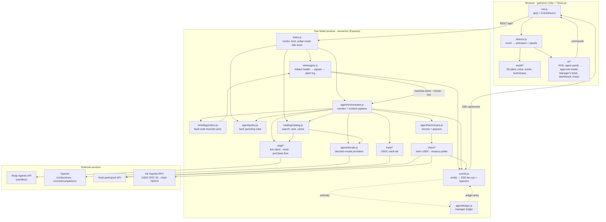
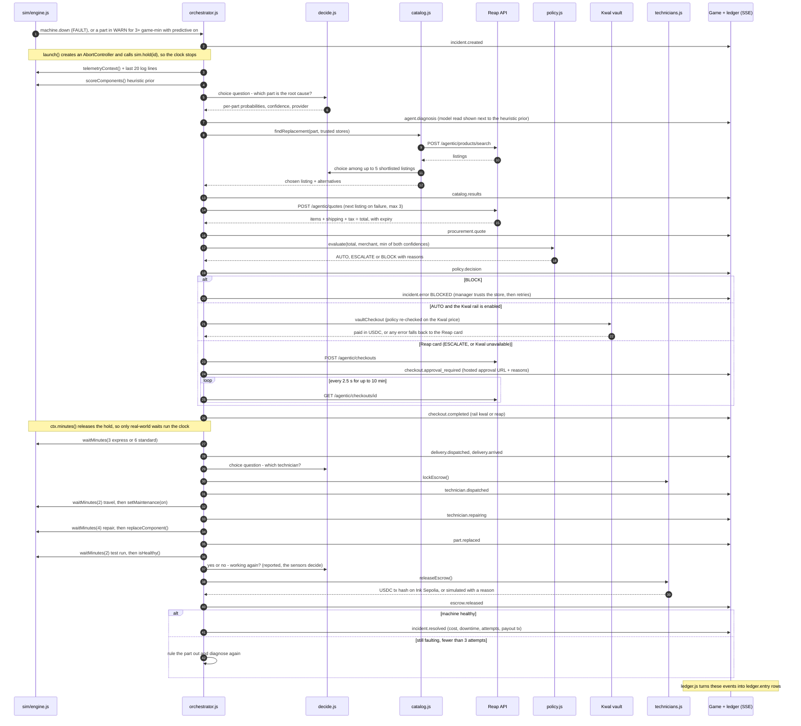
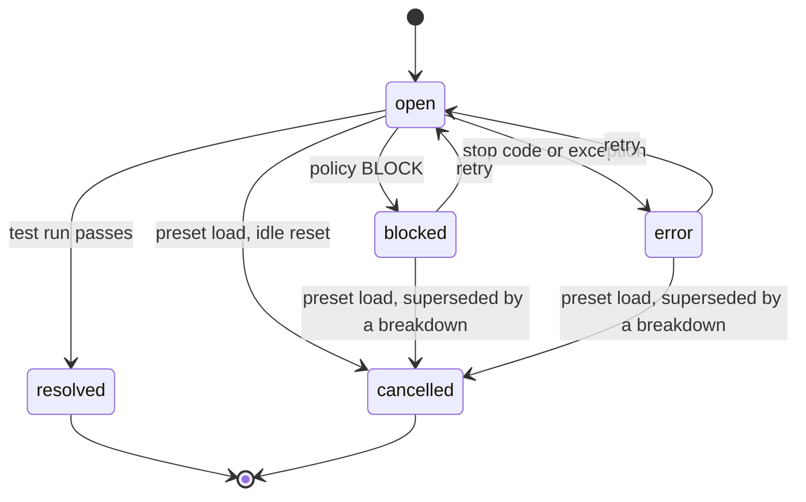
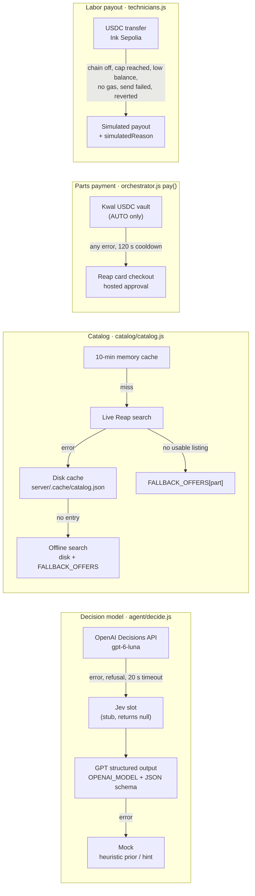
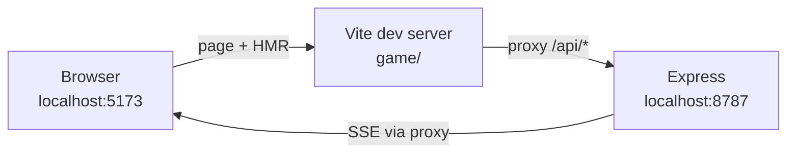
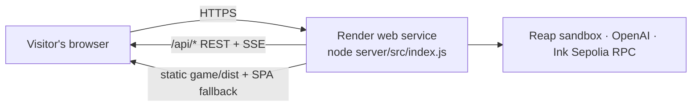

# Architecture

How Wrench-bot Factory is built: a single Node process runs the factory simulation, the maintenance agent and every payment integration, and streams each step to a Three.js game over Server-Sent Events.

**Docs:** [README](../README.md) · **Architecture** · [Agent](AGENT.md) · [Payments](PAYMENTS.md) · [API](API.md) · [Simulation](SIMULATION.md) · [Judging](JUDGING.md)

> Code is the source of truth. Every claim below names a file and a function or constant, so you can check it with `grep`. Paths are relative to the repository root.

---

## TL;DR

- **One process holds all the state.** [`server/src/index.js`](../server/src/index.js) boots the simulation, the agent, the manager ledger and the treasury poller in one Express server. The browser runs no game logic: [`game/src/director.js`](../game/src/director.js) only turns server events into animation and panels.
- **The agent sees only what a real plant shows.** Part health is a hidden variable inside [`server/src/sim/engine.js`](../server/src/sim/engine.js). The agent reads `sim.telemetryContext()` (readings, thresholds, severities, 10-minute trends) and the plant log. The game's terminal renders the same log lines.
- **Spending decisions are plain code, not model output.** [`agent/policy.js`](../server/src/agent/policy.js) `evaluate()` returns `AUTO`, `ESCALATE` or `BLOCK`. The model only recommends a part. The Kwal vault path checks the policy again against Kwal's own price before any money moves (`approve` callback in [`kwal/rail.js`](../server/src/kwal/rail.js)).
- **Every step is an event.** 27 event types (`EVENTS` in [`shared/contract.js`](../shared/contract.js)) pass through `emit()` in [`events.js`](../server/src/events.js). From there they go to every open SSE stream and to the ledger.
- **Every external dependency has a fallback in code.** OpenAI, Reap, Kwal, Ink Sepolia and WebGL can each fail without stopping the demo, and the log says which path ran ([§7](#7-modes-fallbacks-and-degradation)).

## Key numbers

| What | Value | Source |
|---|---|---|
| Machines / parts / sensor signals | 4 / 15 / 25 | `MACHINES` in `shared/contract.js` |
| Cross-part effects (a fault code that points at the wrong part) | 7 | `effects` arrays in `MACHINES` |
| Scenario presets | 6 | `PRESETS` in `shared/contract.js` |
| Server → game event types | 27 | `EVENTS` in `shared/contract.js` |
| HTTP surface | 21 REST endpoints + 1 SSE stream | `app.get/post/put` in `server/src/index.js` |
| Simulation tick | 1,000 ms real time. Each tick advances 1, 2, 4 or 8 game-minutes. | `TICK_MS`, `SPEEDS` in `sim/engine.js` |
| Attempts per incident | up to 3 (after a failed fix, the replaced part is ruled out and the agent diagnoses again) | `MAX_ATTEMPTS` in `agent/orchestrator.js` |
| Manager approval window | 10 min real time | `APPROVAL_TIMEOUT_MS` in `agent/orchestrator.js` |
| Runtime dependencies | server: `express`, `dotenv`, `viem` · game: `three` | `server/package.json`, `game/package.json` |

Reap, OpenAI and Kwal are called with plain `fetch`, with no vendor SDKs (`reap/client.js` `call()`, `agent/decide.js`, `kwal/client.js` `call()`). `viem` is used only for Ink Sepolia USDC (`chain/usdc.js`).

---

## 1. Component map



**Design choices behind the map**

| Choice | Why | Where |
|---|---|---|
| One contract file shared by server and browser | Machines, parts, signals, presets and event names cannot drift between the two sides. The game imports it directly. | `shared/contract.js`; `server.fs.allow: ['..']` in `game/vite.config.js` |
| Server-authoritative simulation | The agent, the UI and the ledger all see the same ground truth. The browser can be reloaded mid-incident and rebuilds itself from one `STATE` payload. | `state()` in `index.js`; `applyState()` in `director.js` |
| SSE for server → game, REST for game → server | Data flows one way, `EventSource` reconnects on its own, and it works through the Vite proxy and a single Render service without extra infrastructure | `sseHandler()` in `events.js`; `connectEvents()` in `game/src/net.js` |
| Ledger built from events, not from agent calls | The pipeline does not depend on the ledger. Every money movement is recorded because it is already an event. | `onEmit(observe)` in `agent/ledger.js` |
| Money rules outside the model | A model can be wrong or prompt-injected. A `<=` comparison cannot. | `evaluate()` in `agent/policy.js` |

---

## 2. Module responsibilities

### 2.1 Shared

| File | Responsibility | Key exports |
|---|---|---|
| [`shared/contract.js`](../shared/contract.js) | Single data contract. 4 machines with 15 parts. Each part has a search `query`, `keywords`, `maxPrice`, `qty`, mean `life`, a fault `code`, its `signals` (nominal/warn/fail) and `effects` on other parts. Also holds the 6 presets, the 27 SSE event names, log levels, and the treasury and `LEDGER` payload shapes. | `MACHINES`, `PRESETS`, `EVENTS`, `LOG_LEVELS` |

### 2.2 Server: core

| File | Responsibility | Key exports / entry points |
|---|---|---|
| [`server/src/index.js`](../server/src/index.js) | Express app. Has 21 REST routes plus SSE, the `STATE` snapshot, the boot sequence, a JSON 404 for unknown `/api/*` routes, a JSON error handler and an `unhandledRejection` logger. In production it serves `game/dist` with an SPA fallback. In judge mode it also runs the idle reset. | `state()`, `loadPreset()`, `mode()`, `warm()` |
| [`server/src/events.js`](../server/src/events.js) | Event bus. `emit()` stamps `{ type, incidentId, data, at }`, writes it to every SSE client and calls every `onEmit` listener (each one inside try/catch). Sends a `: ping` comment every 15 s. | `emit`, `sseHandler`, `setSnapshot`, `onEmit`, `clientCount` |
| [`server/src/config.js`](../server/src/config.js) | Loads `.env` from the repo root and derives the mode flags (`mockReap`, `mockAi`, `judge`) and the fixed shipping address used for quotes. | `config` |

### 2.3 Server: simulation

| File | Responsibility | Key exports |
|---|---|---|
| [`server/src/sim/engine.js`](../server/src/sim/engine.js) | Hidden part health drives signal readings, readings drive part and machine status, and status changes write the plant log. Also accrues KPIs, runs scripted and random failures, enforces one failure at a time, and owns the game clock (holds, `waitMinutes`). Health never leaves this module. | `sim` object: `start`, `step`, `loadPreset`, `injectFault`, `replaceComponent`, `setMaintenance`, `telemetryContext`, `recentLogs`, `waitMinutes`, `hold`, `addBusyCheck`, `on/off` |
| [`server/src/sim/diagnostics.js`](../server/src/sim/diagnostics.js) | A deliberately naive "System 1" prior: `0.6 × max severity + 0.4 × (owns the active fault code)`, softmax at T = 0.25. Because it trusts fault codes, it blames the servo in *Brownout*. The prior is shown to the user, sent to the GPT fallback, and used as the offline answer. It is never sent to the Decisions API ([AGENT.md](AGENT.md)). | `scoreComponents(machineId, { ruledOut })` |

### 2.4 Server: agent

| File | Responsibility | Key exports |
|---|---|---|
| [`server/src/agent/orchestrator.js`](../server/src/agent/orchestrator.js) | **Monitor:** listens for `machine.down` (breakdowns) and `minute` (predictive). When predictive maintenance is on, a part on a running machine that has been in WARN for 3 game-minutes or more triggers a predictive job. **Pipeline:** diagnose → source → quote → policy → pay → ship → repair → verify → pay the technician, re-diagnosing on failure. Keeps one AbortController and one clock hold per incident. | `startMonitor`, `startIncident`, `retryIncident`, `cancelAll`, `resetIncidents`, `listIncidents`, `approveDemo` |
| [`server/src/agent/decide.js`](../server/src/agent/decide.js) | One interface for every typed decision: `choice`, `score`, `yesno` → `{ answer, probabilities, confidence, provider }`. Providers are tried in order (OpenAI Decisions API → Jev slot → GPT structured output) and fall back to an offline mock. `say()` writes the one-sentence speech bubbles. | `decide`, `say`, `compactContext` |
| [`server/src/agent/policy.js`](../server/src/agent/policy.js) | The manager's hard limits. Defaults: $60 auto-approve per order, $1,000 monthly budget, 75% confidence bar, 3 trusted stores, express shipping only for critical machines, predictive maintenance off. `evaluate()` returns BLOCK for an untrusted store, ESCALATE for over budget, over the limit or not sure enough, and AUTO otherwise. | `evaluate`, `getPolicy`, `updatePolicy`, `reset`, `recordSpend`, `DEFAULT_POLICY` |
| [`server/src/agent/technicians.js`](../server/src/agent/technicians.js) | Three technicians (Ana $120, Raj $110, Mei $100). `lockEscrow()` reserves the job when the technician is dispatched. `releaseEscrow()` sends `rate × TECH_PAYOUT_SCALE` USDC after the repair, or records a simulated payout with a reason. Releases are idempotent per escrow id, and an optional global onchain cap applies. | `TECHNICIANS`, `lockEscrow`, `releaseEscrow`, `confirmPayout`, `payoutStats` |
| [`server/src/agent/ledger.js`](../server/src/agent/ledger.js) | Manager dashboard history. Watches events and turns incident, diagnosis, block, approval, purchase, failure, payout and resolution events into `LedgerEntry` rows, and computes totals. Keeps at most 1,000 entries, persisted to `server/.cache/ledger.json` (debounced 1 s, written atomically via tmp + rename). | `startLedger`, `getLedger`, `clearLedger` |

### 2.5 Server: commerce and money

| File | Responsibility | Key exports |
|---|---|---|
| [`server/src/catalog/catalog.js`](../server/src/catalog/catalog.js) | Live spare-parts search over Reap. Results are normalized and kept in a 10-minute in-memory cache plus a disk cache (`server/.cache/catalog.json`). Listings are filtered by spec keywords, `maxPrice` and availability, ranked by query overlap + 0.4 bonus for a trusted store − price penalty, and the top 5 form a shortlist. The decision model picks among the shortlist. At boot, `warmCatalog()` finds the best listing for all 15 parts. | `searchOffers`, `findReplacement`, `warmCatalog`, `getCatalog` |
| [`server/src/catalog/fallback.js`](../server/src/catalog/fallback.js) | 12 entries verified against the Reap sandbox (11 distinct listings: both motor drivers map to the same L298N board), used when nothing usable comes back. The roller bearing, indicator light and barcode scanner have no entry, so they always come from live search or the disk cache. For the barcode scanner that means stores outside *Supplier gap*'s trusted list, which is what makes that scenario block. | `FALLBACK_OFFERS` |
| [`server/src/reap/client.js`](../server/src/reap/client.js) | Thin Reap Agentic client, one function per endpoint (search, details, variant, quotes, shipping option, checkouts, enrollments). Sends `Reap-Version` on every call and a fresh `Idempotency-Key` when it creates a quote, a checkout or an enrollment. Sandbox auto-approval uses `X-Simulate-Checkout`. | `reapLive`, `ReapError` |
| [`server/src/reap/purchase.js`](../server/src/reap/purchase.js) | The purchase flow the agent calls: `quoteParts()` (one merchant per quote, express shipping picked by name) and `startCheckout()`, which returns the hosted `approvalUrl`. | `quoteParts`, `startCheckout` |
| [`server/src/reap/mock.js`](../server/src/reap/mock.js) + [`index.js`](../server/src/reap/index.js) | Offline Reap with the same interface. Quotes are priced locally: items + $6 standard or $18 express shipping + 8% tax. Checkouts wait for `POST /api/mock/approve/:checkoutId`. `reap/index.js` picks the live or mock client once, at import time. | `reapMock`, `reap`, `isMockReap` |
| [`server/src/kwal/client.js`](../server/src/kwal/client.js) | Kwal (Payward) participant API: status, funding, products, variant, quote, shipping, payments. The session token is read from a credentials file outside the repo. | `kwal`, `kwalEnabled`, `kwalAmount` |
| [`server/src/kwal/rail.js`](../server/src/kwal/rail.js) | Vault checkout for AUTO orders: match product → variant → quote → policy re-check on Kwal's own total and store → funding check → pay → wait. Any error makes the orchestrator use the Reap card instead. After a failure the rail rests for 120 s. | `vaultCheckout`, `kwalRailEnabled`, `kwalCooldown` |
| [`server/src/chain/usdc.js`](../server/src/chain/usdc.js) | viem clients for Ink Sepolia (chain 763373) and USDC `0xFabab97dCE620294D2B0b0e46C68964e326300Ac`: balances, `sendUsdc`, `confirmUsdc`. Holds the technicians' public payout addresses. | `sendUsdc`, `confirmUsdc`, `usdcBalance`, `txUrl` |
| [`server/src/chain/treasury.js`](../server/src/chain/treasury.js) | Polls the treasury wallet, the Kwal vault balance and Kwal's setup state every 20 s, plus right after a payout and again 6 s later. Concurrent refreshes are merged into one. Emits `treasury.updated`. | `startTreasury`, `getTreasury`, `refreshTreasury`, `chainActive` |

### 2.6 Game (browser)

| File | Responsibility |
|---|---|
| [`game/src/main.js`](../game/src/main.js) | Wiring. If the 3D world fails to start (for example, no WebGL), it is replaced with a no-op `Proxy`, so panels and the agent flow keep working. `connectLive()` reconnects the SSE stream after 8 s of silence and closes it after a tab has been hidden for 20 s. |
| [`game/src/net.js`](../game/src/net.js) | `api(method, path, body)` for REST and `connectEvents(handler)` for SSE. Both use relative `/api` URLs, so the same build works behind the Vite proxy and on Render. |
| [`game/src/director.js`](../game/src/director.js) | Translates events into UI and world calls (`#dispatch` switch over `EVENTS`). It holds no rules: robot destinations, truck spawns and technician arrivals are all reactions to server events. |
| `game/src/ui/*` | DOM overlay: HUD (`hud.js`), agent panel + approval modal (`agentpanel.js`), Manager's Desk (`desk.js`), chaos tools (`chaos.js`), machine inspector (`inspector.js`), terminal plant log (`plantlog.js`), scenario picker (`scenarios.js`), spare-parts list (`catalogpanel.js`), manager ledger dashboard (`dashboard.js`). `UI.js` is the facade the director calls. |
| `game/src/world/*` | Three.js scene: machines, conveyor line, Wrench-bot robot, delivery truck, technicians, effects. |

---

## 3. Boot sequence

From the bottom of [`server/src/index.js`](../server/src/index.js), in order:

1. `startLedger()` runs first, at module load, so no event is missed. It loads `server/.cache/ledger.json` and subscribes with `onEmit`.
2. Express middleware: an activity stamp for the judge-mode idle timer (every path except `/api/health`), then `express.json({ limit: '1mb' })`.
3. `setSnapshot(state)`: every new SSE connection receives the current `STATE`.
4. `startMonitor()`: the orchestrator subscribes to `machine.down`, `tick`, `minute` and `preset`, and registers its "an incident is open" busy check with the simulation.
5. `resetPolicy(first-failure.policy)`, `sim.loadPreset('first-failure')`, `sim.pause()`, `sim.start()`: the factory idles on the first scenario, paused, until a player picks one.
6. `startTreasury()`: the first onchain + Kwal read, then every 20 s.
7. `app.listen(PORT, '0.0.0.0')`, then `warm()`: the live catalog warm-up for all 15 parts. It emits `catalog.updated` as each machine completes, then collects every store seen so the Manager's Desk can offer it.

---

## 4. The event stream

### 4.1 Transport

- **Endpoint:** `GET /api/events` with `Content-Type: text/event-stream` (`sseHandler()` in `events.js`).
- **Frame:** one unnamed `data:` line per event, carrying JSON `{ type, incidentId?, data, at }`. The game reads it with `EventSource.onmessage` (`game/src/net.js`).
- **On connect:** the server immediately writes `{ type: 'state', data: state() }`, so a new tab, a reconnect or a reload rebuilds from one message.
- **Keep-alive:** a `: ping` comment every 15 s on the server. On the client, `main.js` reconnects if nothing arrives for `STALE_MS = 8000`. Because `sim.tick` is sent every second, silence means the stream is dead.
- **Fan-out:** every connected browser gets every event. There is **one shared factory per server process**: all viewers watch, and can control, the same simulation.

### 4.2 The `STATE` snapshot

Built by `state()` in `index.js`, returned by `GET /api/state`, and sent as the first SSE message:

| Field | Content | Producer |
|---|---|---|
| `sim` | clock, speed, paused, `held`, preset, `lineRunning`, per-machine status + per-part readings, KPIs | `sim.snapshot()` |
| `presets`, `machines`, `technicians` | static definitions | `shared/contract.js`, `technicians.js` |
| `policy` | current limits, plus `remaining` budget | `getPolicy()` |
| `incidents` | every incident on the board | `listIncidents()` |
| `logs` | last 200 plant-log lines | `sim.recentLogs({ limit: 200 })` |
| `catalog` | best live listing per part, with warm-up status | `getCatalog()` |
| `mode` | `{ mockReap, mockAi, enrolled, onchain, kwal, judge }` | `mode()` |
| `merchants` | every store the manager can choose to trust | `merchants()` |
| `treasury` | wallet / vault balances, explorer links, Kwal state | `getTreasury()` |
| `ledger` | last 200 ledger entries + totals | `getLedger({ limit: 200 })` |

### 4.3 Event catalogue and cadence

| Group | Events | Emitted by | Frequency |
|---|---|---|---|
| Snapshot | `state` | `events.js` `sseHandler()` | once per SSE connection |
| Plant | `sim.tick` | `engine.js` `step()` | **every 1 s**, also while paused or held (then `dt = 0`) |
| Plant | `sim.preset` | `engine.js` `loadPreset()` | per scenario load |
| Plant | `log.entry` | `engine.js` `addLog()` | on each WARN/FAULT/clear transition, machine up/down, every `AGENT` line. A WARN that keeps moving repeats every 5 game-min, a steady one every 15 (`WARN_REPEAT_MIN`, `WARN_REMIND_MIN`) |
| Catalog | `catalog.updated` | `index.js` `warm()` | at boot and on `POST /api/catalog/refresh` |
| Incident | `incident.created`, `incident.cancelled`, `incident.resolved`, `incident.error` | `orchestrator.js` | per incident |
| Reasoning | `agent.thinking`, `agent.diagnosis`, `agent.searching`, `catalog.results` | `orchestrator.js` | per attempt |
| Money | `procurement.quote`, `policy.decision`, `checkout.approval_required`, `checkout.completed`, `checkout.failed`, `policy.updated` | `orchestrator.js`, `index.js` | per purchase / policy edit |
| Physical | `delivery.dispatched`, `delivery.arrived`, `technician.dispatched`, `technician.repairing`, `part.replaced` | `orchestrator.js` | per attempt |
| Onchain | `escrow.released`, `treasury.updated` | `orchestrator.js`, `chain/treasury.js` | per payout. Treasury every 20 s + after payouts |
| History | `ledger.entry` | `agent/ledger.js` | per ledger row |

Payload shapes are documented inline next to each name in `EVENTS` ([`shared/contract.js`](../shared/contract.js)). The REST and SSE reference is in [API.md](API.md).

**Plant-log lines are also the model's input.** `logLines()` in the orchestrator takes the last 20 entries of a machine's log, the same entries the in-game terminal renders, formats each as `[clock] LEVEL CODE message` (`[08:14] FAULT E-ARM-310 Gripper position error — …`) and passes them to `decide()`. A judge reading the in-game log is reading what the model read.

### 4.4 Internal simulation events (never sent to the browser)

`sim.on(name, fn)` in `engine.js`. Listeners run inside try/catch, and rejected promises are caught (`fire()`).

| Name | Fired when | Used by |
|---|---|---|
| `machine.down` | a machine goes to `down` | the monitor opens a breakdown incident |
| `minute` | after every simulated game-minute (sub-step) | the predictive WARN check, so it fires on time even at 8× |
| `tick` | after every 1 s step | downtime accounting per incident |
| `preset` | a scenario loaded | safety net: `resetIncidents()` |
| `part.warn`, `machine.up` | status transitions | available to listeners |

### 4.5 Commands: game → server

| Game module | Request | Server handler |
|---|---|---|
| `director.js` boot / reload | `GET /api/state` | `state()` |
| `director.js` | `GET /api/sim/history/:machineId` | `sim.history()` (sparklines) |
| `ui/UI.js` scenario picker | `POST /api/sim/preset { id }` | `loadPreset()`: cancel incidents → reset policy → reset sim |
| `ui/hud.js` | `POST /api/sim/pause`, `/resume`, `/speed { speed }` | `sim.pause/resume/setSpeed` |
| `ui/desk.js` Manager's Desk | `PUT /api/policy` | `updatePolicy()` + `policy.updated` |
| `ui/chaos.js` | `POST /api/sim/fault { machineId, componentId, mode }` | `sim.injectFault()`, returns 409 `BUSY` during a failure |
| `ui/catalogpanel.js` | `POST /api/catalog/refresh` | `warm()` |
| `ui/agentpanel.js` | `POST /api/incidents/:id/retry` | `retryIncident()` |
| `ui/agentpanel.js` approval modal | `POST /api/mock/approve/:checkoutId { approve }` | `approveDemo()` (judge) or `reapMock.approve()` (offline) |
| `ui/dashboard.js` | `GET /api/ledger`, `POST /api/ledger/clear` | `getLedger()`, `clearLedger()` |

Other endpoints, such as `/api/health`, `/api/treasury?refresh=1`, `/api/catalog/search` and `/api/catalog/replacement/:machineId/:componentId`, are for debugging and scripts. See [API.md](API.md).

---

## 5. Incident lifecycle

### 5.1 Sequence



Judge mode replaces the Reap checkout branch with a simulated checkout (see [§9.3](#93-judge-mode)).

### 5.2 Incident states



`ACTIVE = {open, blocked, error}`. A machine has at most one active incident (`activeIncident()` in the orchestrator). `incident.step` moves through `diagnosing → sourcing → quoting → approval → shipping → repairing → verifying → done`.

### 5.3 Steps with code pointers

| # | Step | Function (`agent/orchestrator.js`) | Emits | Clock |
|---|---|---|---|---|
| 0 | Detect | `onMachineDown()`, `checkWarnings()` → `startIncident()` | `incident.created` | held from `launch()` on |
| 1 | Walk over | `walkOver()`: a fixed line, no LLM call (2.5 s ÷ √speed) | `agent.thinking` | held |
| 2 | Diagnose | `diagnose()`: candidates = parts not yet ruled out (predictive: only the parts in WARN) | `agent.diagnosis` | held |
| 3 | Source | `searchCatalog()` → `findReplacement()` | `agent.searching`, `catalog.results` | held |
| 4 | Quote | `quoteWithFallback()`: tries up to 3 listings on `QUOTE_RETRY_CODES` | `procurement.quote` | held |
| 5 | Policy | `evaluate({ total, merchant, confidence })`, where confidence = `min(diagnosis, listing choice)` | `policy.decision` | held |
| 6 | Pay | `pay()` → `payDemo()` / `payFromVault()` / Reap checkout + `pollCheckout()` | `checkout.*`, `policy.updated` | held |
| 7 | Ship | `deliver()`: 3 game-min express, 6 standard. Express only if the machine is stopped and the policy allows it (`wantsExpress()`) | `delivery.*` | **runs** |
| 8 | Repair | `repair()`: technician picked by `decide()`, escrow locked, 2 min travel + 4 min repair under maintenance lockout | `technician.*`, `part.replaced` | **runs** |
| 9 | Verify | `verify()`: 2-min test run. `sim.isHealthy()` decides. On success, the model's yes/no probability appears in the `VERIFY` log line | `agent.thinking` | **runs** |
| 10 | Payout | `payTechnician()` → `releaseEscrow()`. Paid whether or not the fix worked, since the work was done | `escrow.released` | held |
| 11 | Close | `resolve()` with a summary: parts spend, labor, total, order id, rail, approval, attempts, downtime, payout tx | `incident.resolved` | released |

Each attempt runs the clock for 11 to 14 game-minutes (3 or 6 shipping + 2 + 4 + 2). Everything else costs zero game time.

---

## 6. Concurrency, time and cancellation

Node runs everything on one thread. "Concurrency" here means overlapping async operations: model calls, Reap polling, onchain receipts, the 1 s simulation timer and SSE writes all interleave on the event loop.

### 6.1 Two clocks

| Clock | Advances | Used for |
|---|---|---|
| **Game time** (`t`, minutes since a 08:00 shift start) | only inside `engine.js` `advance()`, from the 1 s `setInterval` in `start()`. Sub-steps are at most 1 game-minute, so logs, waits and WARN timers stay exact at 8×. | wear, KPIs, downtime cost, shipping, travel, repair, test run |
| **Real time** | wall clock | HTTP calls (model ≤ 20 s timeout, Reap quotes ~10 s live), the manager's approval (≤ 10 min), onchain receipts (≤ 45 s, then a background confirm up to 180 s) |

### 6.2 Clock holds: the agent's real-time work costs no game time

- `launch()` calls `sim.hold(incident.id, true)` for the whole run. While any hold exists, the timer calls `step(0)`: it still emits `sim.tick`, but no game time passes, no wear happens, and no downtime cost accrues (`accrue()` runs only inside `advance()`).
- `ctx.minutes(n)` is the only way to let time run. It releases the hold, awaits `sim.waitMinutes(n, { signal })`, then takes the hold again.
- When a wait completes, or a new hold starts during a step, the engine sets `interrupted = true` and stops the step at that game-minute. At 8× the agent acts on the minute its wait ended, not up to 7 minutes later.
- `ctx.step(name)` polls every 300 ms while the factory is paused, so the agent freezes along with the factory. `ctx.pause(ms)` shortens animation pauses by `1/√speed`.
- The result: a slow network, a slow model or a slow manager never shows up as extra downtime at 8× speed. Downtime and cost reflect only the simulated real-world steps.

### 6.3 Cancellation: one `AbortController` per incident

| Mechanism | Where |
|---|---|
| A new controller per run (`launch()`), stored in `runtime.get(id).controller` | `orchestrator.js` |
| Every await goes through `ctx.guard(promise)`, which rejects with `Cancelled` the moment the signal aborts, even if the underlying promise is still pending | `guard()` |
| `ctx.sleep()` clears its timer on abort. `sim.waitMinutes()` removes its waiter and rejects with `code: 'CANCELLED'` | `sleep()`, `engine.js` `waitMinutes()` |
| The Kwal rail checks the signal between steps (`stopIfCancelled()`) | `kwal/rail.js` |
| A cancelled run ends quietly: `launch().catch` ignores aborted runs, `finally` releases the clock hold and the maintenance lockout | `launch()` |
| `reset()` (run by every `sim.loadPreset()`) cancels every outstanding waiter and clears all holds, so a wait from the old shift can never resolve into the new one | `engine.js` `reset()` |

**Triggers:** a scenario load (`POST /api/sim/preset` → `resetIncidents()` → `cancelAll()`), a breakdown that supersedes a predictive job stuck on the manager (`onMachineDown()`), the judge-mode idle reset, and the `preset` safety-net listener.

**Money is never sent twice, and a broadcast transfer is never abandoned.** `releaseEscrow()` caches its promise per escrow id. If the incident is cancelled mid-payout, the transfer still settles and is logged on the server, but no `escrow.released` is emitted into the new shift (`payTechnician()` checks `ctx.signal.aborted`). Model HTTP calls are bounded by `AbortSignal.timeout(20 s)` rather than the incident signal. After a cancel their result is discarded by `guard()`.

### 6.4 One failure at a time

The pipeline can run several incidents at once: incidents live in a `Map`, each machine is limited to one active incident, and controllers and holds are per incident. The simulation deliberately keeps the story to one breakdown → one diagnosis → one repair:

- `busy()` in `engine.js` is true while any machine is not running, any part is faulted, any part is on a decline ramp, or any registered busy check returns true. The orchestrator registers "an incident is `open`" (`startMonitor()`).
- While busy: chaos is refused (`injectFault()` throws `BUSY`, and the route returns HTTP 409), the Free-play scheduler waits (`scheduleFailure()`), and due scripted events are marked `held`. A held event fires only after 2 calm minutes (`advance()`). This is how *Month-end crunch* serializes its two failures.
- If a machine breaks down while its predictive job is still `open`, no second incident is opened. The fault codes are merged into the running job. If the job was still early (diagnosing to shipping), it is also flagged `overtaken`, so the summary says the machine failed before the planned swap (`onMachineDown()`).

### 6.5 Other serialization points

| Point | Guarantee | Where |
|---|---|---|
| Treasury transfers | one at a time (`serial()` promise chain), so two payouts never race for a nonce | `technicians.js` |
| Treasury reads | concurrent `refreshTreasury()` calls share one in-flight poll | `chain/treasury.js` |
| Catalog warm-up | a second `warmCatalog()` call is ignored while one is running (`state.warming`) | `catalog.js` |
| Simulation step | re-entrancy guard (`stepping`) | `engine.js` `step()` |
| Ledger writes | debounced 1 s, written to `.tmp` then `rename` | `ledger.js` `persist()` |
| Kwal rail | 120 s cooldown after a failure, so the ~2 s failure isn't paid again on every order | `kwal/rail.js` `kwalCooldown()` |

---

## 7. Modes, fallbacks and degradation

### 7.1 Mode switches

| Flag | On when | Effect |
|---|---|---|
| `config.mockReap` (`isMockReap`) | `MOCK_REAP=1` **or** `REAP_API_KEY` empty | `reap` = `reapMock`. Catalog served from the disk cache + `FALLBACK_OFFERS`. Checkouts approved in-game. The Kwal rail and onchain payouts are both off. |
| `config.mockAi` | `MOCK_AI=1` **or** `OPENAI_API_KEY` empty | `decide()` returns the mock (the heuristic prior mapped onto the options). `say()` returns its fixed fallback sentence. |
| `chainActive()` | `TREASURY_PRIVATE_KEY` set **and** `ONCHAIN != 0` **and** not `mockReap` | Real USDC payouts, plus live treasury balances in the HUD |
| `kwalRailEnabled()` | a valid Kwal session file **and** `KWAL != 0` **and** not `mockReap` **and** not `judge` | AUTO orders try the vault before the Reap card |
| `config.judge` | `JUDGE_MODE=1` | Live AI + live Reap search and quotes. Checkout simulated with in-game approve/reject. Kwal rail off. Idle reset ([§9.3](#93-judge-mode)). The tiny, capped payouts come from the companion `TECH_PAYOUT_SCALE` and `ONCHAIN_MAX_PAYOUTS` values in `render.yaml`, not from the flag itself. |

`npm run dev:mock` sets `MOCK_REAP=1 MOCK_AI=1` and runs the full game with no keys and no network. The active flags are exposed in `GET /api/health` and `STATE.mode`. The game shows them as badges in the menu and on the scenario picker (`modeBadges()` in `ui/hud.js`).

### 7.2 Fallback chains



| Dependency | Primary | Fallback | Trigger | Visible to the user as |
|---|---|---|---|---|
| Diagnosis / choices | Decisions API `gpt-6-luna` (`openaiDecisions()`) | GPT structured output → mock | non-2xx, `refusal`, 20 s timeout | `provider` field on `agent.diagnosis` and `catalog.results` |
| Speech bubbles | chat completion (`say()`) | fixed sentence built from the evidence | any error | none (same meaning, plainer wording) |
| Catalog | live Reap search | disk cache → offline search → `FALLBACK_OFFERS` | network or API error, `MOCK_REAP` | `source: live / offline / fallback` on `catalog.results`, and in the `SOURCE` log line |
| Quote | chosen listing | next 2 listings | `QUOTE_UNFULFILLABLE`, `CARD_PAYMENT_UNAVAILABLE`, `AGENTIC_REQUEST_REJECTED`, `CHECKOUT_URL_INVALID` | WARN log line "can't fill the order. Trying the next listing." |
| Parts payment | Kwal vault (AUTO orders) | Reap card | any Kwal error (currently HTTP 400 `ParticipantBadRequest`) | `PAY` log line "Kwal vault rail unavailable (…) — paying by Reap card instead". `rail` field on `checkout.completed` |
| Technician payout | onchain USDC | simulated | see diagram | `escrow.onchain`, `simulatedReason`, `txUrl` on `escrow.released` |
| 3D view | Three.js `World` | no-op `Proxy` + message | WebGL or module error | "3D view unavailable. The plant, the agent and every panel still work." |

### 7.3 How failures reach the user

Every pipeline stop becomes `incident.error { code, message, retryable: true }` (`fail()` in the orchestrator) and an `ERROR` line in the plant log. The director shows a toast and walks the robot home (`director.js`). `POST /api/incidents/:id/retry` restarts the incident with the attempt counter reset.

| Code | Raised in | Meaning |
|---|---|---|
| `BLOCKED` | `run()` after `evaluate()` | store not on the trusted list. The status becomes `blocked` and the store is flagged in the Manager's Desk. |
| `NO_PARTS` | `searchCatalog()` | no listing matches the spec under `maxPrice`, and there is no fallback |
| `NO_QUOTE` | `quoteWithFallback()` | none of up to 3 stores could fill the order |
| `NO_CARD` | `pay()` | live mode without `REAP_ENROLLMENT_ID` |
| `CHECKOUT_EXPIRED` / `CHECKOUT_TIMEOUT` / `CHECKOUT_FAILED` | `pay()`, `payDemo()` | the manager rejected the order / no answer within 10 min / the payment failed. `checkout.failed` is also emitted. |
| `GAVE_UP` | `run()`, `diagnose()` | 3 attempts used, or every part ruled out |
| HTTP 409 `BUSY` | `engine.js` `injectFault()` | chaos refused while a failure is in progress |

---

## 8. Configuration

Read from `.env` at the repo root (`config.js` loads it with `dotenv`) or from the host's environment. `.env` is git-ignored. On Render, secrets are entered in the dashboard (`sync: false` in `render.yaml`). The table lists names and behavior only, no values.

| Variable | Read in | When unset |
|---|---|---|
| `PORT` | `config.js` | 8787 |
| `REAP_API_KEY` *(secret)* | `config.js` | offline Reap mock (`mockReap`) |
| `REAP_BASE_URL` | `config.js` | Reap sandbox base URL |
| `REAP_VERSION` | `config.js` | `2025-02-14` (Reap rejects requests without this header) |
| `REAP_ENROLLMENT_ID` | `config.js` | live card checkout stops with `NO_CARD` (not needed in mock or judge mode) |
| `REAP_RETURN_URL` | `config.js` | placeholder public HTTPS URL. Reap rejects localhost return URLs |
| `BUYER_EMAIL` | `config.js` | placeholder email on quotes |
| `OPENAI_API_KEY` *(secret)* | `config.js` | mock decisions (`mockAi`) |
| `OPENAI_MODEL` | `config.js` | model for the GPT structured fallback and `say()`. The Decisions API always uses `gpt-6-luna` (hard-coded in `decide.js`) |
| `JEV_API_KEY` | `config.js` | Jev provider slot (currently a stub) |
| `MOCK_REAP`, `MOCK_AI` | `config.js` | `1` forces the offline mode even when keys are present |
| `JUDGE_MODE` | `config.js` | `1` = public demo mode |
| `JUDGE_IDLE_MS` | `index.js` | 10 min idle window before the judge-mode reset |
| `TREASURY_PRIVATE_KEY` *(secret)* | `chain/usdc.js` | no onchain payouts (simulated) |
| `INK_RPC_URL` | `chain/usdc.js` | public Ink Sepolia RPC |
| `ONCHAIN` | `chain/usdc.js`, `chain/treasury.js` | `0` = never send onchain, even with a key |
| `TECH_PAYOUT_SCALE` | `agent/technicians.js` | `0.01` (a $120 job pays 1.20 USDC) |
| `ONCHAIN_MAX_PAYOUTS` | `agent/technicians.js` | no cap. Count kept in `server/.cache/onchain.json` |
| `TREASURY_POLL_MS` | `chain/treasury.js` | 20 s |
| `KWAL` | `kwal/client.js` | `0` = vault rail off |
| `KWAL_RETRY_MS` | `kwal/rail.js` | 120 s cooldown after a vault failure |
| `KWAL_VAULT_ADDRESS` | `chain/treasury.js` | the deployed vault's public address (Kwal's status overrides it) |
| `PWS_CREDENTIALS_FILE` | `kwal/client.js` | Kwal session file in the user's home config directory, outside the repo |
| `LEDGER_FILE` | `agent/ledger.js` | `server/.cache/ledger.json` |
| `ENROLL_RETURN_URL` | `server/scripts/enroll.js` | return URL for the one-time card enrollment script |
| `DELIVERY_SECONDS`, `EXPRESS_DELIVERY_SECONDS`, `REPAIR_SECONDS`, `PUBLIC_URL` | `config.js` | read into `config`, but nothing currently uses them. Durations are the game-minute constants in `MINUTES` (`orchestrator.js`) |
| `NODE_VERSION` | `render.yaml` | Render build image only |

---

## 9. Deployment

### 9.1 Local development: two processes



`npm run dev` runs both with `concurrently` (root `package.json`). The server uses `node --watch`. `game/vite.config.js` proxies `/api` to `:8787` and allows importing `../shared/contract.js`.

### 9.2 Production on Render: one web service



Defined in [`render.yaml`](../render.yaml):

| Setting | Value | Why |
|---|---|---|
| `type` / `runtime` / `plan` | `web` / `node` / `free` | one service serves the API and the game |
| `buildCommand` | `npm install --include=dev && npm run build` | Vite is a devDependency. Root `build` runs `vite build` in `game/`, producing `game/dist`. |
| `startCommand` | `npm start` | root `start` → `npm start -w server` → `node src/index.js` |
| `healthCheckPath` | `/api/health` | excluded from the idle-activity timer, so health checks don't keep the demo "busy" |
| Secrets | `REAP_API_KEY`, `OPENAI_API_KEY`, `TREASURY_PRIVATE_KEY` with `sync: false` | entered in the dashboard, never committed |
| Demo settings | `JUDGE_MODE=1`, `KWAL=0`, `TECH_PAYOUT_SCALE=0.0001`, `ONCHAIN_MAX_PAYOUTS=200` | see §9.3 |

Static serving is conditional. `index.js` mounts `express.static(GAME_DIST)` and a `*` → `index.html` fallback only if `game/dist/index.html` exists. Unknown `/api/*` routes return a JSON 404 before that fallback, so API typos never return HTML. The server listens on `0.0.0.0`. Because the game uses relative `/api` URLs and is served from the same origin, the production build needs no CORS configuration.

### 9.3 Judge mode

Judge mode is the public demo configuration ("the live demo", linked in the [README](../README.md)). It keeps everything real that can safely be real for anonymous visitors:

| Concern | Behaviour | Code |
|---|---|---|
| AI | live (Decisions API → GPT → mock) | unchanged |
| Catalog + quotes | live Reap sandbox search and quotes | unchanged |
| Checkout | simulated: visitors cannot complete the passkey tap on Reap's hosted page. AUTO orders complete after a short pause (1.2 s ÷ √speed). ESCALATE orders wait for the in-game Approve / Reject buttons (`POST /api/mock/approve/:checkoutId` → `approveDemo()`), with the same 10-min window. Order ids are `DEMO-#####` and events carry `demo: true`. | `payDemo()`, `approveDemo()` in `orchestrator.js` |
| Spending rules | identical. `evaluate()` still decides AUTO, ESCALATE or BLOCK, and budget spend is recorded | `policy.js` |
| Kwal rail | off (`kwalRailEnabled()` returns false in judge mode) | `kwal/rail.js` |
| Technician payouts | real USDC, but tiny and capped. With `render.yaml`'s scale a $120 job pays 0.012 USDC, and at most 200 onchain payouts are sent (≤ 2.4 USDC in total). After the cap, payouts are simulated with reason "demo payout cap reached" | `technicians.js` `payoutCapReached()` |
| Ledger honesty | purchases and approvals from demo checkouts are stored with `simulated: true` and shown with a "demo" tag in the dashboard | `ledger.js`, `game/src/ui/dashboard.js` |
| Idle reset | the server checks activity every 30 s (or every half of the idle window, if that is shorter). After 10 min (`JUDGE_IDLE_MS`) with no HTTP request (except `/api/health`) and no open SSE stream, it reloads *Sensor burnout* and pauses | `IDLE_RESET_MS`, `clientCount()` in `index.js` |

### 9.4 State and persistence

| State | Lives in | Survives restart? |
|---|---|---|
| Simulation, incidents, policy, Kwal cooldown | module-level variables (`engine.js` `state`, `orchestrator.js` `incidents`, `policy.js` `policy`) | no: boot reloads *Sensor burnout*, paused |
| Manager ledger | `server/.cache/ledger.json` (or `LEDGER_FILE`) | yes, if the disk persists |
| Catalog search cache | `server/.cache/catalog.json` | yes, if the disk persists |
| Onchain payout count (cap) | `server/.cache/onchain.json` | yes, if the disk persists |
| Technician wallet overrides | `server/.cache/wallets.json` (optional; public defaults in `chain/usdc.js`) | yes, if the disk persists |

`server/.cache/` is git-ignored. On a host without a persistent disk (such as Render's free plan) these files last only as long as the instance's filesystem. The demo still works without them: the catalog falls back to live search, and the ledger starts empty.

---

## 10. External systems: verified facts that shaped the design

Verified by the team against the live sandbox and testnet on 9 Oct 2026. Details are in [PAYMENTS.md](PAYMENTS.md) and [AGENT.md](AGENT.md).

| System | Finding | Design consequence |
|---|---|---|
| Reap Agentic API | `Reap-Version: 2025-02-14` is required, and it was discoverable only from a validation error | sent on every call (`reap/client.js` `call()`) |
| Reap quotes | need `shippingAddress { firstName, lastName, phone (E.164), addressLine1, city, country }`. Take ~10 s and expire after ~15 min. One merchant per quote (mixed carts → `AGENTIC_REQUEST_REJECTED`) | fixed demo address in `config.shippingAddress`. The clock is held during quotes. One part per order. The 10-min approval window is shorter than the quote lifetime |
| Reap checkout | return URLs must be public HTTPS. Even with `X-Simulate-Checkout: COMPLETED`, sandbox checkouts return `REQUIRES_ACTION` and need a one-tap approval (an unapproved test checkout went `EXPIRED`). Mandates are "not available yet" | `REAP_RETURN_URL` default is public HTTPS. The orchestrator emits `checkout.approval_required` whenever Reap returns a hosted URL, even for AUTO orders. The modal then says "Within your limits — confirm on Reap (one tap)". Our own policy stands in for mandates. |
| Reap catalog | a ~80-query sweep found ~1,750 purchasable products. All 15 machine parts resolve to live listings | live search first. 12 verified listings are kept as `FALLBACK_OFFERS` |
| OpenAI Decisions API | `gpt-6-luna` returns per-option probabilities + confidence. When given the heuristic prior, the model copied it | the prior is withheld from the Decisions API (`prior: undefined` in `openaiDecisions()`) and shown to the user instead |
| Kwal (Payward) | vault `0x14735b01eD166F386EFE0aD27A2791498b44572f` deployed and funded with 8 USDC, but the variant and quote endpoints return HTTP 400 `ParticipantBadRequest` for every product | automatic fallback to the Reap card with a logged reason, plus a 120 s cooldown |
| Ink Sepolia | treasury `0x081f8183Ff9EE52958644F63B9567e309b2bD97c` sent a real 0.05 USDC technician payout test ([tx](https://explorer-sepolia.inkonchain.com/tx/0x77816ec667d73c0cffaceb2096d10d7e878788c7f97c189a722c2861fd794e12)). Gas is ~6e-8 ETH per transfer | onchain payouts on by default when a key is present, scaled 1:100 (1:10,000 with the `render.yaml` demo settings) |

---

## 11. Known limits

- **One factory per process.** All state is in memory and shared by every viewer. This suits a live demo; the system is not multi-tenant.
- **The Jev provider is a stub** (`jev()` in `decide.js` returns `null`), so the effective chain is Decisions API → GPT structured output → mock.
- **One merchant per quote.** `quoteParts()` throws `MIXED_MERCHANTS` for multi-store carts, as Reap requires. Every incident buys a single part, so the pipeline never hits this. `refreshQuote()` for expired quotes is a TODO.
- **Model HTTP calls are not aborted on cancel.** They are bounded by a 20 s timeout, and `guard()` discards the result.
- **Kwal vault purchases currently always fall back** to the Reap card because of the upstream HTTP 400 (§10).
- **Four environment variables are read but unused** (`DELIVERY_SECONDS`, `EXPRESS_DELIVERY_SECONDS`, `REPAIR_SECONDS`, `PUBLIC_URL`).

---

## 12. Verify it yourself

```bash
npm install
npm run dev:mock                       # no keys needed: server :8787, game :5173

curl -s localhost:8787/api/health      # { ok, mockReap, mockAi, enrolled, onchain, kwal, judge }
curl -sN localhost:8787/api/events | head -c 400   # first frame is the full STATE snapshot

# Load the misleading-fault scenario and watch the agent work from the log
curl -s -X POST localhost:8787/api/sim/preset -H 'Content-Type: application/json' -d '{"id":"brownout"}'
curl -s 'localhost:8787/api/sim/logs?machineId=arm&minLevel=WARN&limit=30'
curl -s localhost:8787/api/incidents
curl -s localhost:8787/api/ledger      # every decision, purchase and payout, with totals
```

Next: [AGENT.md](AGENT.md) covers how the diagnosis works, [PAYMENTS.md](PAYMENTS.md) the money paths and evidence, [API.md](API.md) every endpoint and payload, [SIMULATION.md](SIMULATION.md) the plant model, and [JUDGING.md](JUDGING.md) how this maps to the judging criteria.
