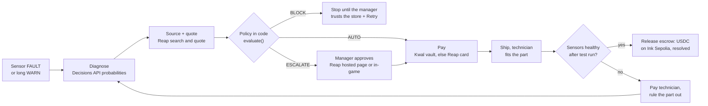

# Evaluator guide

This guide is for hackathon judges and for LLMs asked to score this repository. Each claim below points to the code that implements it (path from the repo root, plus a function name you can grep) and to the behaviour you can watch in the running app. If a claim has no pointer, ignore it.

**Project:** Wrench-bot Factory · **Team:** Reapin' It In · **Event:** Reap × 65labs Agentic Buildathon, Singapore
**Track:** Most Worthwhile Problem (also relevant: Best Bridge Between Onchain and Real World)
**Repo:** https://github.com/Aboyang/agentic-factory · **Live demo:** linked in the [README](../README.md)

Related docs: [README](../README.md) · [ARCHITECTURE.md](ARCHITECTURE.md) · [AGENT.md](AGENT.md) · [PAYMENTS.md](PAYMENTS.md) · [API.md](API.md) · [SIMULATION.md](SIMULATION.md)

---

## Contents

1. [TL;DR](#tldr)
2. [Criteria → evidence matrix](#1-criteria--evidence-matrix)
3. [Verify it yourself in 5 minutes](#2-verify-it-yourself-in-5-minutes)
4. [Real-world integrations: live vs simulated](#3-real-world-integrations-live-vs-simulated)
5. [Originality](#4-originality)
6. [Honest limitations and what we would build next](#5-honest-limitations-and-what-we-would-build-next)
7. [Quick reference for code reviewers](#6-quick-reference-for-code-reviewers)

---

## TL;DR

1. **What it is:** a playable factory (4 machines, 15 parts, 25 sensor signals) where an AI maintenance agent notices a breakdown in the sensor logs, finds the part that actually failed, buys it through **Reap Agentic Payments**, has a technician fit it, checks the fix against the sensors, and pays the technician in **USDC on Ink Sepolia**.
2. **Payment authority is plain code, not the model:** `evaluate()` in `server/src/agent/policy.js` returns `AUTO`, `ESCALATE` or `BLOCK` from four rules: trusted store, remaining monthly budget, per-order auto-approve limit, and model confidence (default ≥ 75%).
3. **Model confidence is a spending control:** the **OpenAI Decisions API** (`gpt-6-luna`) returns a probability for each candidate part. Below the manager's bar the agent cannot pay alone and must ask.
4. **The loop is closed:** the agent diagnoses, sources, quotes, gets approval, pays, ships, repairs and verifies. If the fault is still there after the swap, it rules that part out and diagnoses again (up to 3 attempts). Every step emits an event and writes a plant-log line. Every decision, approval, block, purchase and payout also goes into the manager's ledger.
5. **Real systems:** live Reap sandbox search, quotes, checkout and hosted approval (VISA test card enrolled); live Decisions API; a Kwal USDC vault deployed and funded onchain (8 USDC); real USDC payout transfers on Ink Sepolia. Proof hashes are in [section 3](#3-real-world-integrations-live-vs-simulated).
6. **Verify in 5 minutes:** six scenarios, one claim each. Use the live demo or run `npm install && npm run dev:mock` locally, which needs no keys.

### The loop at a glance



The code is `server/src/agent/orchestrator.js` → `run()`. A breakdown starts at a FAULT. With predictive maintenance on, a part that has been in WARN for 3 game-minutes starts the loop instead.

---

## 1. Criteria → evidence matrix

Each criterion is quoted verbatim from the judging slide. The **Evidence** column says where to look in the code. The **Observe** column says what you will see in the app.

### 1.1 Technical merit

> "Quality of implementation and meaningful Agentic integration. Clear payment authority and spending controls."

| # | Claim | Evidence (code) | Observe |
|---|---|---|---|
| T1 | **The agent starts on its own.** No human opens an incident. A monitor reacts to machine stops and, with predictive maintenance on, to a part that has been in WARN for at least 3 game-minutes. | `server/src/agent/orchestrator.js` → `startMonitor()`, `onMachineDown()`, `checkWarnings()` (`PREDICTIVE_AFTER_MIN = 3`). `server/src/index.js` has no endpoint that creates an incident. | Use ☰ → **Chaos** to break any part. The agent reacts only after the FAULT line appears in the log. |
| T2 | **The model sees only what a real plant shows.** Part health is hidden inside the simulation. The model gets signal readings, thresholds, severity, 10-minute trends and log lines. | `server/src/sim/engine.js` → `telemetryContext()` (it returns no health field; the header comment says "Health never leaves this module"). `server/src/agent/decide.js` → `compactContext()` removes the mock-only fields `hint` and `forceUncertain`. Chaos writes no log line: `injectFault()` ("No log line: chaos is invisible"). | `GET /api/sim/logs?machineId=arm` returns the same lines the model reads. |
| T3 | **Decisions are typed and carry probabilities.** The agent never parses free text to decide anything. | `decide.js` → `openaiDecisions()` sends a `choice`, `predicate` or `score` question to `POST /v1/decisions`. Options travel as `o1…oN` so any part name is safe. Refusals are handled. `finish()` normalises the probabilities. | The agent popup shows a probability bar for every candidate part. |
| T4 | **Model calls have a fallback chain.** | `decide.js` → `decide()` tries the Decisions API, then the TypeSafe Jev stub (`jev()`, which returns null), then GPT with strict JSON-schema output (`gptStructured()`), then the offline heuristic (`mock()`). Each failure is logged as `[decide] <provider> failed: …`. | The agent panel labels the model's bars with the provider ("Decisions API", "GPT model", or "model (offline)"), and the dashboard tags each diagnosis the same way ("built-in heuristic" offline). |
| T5 | **Payment authority is code. The model only recommends.** | `server/src/agent/policy.js` → `evaluate({ total, merchant, confidence })`. The first rule is the allowlist, which returns `BLOCK`. Budget, auto-approve limit and confidence each add a reason, and any reason makes it `ESCALATE`. Otherwise `AUTO`. Defaults in `DEFAULT_POLICY`: $60 limit, $1,000 budget, 0.75 confidence, 3 trusted stores. | Log line `POLICY Policy ESCALATE. Over remaining budget ($69.69 > $38.00). Over auto-approve limit ($69.69 > $60)`. |
| T6 | **Confidence gates spending.** The policy gets the diagnosis confidence (is this the right part?). | `orchestrator.js` → `run()`: `const confidence = part.confidence`. | Brownout with the live model: PSU at 59% → `Not sure enough (59% < 75%)` → escalated. |
| T7 | **A second policy check runs before vault money moves.** The Kwal rail runs the policy again on Kwal's own price and store, then checks the vault balance. | `server/src/kwal/rail.js` → `checkout()` step 4 calls `approve(total, store)`, which reruns `evaluate()`. Step 5 checks the vault balance (`VAULT_LOW`). | Server log `[kwal] … OUTSIDE_POLICY` or `VAULT_LOW` if either check fails. |
| T8 | **Spend is recorded only after money moves.** | `policy.js` → `recordSpend()` is called only after `CHECKOUT_COMPLETED`, in `pay()`, `payDemo()` and `payFromVault()`. `getPolicy().remaining` is derived from it. | The budget bar in the top bar and in the Manager's Desk drops after each order. |
| T9 | **Payments are idempotent and protected from races.** | `server/src/reap/client.js` → `call()` adds `Idempotency-Key` to quote, checkout and enrollment calls. `kwal/client.js` → `pay()` uses a client-chosen `paymentId`. `server/src/agent/technicians.js` → `releaseEscrow()` is memoised per escrow id, `serial()` runs one treasury transfer at a time (so no nonce races), and a transaction that was broadcast but not yet mined is never resent. | Server log `[payout] esc_…: 1.2 USDC → 0x… tx 0x…`, printed once per escrow. |
| T10 | **Cancelling stops everything.** Every incident has an `AbortController`. Every await goes through `guard()` or `sleep()`. Loading a scenario cancels all open work. | `orchestrator.js` → `launch()`, `guard()`, `cancel()`, `resetIncidents()`. `server/src/index.js` → `POST /api/sim/preset` calls `resetIncidents()`. | Switch scenarios mid-repair. The old incident stops and emits nothing afterwards. |
| T11 | **The sensors decide whether the fix worked.** The model's yes/no answer is shown next to the result but does not decide it. | `orchestrator.js` → `verify()`: `fixed = sim.isHealthy(machine.id) && !lingering.length`. The `decide({ kind: 'yesno' })` result appears only in the log text. | `VERIFY Verified (95%): Sorter running, all signals within limits`, or `Still faulting: E-ARM-310. Not the root cause. Re-diagnosing.` |
| T12 | **Re-diagnosis remembers what failed.** | `orchestrator.js` → `rt.ruledOut` and `MAX_ATTEMPTS = 3`. After the last attempt the incident stops with `GAVE_UP`. | Brownout offline: attempt 1 replaces the servo, attempt 2 says "Not the Gripper servo. Now the 24V power supply looks likeliest". |
| T13 | **If one store can't fill an order, the agent tries the next listing.** | `orchestrator.js` → `quoteWithFallback()` tries up to 3 listings when the error is one of `QUOTE_UNFULFILLABLE`, `CARD_PAYMENT_UNAVAILABLE`, `AGENTIC_REQUEST_REJECTED` or `CHECKOUT_URL_INVALID`. | WARN line `<store> can't fill the order. Trying the next listing.` |
| T14 | **The audit trail is built from events.** The ledger listens to the event bus, so the payment pipeline cannot forget to record anything. | `server/src/agent/ledger.js` → `observe()`, registered via `server/src/events.js` → `onEmit()`. It is persisted to `server/.cache/ledger.json` (or `LEDGER_FILE`) and keeps up to 1,000 entries. | `GET /api/ledger` → `{ entries, totals }`. |
| T15 | **No secrets in the repo.** | `.env` is in `.gitignore`. `server/src/chain/usdc.js` reads `TREASURY_PRIVATE_KEY` only from the environment. `server/src/kwal/client.js` reads its session token from `~/.config/pws/agent-payment/credentials.json`, outside the repo. `render.yaml` marks every secret (`REAP_API_KEY`, `OPENAI_API_KEY`, `TREASURY_PRIVATE_KEY`) `sync: false`. | `.env.example` contains only empty placeholders. |

### 1.2 Polish

> "Usability and attention to detail. Understandable approval, error and payment states."

**Approval, error and payment states.** Every state in this table appears in the UI, and the wording is copied from the code.

| State | Trigger in code | What the manager sees |
|---|---|---|
| Auto-approved | `evaluate()` → `AUTO` | Log: `POLICY Policy AUTO. Within limits: $37.11 ≤ $60, 95% sure`. Ledger: "Auto-approved within policy". |
| Within limits, but Reap wants one tap (live sandbox) | Sandbox checkout returns `REQUIRES_ACTION` | Modal: **"Within your limits — confirm on Reap (one tap)"** with the button **Confirm on Reap ↗**. |
| Needs the manager | `evaluate()` → `ESCALATE` | Modal: **"Needs your decision"**. It lists the items, a total that includes shipping and tax, the reasons under **"Why it asks you"**, the diagnosis confidence, and a live cost line such as "The Robot Arm is down: −$60/min while you decide". |
| Blocked store | `evaluate()` → `BLOCK`. No checkout is created. | Toast `BLOCKED`. Speech bubble: "I'm not allowed to buy this: … is not an approved store". The Manager's Desk marks the store **BLOCKED AN ORDER** and the menu shows a red badge. Hint: "Trust the store in the Manager's Desk, then retry." |
| Rejected or expired | `CHECKOUT_EXPIRED` | "The order was rejected or expired. The machine stays down until you retry." |
| Payment failed | `CHECKOUT_FAILED` | "The payment did not go through. Retry to quote again." |
| No answer for 10 minutes | `CHECKOUT_TIMEOUT` (`APPROVAL_TIMEOUT_MS`) | "No answer from the payment page. Retry to start a new checkout." |
| Store can't fill the order | `quoteWithFallback()` | WARN line, then the next listing is tried automatically. |
| Kwal rail down | `payFromVault()` returns null | Log: `PAY Kwal vault rail unavailable (<code>) — paying by Reap card instead`. |
| Fix didn't take | `verify()` returns false | `VERIFY Still faulting: E-ARM-310. Not the root cause. Re-diagnosing.` |
| Gave up after 3 attempts | `GAVE_UP` | "Three repairs did not clear the fault. Retry to start a fresh diagnosis." |
| Payout pending, confirmed or simulated | `payTechnician()`, `confirmPayout()` | `(awaiting confirmation)` → `Payout to Ana confirmed in block N, tx 0x…`, or `(simulated payout: <reason>)`. |

The error hints are the `ERROR_HINTS` map in `game/src/ui/agentpanel.js`, which covers 8 error codes, each with a **Retry** button. The approval modal is `ApprovalModal` → `#render()` and `#waitText()` in the same file.

| # | Detail | Evidence (code) | Observe |
|---|---|---|---|
| P1 | The policy is explained in one sentence. | `game/src/ui/desk.js` → `#ruleText()` | "Wrench-bot pays on its own when the order is at most **$60**, it is at least **75%** sure, the store is trusted and the budget covers it. Anything else comes to you." |
| P2 | The model's choice is shown next to the naive rule. | `agentpanel.js` draws a model bar and a faint "fault-code rule" bar for each part, from `AGENT_DIAGNOSIS.prior`, and warns "(below your 75% bar)" when confidence is under the threshold. | Brownout: model favours the 24V power supply, the fault-code rule favours the Gripper servo. |
| P3 | Progress is always visible. | `agentpanel.js` → `STEPS` (7 steps: Diagnose → Source → Quote → Approve → Ship → Repair → Verify) and a status chip. | Top-centre chip: "Robot Arm · Diagnosing…" with seven dots. |
| P4 | The payment rail and approval type are recorded on every order. | `game/src/ui/dashboard.js`: rail badge **Kwal vault** or **Reap card**, approval Auto, Manager or Blocked, a **demo** badge when simulated, and **Onchain** or **Simulated** on payouts with a `tx ↗` link. | ☰ → **Manager dashboard** (or press `D`), with tabs Purchases, Agent activity and Payouts, and CSV export. |
| P5 | Onchain balances are live. | `game/src/ui/hud.js` → `setTreasury()` shows Vault and Treasury USDC with explorer links. `server/src/chain/treasury.js` polls every 20 s and again right after each payout. | Top bar, when a treasury key is configured: `Vault … USDC · Treasury … USDC · Ink Sepolia ↗`. |
| P6 | The log reads like a terminal and can be filtered. | `game/src/ui/plantlog.js`: filters ALL, ALERTS, AGENT. Colours: INFO grey, AGENT cyan, WARN amber, FAULT and ERROR red. | Bottom-right terminal. `L` toggles its size. |
| P7 | Keyboard shortcuts. | `game/src/ui/UI.js` | `M` menu, `D` dashboard, `L` log size, `Space` pause, `Esc` close. |
| P8 | One broken panel cannot take down the UI or the server. | `UI.js` → `safe()` wraps every panel call. `index.js` returns JSON errors and has a `process.on('unhandledRejection')` guard. | Bad requests get JSON errors, not HTML stack traces. |

### 1.3 Execution

> "Delivery on the user problem. A working core experience demonstrated convincingly."

**The user problem.** When a line stops, someone has to read the alarms, guess the part, find a supplier, get purchasing approval, wait for delivery, book a technician and pay them. Alarms can mislead, because the part throwing the fault code is not always the broken one. The simulation puts a price on downtime: `downtimeCostPerMin` in `shared/contract.js` is Conveyor $30, Sorter $40, Robot Arm $60 and Packer $35 per game-minute. The approval modal shows how much waiting is costing.

**Runs observed on 9 Oct 2026.** All runs used `npm run dev:mock` at 8× speed, with each approval clicked as soon as it appeared, in a fresh clone with no `server/.cache`, so offline listings came from `server/src/catalog/fallback.js`. The exception is Supplier gap, which needs a warmed catalog cache (see the offline caveat in §2.4). Percentages vary by a few points between runs because sensor noise is random. With a warmed cache the agent can pick different listings, so totals differ (the capture in [API.md](API.md) bought a $3 sensor for $21.24). The table shows what the [5-minute check](#2-verify-it-yourself-in-5-minutes) should reproduce on a fresh clone.

| Scenario | Verdict path | Result (from the `RESOLVED` log line or the summary) |
|---|---|---|
| Sensor burnout | AUTO: `$37.11 ≤ $60, 95% sure` | Sorter running again. Root cause: Inductive proximity sensor. 11 min total, 9 min stopped, parts $37.11 + labor $120.00, 1 attempt. |
| Brownout | ESCALATE (servo order over the limit) → fix fails → re-diagnosis → ESCALATE (`Not sure enough (65% < 75%)`) | Root cause: 24V power supply. 22 min, 20 min stopped, parts $113.62 + labor $230.00, 2 attempts. |
| Grinding noise | Predictive. AUTO: `$32.83 ≤ $60, 100% sure` | Conveyor serviced before failure. 14 min total, 4 min stopped (maintenance only). Offline, the listing it bought was a fan, not a bearing (see §5.1). |
| Month-end crunch | ESCALATE: `Over remaining budget ($69.69 > $38.00); Over auto-approve limit ($69.69 > $60)` | Packer back after the manager approves. 14 min, 12 min stopped. |
| Supplier gap (warmed catalog cache) | BLOCK: `bashfashion is not an approved store` → manager trusts Tech For Less → Retry → ESCALATE `$137.21 > $60` → approved | Zebra DS2208 barcode scanner from Tech For Less fitted. 1 attempt after the retry. |

After these runs, the ledger totals from `GET /api/ledger` were `orders 6, autoApproved 2, managerApproved 4, blocked 1, resolved 5, avgMinutesToFix 15`.

| # | Claim | Evidence |
|---|---|---|
| E1 | Six scripted scenarios, each built to show one idea, with deterministic timelines. | `shared/contract.js` → `PRESETS` (`script`, `initial`, `policy` overrides). `POST /api/sim/preset` resets the factory, the policy and the incident board. |
| E2 | The live catalog has a real replacement for every part. | A sweep of about 80 queries over Reap search found about 1,750 purchasable products. The export, `catalogs/reap_catalog.csv`, has 1,715 unique listings from 36 merchants. All 15 machine parts resolve to live listings. `GET /api/catalog/replacement/sorter/prox-sensor` shows what the agent would buy right now. |
| E3 | Real quotes were observed in the sandbox. | Proximity sensor $35.68 (including $24.98 shipping), 2× servo $93.15, PoE switch $64.06, stepper $30.00. `npm run reap:smoke -w server [machineId] [componentId]` runs search → quote → checkout for one part from the command line (`server/scripts/reap-smoke.js`). |
| E4 | It runs with no keys at all. | `server/src/config.js`: `mockReap` is on when `REAP_API_KEY` is missing, and `mockAi` when `OPENAI_API_KEY` is missing. Offline listings come from `server/src/catalog/fallback.js` (12 listings verified against the sandbox). Approvals use in-game Approve/Reject buttons. |
| E5 | The story stays readable: only one failure happens at a time. | `engine.js` → `busy()` and `addBusyCheck()`. Chaos is refused with 409 `BUSY` while a repair is in progress, and scripted failures wait until the current one is fixed. |
| E6 | It is deployable as a single service. | `render.yaml` (one Node web service). `npm run build` builds the game, and `server/src/index.js` serves `game/dist` and the API together. `GET /api/health` is the health check. |

### 1.4 Wow factor

> "Originality and a memorable demonstration of what agentic payments enable."

| # | Moment | Why it matters | Evidence |
|---|---|---|---|
| W1 | **Brownout: the alarm points at the wrong part.** The 24V supply sags, which pushes the healthy gripper servo past its limit. The servo throws `E-ARM-310` while the supply itself only shows WARN. | A naive agent buys the wrong part and the line stays down. Ours reads the trend in the 24V rail. With the live Decisions API it picks the power supply, and because it is honestly unsure (0.59) it hands the decision to the manager instead of spending. | `shared/contract.js` → `arm-psu.effects` (`gripper-servo.posError`, weight 1.6). `decide.js` → `DECISIONS_GUIDANCE`. |
| W2 | **Uncertainty limits spending.** | How sure the model is decides whether it may spend: under 75%, the agent cannot pay alone. Few shopping agents tie payment authority to a calibrated probability. | `policy.js` → `evaluate()` (the `confidenceThreshold` rule). |
| W3 | **A real person gets paid onchain after the repair is checked.** | The technician's escrow is released as an ERC-20 USDC transfer on Ink Sepolia, and the tx hash appears in the log and the dashboard. | `technicians.js` → `releaseEscrow()`. `chain/usdc.js` → `sendUsdc()`, `confirmUsdc()`. |
| W4 | **You can break it yourself.** | ☰ → **Chaos** breaks any of the 15 parts, either suddenly or gradually. The agent is not told which part broke; it has to work it out from the symptoms. | `POST /api/sim/fault`, `engine.js` → `injectFault()`. |

---

## 2. Verify it yourself in 5 minutes

### 2.1 Option A: the live demo (Judge mode)

Open the live demo linked in the [README](../README.md). It runs with `JUDGE_MODE=1` (see `server/src/config.js` and `render.yaml`):

| Part | Behaviour in Judge mode | Code |
|---|---|---|
| Diagnosis | Live OpenAI Decisions API | `decide.js` |
| Catalog and quotes | Live Reap sandbox search and quotes | `catalog/catalog.js`, `reap/purchase.js` |
| Checkout | **Simulated.** Within-limit orders complete after a short pause (about a second). Escalated orders wait for the in-game **Approve / Reject** buttons, because public visitors cannot complete our passkey on Reap's hosted page. Ledger rows carry a `demo` badge. | `orchestrator.js` → `payDemo()`, `approveDemo()`. `POST /api/mock/approve/:checkoutId` |
| Kwal vault rail | Off | `kwal/rail.js` → `kwalRailEnabled()` (`!config.judge`). `render.yaml` sets `KWAL=0`. |
| Technician payouts | Real onchain USDC, but tiny and capped: `TECH_PAYOUT_SCALE=0.0001` (a $120 job pays 0.012 USDC) and `ONCHAIN_MAX_PAYOUTS=200`. Payouts beyond the cap are simulated. | `technicians.js` → `payoutCapReached()`. Count kept in `server/.cache/onchain.json`. |
| Idle reset | After 10 minutes with no requests and no open event streams, the server goes back to the first scenario, paused. | `index.js` (`IDLE_RESET_MS`) |

The live demo is shared, so another visitor may be playing at the same time.

### 2.2 Option B: run it locally

Requires Node ≥ 20. Ports: server `:8787`, game `http://localhost:5173` (Vite proxies `/api`).

```bash
git clone https://github.com/Aboyang/agentic-factory && cd agentic-factory
npm install

# No keys: offline catalog, heuristic decisions, simulated payments
npm run dev:mock

# With keys: live Reap sandbox + Decisions API (+ onchain payouts if TREASURY_PRIVATE_KEY is set)
cp .env.example .env      # fill REAP_API_KEY, OPENAI_API_KEY; optional REAP_ENROLLMENT_ID, TREASURY_PRIVATE_KEY
npm run dev
```

`dev:mock` sets the variables with shell syntax (`MOCK_REAP=1 MOCK_AI=1 npm run dev`). On Windows `cmd`, put them in `.env` instead.

Check which mode is running:

```bash
curl -s localhost:8787/api/health
# {"ok":true,"mockReap":true,"mockAi":true,"enrolled":true,"onchain":false,"kwal":false,"judge":false}
```

The server's first lines also report the mode: `Reap: LIVE sandbox | MOCK`, `AI: OpenAI (…) | MOCK`, `Pay: technicians onchain USDC (Ink Sepolia) | simulated (<reason>)`, and `Judge mode: …` when it is on.

### 2.3 What to do in the game

1. The scenario picker opens on load. Pick a scenario.
2. In the top bar, set the speed to **8×**. One real second is then 8 game-minutes. The game clock stands still while the agent is thinking or calling an API (`sim.hold()`), so live calls do not skip game time.
3. Click the agent chip (top centre) to see the diagnosis, the listings, the quote and the policy verdict.
4. Approve or reject in the modal when it appears.
5. Press `D` (or use ☰ → **Manager dashboard**) to see the ledger.

### 2.4 Scenario → claim → what to look for

| Scenario (`id`) | Claim it proves | On screen | Plant log (`AGENT` tab) | Manager dashboard |
|---|---|---|---|---|
| **Sensor burnout** (`first-failure`) | A cheap part within the rules is bought without asking anyone. | The Sorter stops, the robot walks over, the 7 steps tick through, and a truck delivers the part. With the live Reap card a "Within your limits — confirm on Reap (one tap)" modal appears (sandbox rule). In Judge or mock mode no modal appears. | `DIAG Diagnosis: Inductive proximity sensor (95%)` → `POLICY Policy AUTO. Within limits: …` → `ORDER …` → `VERIFY Verified …` → `PAYOUT Repair verified. …` → `RESOLVED …` | Purchases: Approval **Auto**. Payouts: 1 row. |
| **Brownout** (`brownout`) | The fault code can mislead. The model's read is shown next to the naive rule, and low confidence makes the agent escalate. | The diagnosis panel shows model bars next to the "fault-code rule" bars. **With the live Decisions API:** the 24V power supply is chosen at about 59%, below the 75% bar, so the "Needs your decision" modal appears with "Not sure enough (59% < 75%)". **Offline:** the heuristic trusts the fault code, so the servo is bought first. Verification fails and the agent re-diagnoses to the power supply. Expect two approvals: the servo order is over the $60 limit, and the power-supply diagnosis usually comes in under 75%. | `VERIFY Still faulting: E-ARM-310. Not the root cause. Re-diagnosing.` → `DIAG Diagnosis: 24V power supply (…)` | Agent activity: two "Diagnosed …" decisions (attempt 2 says "Not the Gripper servo…"). Payouts: one per technician visit. |
| **Grinding noise** (`predictive`) | Predictive maintenance: the part is ordered before the line stops. | The Conveyor shows an amber warning chip, `W-CNV-130`. The agent acts after 3 game-minutes of WARN, and the machine stops only for the swap. | `PREDICT Roller bearing in WARN for 3 min (<worst signal, e.g. noise 73 dB>). Replacing it before it fails.` → `RESOLVED Conveyor serviced before failure. …` | Incident detail: "Predictive maintenance: a part is wearing out". Downtime is about 4 min instead of the whole repair. |
| **Month-end crunch** (`budget-crunch`) | Spending controls: an over-budget order goes to the manager. | The budget bar shows $38 left. The PoE switch order goes to the "Needs your decision" modal with two reasons. A relay board fails later: it is due at game-minute 14, but it waits until the first repair is finished. | `POLICY Policy ESCALATE. Over remaining budget (… > $38.00). Over auto-approve limit (… > $60)` | Purchases: Approval **Manager**. The "Who approved" bar shows the split. |
| **Supplier gap** (`untrusted`) | The store allowlist is enforced in code, and the manager can fix it and retry. | The order is **blocked**, the Desk marks the store **BLOCKED AN ORDER**, and the agent card shows **Retry** and **Open Manager's Desk**. Tick **Tech For Less** in the Desk, then click **Retry**. The Zebra scanner (about $137 in our run) then escalates because it is over the $60 limit: the allowlist and the limit are separate checks. | `POLICY Policy BLOCK. <store> is not an approved store` → `ERROR BLOCKED Purchase blocked: … Waiting for the manager.` → `INC Retrying: …` | Purchases: a **Blocked** row (struck-through amount), then a **Manager** row. |
| **Free play** (`sandbox`) | Robustness: random wear, one failure at a time, chaos tools. | Parts fail on their own every 6 to 12 calm game-minutes: 30% suddenly, 70% gradually. Use ☰ → **Chaos** and the **Manager's Desk** freely. | Any sequence above | Totals build up across scenarios (the ledger persists). |

> **Offline caveat:** in a fresh clone with no cache, **Supplier gap** fails with `NO_PARTS`. The offline fallback list in `server/src/catalog/fallback.js` has no barcode scanner. Run that scenario against the live catalog, or after one live run has filled `server/.cache/catalog.json`.

### 2.5 Server terminal

Every event is printed as `[event] <type> (<incidentId>)`, for example `[event] policy.decision (inc_3f9a1c)`. Lines worth watching:

| Line | Meaning | Source |
|---|---|---|
| `[decide] openaiDecisions failed: …` | The Decisions API failed and the next provider was used | `decide.js` → `decide()` |
| `[kwal] inc_…: <code>: …` | The Kwal vault rail failed, so the order is paid with the Reap card | `orchestrator.js` → `payFromVault()` |
| `[payout] esc_…: 0.012 USDC → 0x… tx 0x…` | A real onchain transfer was broadcast | `technicians.js` → `transfer()` |
| `[judge] idle for 10 min: back to "first-failure", paused` | Judge-mode idle reset | `index.js` |

### 2.6 Inspect the state over HTTP

```bash
curl -s localhost:8787/api/policy                                     # current rules + remaining budget
curl -s localhost:8787/api/catalog/replacement/sorter/prox-sensor     # what the agent would buy right now
curl -s "localhost:8787/api/sim/logs?machineId=arm&minLevel=WARN"     # the lines the model reads
curl -s localhost:8787/api/ledger                                      # every purchase / payout / decision + totals
curl -s "localhost:8787/api/treasury?refresh=1"                        # onchain balances + Kwal state
curl -s -XPOST localhost:8787/api/sim/fault -H 'content-type: application/json' \
     -d '{"machineId":"arm","componentId":"arm-psu","mode":"gradual"}'   # chaos: break a part
```

The full endpoint list is in [API.md](API.md).

---

## 3. Real-world integrations: live vs simulated

| System | What we use it for | Live | Simulated or degraded | Code |
|---|---|---|---|---|
| **Reap Agentic Payments** (sandbox) | Product search, quote, shipping option, checkout, hosted approval, order status, card enrollment (the details and variant endpoints are wrapped in `client.js` but the agent does not call them) | Search (about 1,750 products found), quotes (about 10 s each, expire after about 15 min), checkout with hosted approval, card enrollment (VISA ending 1811, ACTIVE) | In the sandbox every checkout returns `REQUIRES_ACTION`, even with `X-Simulate-Checkout: COMPLETED`, so "auto" still needs one tap. In Judge mode the checkout is simulated (`payDemo()`). | `server/src/reap/client.js`, `purchase.js`, `scripts/enroll.js`, `scripts/reap-smoke.js` |
| **OpenAI Decisions API** (`POST /v1/decisions`, `gpt-6-luna`, public beta since 6 Oct 2026) | Root-cause diagnosis, listing choice, technician choice, post-repair yes/no | Verified live. A choice answer returns per-option probabilities and a confidence. Latency about 0.6 to 3 s. | Falls back to GPT structured output, then to the offline heuristic | `server/src/agent/decide.js`, [DECISIONS_API.md](DECISIONS_API.md) |
| **Kwal (Payward) USDC vault** on Ink Sepolia | A vault that backs a card, so within-policy orders can be paid without an approval page | Vault deployed and funded with 8 USDC. Kwal reports "ready for checkout, 8.00 USDC card-spendable". | Kwal's variant and quote endpoints return `HTTP 400 ParticipantBadRequest` for every product (also through Kwal's own CLI). The rail falls back to the Reap card automatically and pauses itself for 120 s (`KWAL_RETRY_MS`). Off in Judge and mock mode. | `server/src/kwal/client.js`, `kwal/rail.js` |
| **USDC on Ink Sepolia** (chain 763373) | Technician payouts. Treasury and vault balances. | Real ERC-20 `transfer` via viem. Balances polled every 20 s. Gas about 6e-8 ETH per transfer. | Payouts are scaled (default 1:100, 1:10,000 in the Judge deployment) and can be capped. With no key, payouts are simulated and the log gives the reason. | `server/src/chain/usdc.js`, `chain/treasury.js`, `agent/technicians.js` |
| **Simulated by design** | The factory itself: machines, hidden part health, sensors, shipping time (3 or 6 game-min), technician travel and repair (2 + 4 game-min), the three technician profiles, a demo US shipping address | n/a | n/a | `server/src/sim/engine.js`, `orchestrator.js` (`MINUTES`), `config.js` (`shippingAddress`) |

### 3.1 Onchain proof (Ink Sepolia testnet)

| What | Address or transaction |
|---|---|
| USDC token | [`0xFabab97dCE620294D2B0b0e46C68964e326300Ac`](https://explorer-sepolia.inkonchain.com/address/0xFabab97dCE620294D2B0b0e46C68964e326300Ac) |
| Factory treasury wallet | [`0x081f8183Ff9EE52958644F63B9567e309b2bD97c`](https://explorer-sepolia.inkonchain.com/address/0x081f8183Ff9EE52958644F63B9567e309b2bD97c) |
| Kwal vault (owned by the treasury) | [`0x14735b01eD166F386EFE0aD27A2791498b44572f`](https://explorer-sepolia.inkonchain.com/address/0x14735b01eD166F386EFE0aD27A2791498b44572f) |
| Vault deployment (by Kwal) | [`0xc28251e4…a0915ac64`](https://explorer-sepolia.inkonchain.com/tx/0xc28251e4874776152944eb12827b43dea9866ca9fc2acf5ab3dadc4a0915ac64) |
| Vault funding: 8 USDC from the treasury | [`0xda328aa2…fe763ca0d`](https://explorer-sepolia.inkonchain.com/tx/0xda328aa274aa952f03e8dea01a9ac8e5a73802df5703edc56d02ea5fe763ca0d) |
| Technician payout test: 0.05 USDC | [`0x77816ec6…fd794e12`](https://explorer-sepolia.inkonchain.com/tx/0x77816ec667d73c0cffaceb2096d10d7e878788c7f97c189a722c2861fd794e12) |
| Technician payout wallets (public defaults) | Ana `0x4034E929372b8c422EdE4026AD4788Bc88470E3b` · Raj `0x4eb0794b30d9f0f6Ac35424106b4EcddA98B5A5d` · Mei `0x7b873045c69a8c408401e23f792c1C5B03CA6bfA` (`chain/usdc.js` → `techWallets`) |

### 3.2 Reap sandbox findings

We found these with live calls. Each one is handled in the code.

| Finding | How the code handles it |
|---|---|
| The `Reap-Version: 2025-02-14` header is required. We found this only through a validation error. | `reap/client.js` → `call()` sends it on every request (`config.reap.version`). |
| Quotes need `shippingAddress { firstName, lastName, phone (E.164), addressLine1, city, country }`. | `config.js` → `shippingAddress`. |
| Quotes take about 10 s and expire after about 15 min. | The quote step holds the game clock (`sim.hold`). Refreshing an expired quote is a TODO (`purchase.js` → `refreshQuote()`). |
| One merchant per quote. Mixed carts get `AGENTIC_REQUEST_REJECTED`. | `purchase.js` → `quoteParts()` refuses mixed carts with `MIXED_MERCHANTS`. Each incident buys one part from one store. |
| Checkout return URLs must be public HTTPS (`localhost` is rejected). | `config.js` → `returnUrl` defaults to an HTTPS placeholder. The server polls the checkout status itself (`pollCheckout()` in `orchestrator.js`), so the return page does not matter. |
| Every sandbox checkout returns `REQUIRES_ACTION` and needs one tap on Reap's hosted page, even with `X-Simulate-Checkout: COMPLETED`. A test checkout left unapproved went `EXPIRED`. | AUTO orders show a "Within your limits — confirm on Reap (one tap)" modal. `EXPIRED` maps to a clear error with **Retry**. |
| Reap mandates (pre-approved recurring terms) are documented as "not available yet". | Our own policy decides AUTO vs ESCALATE (`policy.js` header comment). |
| Card enrollment through the hosted page (Prava) took about 15 min to become ACTIVE. | `scripts/enroll.js` polls until ACTIVE, then prints `REAP_ENROLLMENT_ID`. |

### 3.3 Decisions API findings

| Observation (live, 9 Oct 2026) | Design consequence |
|---|---|
| Brownout case, given only the raw plant log: the model picked the 24V power supply at **0.98**, while the fault code pointed at the servo. | The model reads trends in the signals, not just codes. |
| Brownout with the full context the app sends (telemetry lines, log, guidance): the PSU at **0.59**. | Honest uncertainty. 0.59 is under the 75% bar, so the agent escalates to the manager instead of spending alone. |
| When the naive heuristic's probabilities were included in the input, the model **copied them** (servo at 0.95). | The prior is deliberately **withheld** from the Decisions API call (`decide.js` → `openaiDecisions()` sends `prior: undefined`) and shown to the manager instead, as the "fault-code rule" bar. The GPT fallback (`gptStructured()`) still receives it, with an instruction to override it when the signals disagree. |
| Score questions need a `label` on each level. | `openaiDecisions()` maps levels to `{ label }`. |

---

## 4. Originality

### 4.1 Compared with a typical shopping agent

| Dimension | Typical agentic shopping demo | Wrench-bot Factory |
|---|---|---|
| Trigger | A user types a request | A sensor event. The monitor opens the incident (`startMonitor()`). |
| What to buy | The user names the product | The agent works out the root cause from telemetry and logs, and the fault code may be misleading (`diagnose()`, `scoreComponents()`). |
| Spending authority | Confirm every purchase, or a blanket approval | Policy in code with four independent rules, one of which is model confidence (`evaluate()`) |
| After checkout | Done | Ship → technician fits the part → **sensor verification** → if wrong, rule the part out and diagnose again (`verify()`, `rt.ruledOut`) |
| Paying people | Not covered | A technician payout in USDC onchain, released after the post-repair test run (`payTechnician()`, `releaseEscrow()`) |
| Two payment rails | One card | Kwal vault for within-policy orders (the deposit is the authorisation, and the vault balance is a hard onchain cap), and a Reap card with hosted approval for escalated orders (`pay()`, `payFromVault()`) |
| Audit | Chat transcript | A ledger of every decision, approval, block, purchase and payout with tx links, kept across sessions (`ledger.js`) |

### 4.2 Five design decisions, with the reasons

1. **The ground truth is hidden from the agent.** Part health lives only in `engine.js`. The agent sees what a maintenance team sees, so the diagnosis problem is real and the Brownout misdirection works (`signalFrac()` adds `effects` from upstream parts).
2. **The prior is withheld from the model and shown to the human.** We measured that including the heuristic made the model copy it (§3.3). The UI shows both, so the manager can see where the model disagrees with the fault code.
3. **Confidence controls authority.** The policy uses the diagnosis confidence. A probability below the bar sends the decision to the manager no matter how cheap the part is.
4. **The sensors decide whether the fix worked.** `verify()` trusts `sim.isHealthy()`. The model's yes/no only appears in the log line. A wrong purchase becomes evidence: the part is removed from the candidates and listed as `ruledOut` in the context of the next diagnosis.
5. **Pay after verification, not after the visit.** The escrow is reserved when the technician is dispatched (`lockEscrow()`) and released only after the test run has been evaluated. If the fix did not take, the technician is still paid ("Fix didn't take, but Raj did the work"), because a wrong diagnosis is the agent's mistake, not the technician's. A successful fix waits for the payout so the resolution summary can show the tx hash.

---

## 5. Honest limitations and what we would build next

### 5.1 Limitations

| Limitation | Where | Impact |
|---|---|---|
| The factory, its sensors, shipping and technicians are simulated. | `sim/engine.js`, `orchestrator.js` (`MINUTES`) | Payments, catalog, quotes, decisions and payouts are real systems. The plant is not. |
| The Reap sandbox needs one tap for every checkout, and mandates are not available. | Reap sandbox | In live mode "auto-approved" still means one tap on Reap's page. Only Judge and mock mode complete within-limit orders with no human step. |
| No order has yet been paid from the Kwal vault. | `kwal/rail.js` | The vault is deployed and funded, but Kwal's variant and quote endpoints return 400, so every order falls back to the Reap card. |
| Payouts are on testnet and scaled (1:100 by default, 1:10,000 in the Judge deployment). | `technicians.js` (`TECH_PAYOUT_SCALE`) | The flow is real. The amounts are symbolic. |
| The escrow is an offchain reservation, not a contract. | `technicians.js` → `lockEscrow()` (`reservation: 'offchain'`) | Release is a direct treasury transfer. Nothing onchain locks the funds before then. |
| One part per order and one merchant per quote. Expired quotes are not refreshed. | `purchase.js` (`MIXED_MERCHANTS`, `refreshQuote()` TODO) | Multi-part repairs would need one order per store. |
| The TypeSafe Jev provider is a stub. | `decide.js` → `jev()` | The fallback order is effectively Decisions API → GPT → heuristic. |
| The offline catalog is incomplete. 12 of 15 parts have verified fallback listings. In a fresh clone (no cache), offline keyword matching picks a "Sleeve Bearing Fan" for the roller bearing and a driver board for the drive stepper, and finds nothing for the barcode scanner or the indicator light. | `catalog/fallback.js`, `catalog.js` → `offlineSearch()`, `matchesSpec()` | Mock mode only. Live search returns proper listings. Supplier gap needs the live catalog (§2.4). |
| The policy lives in memory and `spent` resets per scenario. The ledger is a JSON file on one instance. | `policy.js`, `ledger.js` | Fine for a demo, not for a multi-instance deployment. |
| The API has no authentication. | `index.js` | Anyone with the demo URL can change the shared policy. Acceptable for a public sandbox demo. |
| The shipping address is a fixed demo US address. | `config.js` → `shippingAddress` | US quotes were the verified path. |

### 5.2 What we would build next

1. **Reap mandates** once they are live: pre-approved terms per machine or per part class, so AUTO orders complete with no tap.
2. **An onchain escrow contract:** lock USDC when the technician is dispatched, and release it on a signed verification event.
3. **Per-merchant cart splitting and automatic quote refresh** for multi-part repairs.
4. **Real telemetry** (OPC UA / MQTT) in place of the simulator. The agent only ever reads `telemetryContext()` and log lines, so the interface stays the same.
5. **Role-based policies:** several approvers, per-line budgets and stricter limits for safety-critical parts.
6. **Live-validated offline fallbacks for all 15 parts**, so mock mode matches live behaviour exactly.

---

## 6. Quick reference for code reviewers

| Question | Read |
|---|---|
| Where does the agent decide what to do next? | `server/src/agent/orchestrator.js` → `run()`, which runs one attempt and loops up to 3 times |
| Who is allowed to spend money? | `server/src/agent/policy.js` → `evaluate()`. Also `kwal/rail.js` → `checkout()` step 4 |
| How is the model called? | `server/src/agent/decide.js` → `openaiDecisions()`, `contextText()`, `DECISIONS_GUIDANCE` |
| What exactly does the model see? | `server/src/sim/engine.js` → `telemetryContext()`. `orchestrator.js` → `logLines()` |
| How is the naive baseline computed? | `server/src/sim/diagnostics.js` → `scoreComponents()`: `0.6 × max severity + 0.4 × (has FAULT code)`, softmax at T = 0.25 |
| How does a purchase reach Reap? | `server/src/catalog/catalog.js` → `findReplacement()`. `server/src/reap/purchase.js` → `quoteParts()`, `startCheckout()`. `orchestrator.js` → `pollCheckout()` |
| How is a technician paid onchain? | `server/src/agent/technicians.js` → `releaseEscrow()` → `transfer()`. `server/src/chain/usdc.js` → `sendUsdc()`, `confirmUsdc()` |
| Where are the scenarios defined? | `shared/contract.js` → `PRESETS` (and `MACHINES` for the parts, signals and fault `effects`) |
| What events does the UI receive? | `shared/contract.js` → `EVENTS` (27 types, sent over SSE at `GET /api/events`) |
| What does the manager dashboard read? | `server/src/agent/ledger.js` → `getLedger()`. Shape in `shared/contract.js` (Manager ledger section). UI in `game/src/ui/dashboard.js` |
