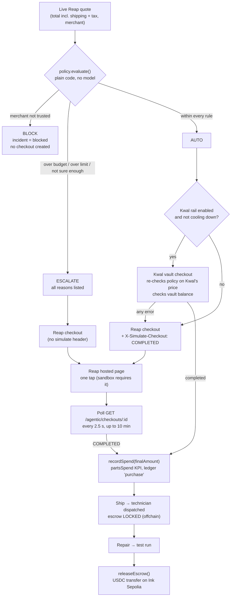
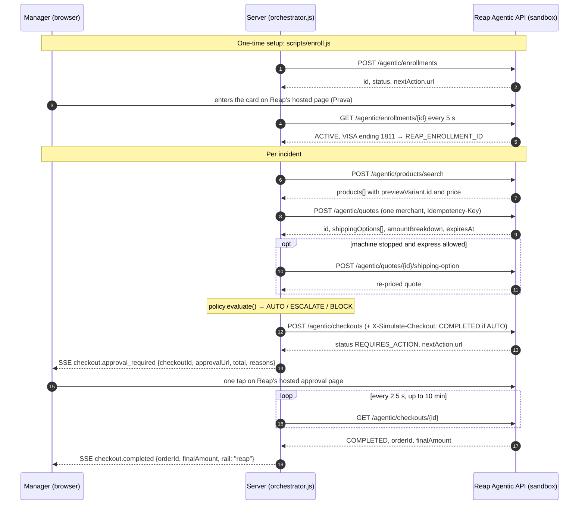
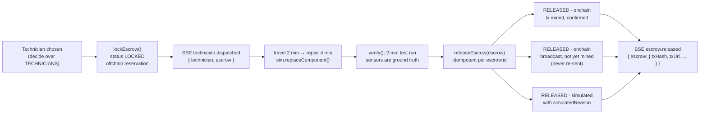

# Payments, spending controls and onchain settlement

> **Scope.** This document covers every path by which Wrench-bot moves money: buying spare parts through
> **Reap Agentic Payments** (card rail), the **Kwal USDC vault** (onchain-backed card rail), and **technician payouts
> in USDC on Ink Sepolia**. It also covers the policy engine that decides who may authorise each payment, every error
> state, Judge mode, and the manager ledger.
>
> **Source of truth.** Every statement points at the code that implements it. Paths are relative to this file.
> Live facts were verified against the Reap sandbox, the OpenAI Decisions API and Ink Sepolia on **9 Oct 2026**.
>
> Related docs: [README](../README.md) · [ARCHITECTURE](ARCHITECTURE.md) · [AGENT](AGENT.md) · [API](API.md) ·
> [SIMULATION](SIMULATION.md) · [JUDGING](JUDGING.md)

---

## TL;DR for evaluators

| Question | Answer | Where it is enforced |
|---|---|---|
| Can the LLM spend money? | **No.** The model only returns probabilities (`decide()` → `{ answer, probabilities, confidence }`). It cannot call any payment function. A low probability can only make the agent ask the manager. | [`agent/decide.js`](../server/src/agent/decide.js), [`agent/policy.js` → `evaluate()`](../server/src/agent/policy.js) |
| Who decides whether a payment goes ahead? | A 98-line, model-free policy module: **AUTO**, **ESCALATE** or **BLOCK**. | [`agent/policy.js`](../server/src/agent/policy.js) |
| Default limits | $60 per order without asking · $1,000 monthly budget · 75% confidence · 3 trusted stores | `DEFAULT_POLICY` in [`policy.js`](../server/src/agent/policy.js) |
| Parts rail | Reap Agentic Payments sandbox: enrollment → search → quote → shipping → checkout → hosted approval → status poll. Card: VISA ending 1811. | [`reap/client.js`](../server/src/reap/client.js), [`reap/purchase.js`](../server/src/reap/purchase.js), `pay()` in [`orchestrator.js`](../server/src/agent/orchestrator.js) |
| Onchain spending cap for parts | A Kwal USDC vault on Ink Sepolia, funded with **8 USDC**. Its balance is the most its card can spend. Kwal's quote API currently returns `400 ParticipantBadRequest`, so the agent **falls back to the Reap card automatically**. | [`kwal/rail.js`](../server/src/kwal/rail.js), `payFromVault()` |
| Labor rail | Real ERC-20 USDC `transfer` from the factory treasury to the technician's wallet, sent with viem. The escrow is **released only after the post-repair test run**, at most once per escrow. | [`agent/technicians.js`](../server/src/agent/technicians.js), [`chain/usdc.js`](../server/src/chain/usdc.js) |
| Proof onchain | Vault deployment, 8 USDC funding and a 0.05 USDC technician payout. All three are linked in [§7.6](#76-verified-onchain-evidence). | Ink Sepolia explorer |
| Audit trail | Every purchase, approval, block, failure, payout and decision is written to a persisted ledger: `GET /api/ledger` and the **Manager dashboard**. | [`agent/ledger.js`](../server/src/agent/ledger.js), [`game/src/ui/dashboard.js`](../game/src/ui/dashboard.js) |

**One-line model of authority:** *the model recommends, code decides, the manager approves, and the vault balance and
the treasury balance cap what can actually be spent.*

---

## Contents

1. [Payment authority: who can spend what, enforced where](#1-payment-authority-who-can-spend-what-enforced-where)
2. [The policy engine](#2-the-policy-engine)
3. [Policy verdict → what the manager sees](#3-policy-verdict--what-the-manager-sees)
4. [The Reap Agentic flow as implemented](#4-the-reap-agentic-flow-as-implemented)
5. [Reap sandbox findings and how the code handles them](#5-reap-sandbox-findings-and-how-the-code-handles-them)
6. [The Kwal vault rail](#6-the-kwal-vault-rail)
7. [Onchain technician payouts](#7-onchain-technician-payouts)
8. [Every error state](#8-every-error-state)
9. [Judge mode: payment behaviour](#9-judge-mode-payment-behaviour)
10. [The manager ledger](#10-the-manager-ledger)
11. [Configuration reference](#11-configuration-reference)
12. [Verify it yourself](#12-verify-it-yourself)
13. [Honest limits](#13-honest-limits)

---

## 1. Payment authority: who can spend what, enforced where

### 1.1 Actors and their powers

| Actor | What it can spend | What it cannot do | Enforced in |
|---|---|---|---|
| **Decision model** (OpenAI Decisions API, `gpt-6-luna`) | Nothing. | It cannot call Reap, Kwal or the chain. Its only effect on money is the `confidence` number, and the policy uses that number to **escalate**, never to approve. | `diagnose()` and `searchCatalog()` in [`orchestrator.js`](../server/src/agent/orchestrator.js) take only `answer` and `probabilities` from [`decide()`](../server/src/agent/decide.js) |
| **Agent code** (`orchestrator.js`) | One part order per attempt, **only when the policy returns `AUTO`**. | It cannot change the policy or the budget, and it cannot approve its own escalations. For an escalated order it never sends `X-Simulate-Checkout`. | `run()` → `evaluate()` → `pay()` in [`orchestrator.js`](../server/src/agent/orchestrator.js) |
| **Manager** (human, in the game) | Approves escalated orders with one tap on **Reap's hosted page**, or with the Approve button in mock or Judge mode. Edits limits, budget, confidence and trusted stores in the Manager's Desk. | The Desk cannot edit `spent`; only the settled amount of a completed checkout changes it. | `ApprovalModal` in [`agentpanel.js`](../game/src/ui/agentpanel.js), [`desk.js`](../game/src/ui/desk.js), `updatePolicy()` in [`policy.js`](../server/src/agent/policy.js) |
| **Reap** (card issuer / checkout) | Charges the enrolled card (VISA ending 1811). | In the sandbox it charges nothing without a tap on its hosted page, even for AUTO orders ([§5](#5-reap-sandbox-findings-and-how-the-code-handles-them)). | Reap's `REQUIRES_ACTION` → `nextAction.url` |
| **Kwal vault** (onchain USDC) | Up to its onchain balance (8 USDC funded). | It cannot spend more than the vault holds. The agent also re-checks the policy against Kwal's own price before paying. | `vaultCheckout()` in [`kwal/rail.js`](../server/src/kwal/rail.js) (`OUTSIDE_POLICY`, `VAULT_LOW`) |
| **Treasury wallet** → technicians | A fixed job rate × `TECH_PAYOUT_SCALE` per completed repair job, one transfer per escrow. | No payout without a dispatched technician and a finished test run. No double payout. Nothing beyond the treasury balance or the `ONCHAIN_MAX_PAYOUTS` cap. | `lockEscrow()`, `releaseEscrow()`, `transfer()` in [`technicians.js`](../server/src/agent/technicians.js) |

### 1.2 Money paths



### 1.3 Spending limits that hold whatever the model says

| # | Control | Value | Code |
|---|---|---|---|
| 1 | Trusted-store allowlist (BLOCK) | `['Switch Electronics', 'Digitmakers.ca', 'Tech For Less']` | `DEFAULT_POLICY.allowedMerchants`, `evaluate()` |
| 2 | Per-order auto-approve limit | $60 (Desk slider $0–$300, step $5) | `autoApproveLimit`; slider in [`desk.js`](../game/src/ui/desk.js) |
| 3 | Monthly budget, based on settled amounts | $1,000 (Desk slider $100–$3,000, step $50) | `monthlyBudget`, `recordSpend()` |
| 4 | Confidence floor | 75% (Desk slider 50%–95%, step 5%) | `confidenceThreshold`; `confidence = min(diagnosis, listing pick)` in `run()` |
| 5 | Per-part unit price ceiling | Each part's `maxPrice`, e.g. servo $120, fuse $10. Pricier listings are never shortlisted. | `MACHINES[].components[].maxPrice` in [`shared/contract.js`](../shared/contract.js); `shortlistOf()` in [`catalog.js`](../server/src/catalog/catalog.js) |
| 6 | At most 3 orders per incident | `MAX_ATTEMPTS = 3`, then `GAVE_UP` | `run()` in [`orchestrator.js`](../server/src/agent/orchestrator.js) |
| 7 | At most one active incident per machine | statuses `open`, `blocked`, `error` | `activeIncident()`, `startIncident()` |
| 8 | Express shipping only when it pays for itself | only if the machine is stopped **and** (it is critical **or** `expressForCriticalOnly` is off) | `wantsExpress()` |
| 9 | Re-check on the second rail's own price | Kwal's total and store run through `evaluate()` again before any USDC moves | `approve` callback in `payFromVault()`; `OUTSIDE_POLICY` in [`kwal/rail.js`](../server/src/kwal/rail.js) |
| 10 | Onchain balance caps | vault: 8 USDC; treasury: USDC + ETH balances checked before each transfer | `VAULT_LOW` in `rail.js`; `transfer()` in `technicians.js` |
| 11 | Onchain payout count cap | `ONCHAIN_MAX_PAYOUTS` (Judge deployment: 200), persisted across restarts | `payoutCapReached()` in `technicians.js`; [`render.yaml`](../render.yaml) |

---

## 2. The policy engine

**File:** [`server/src/agent/policy.js`](../server/src/agent/policy.js), 98 lines with no imports and no model calls.
The header comment states the design: *"HARD spending limits. Plain code, never a model. The model only recommends;
this decides whether the agent may pay alone, must ask, or is blocked."*

### 2.1 Inputs

`evaluate({ total, merchant, confidence })` is called once per attempt, right after a live quote. The call is in `run()` in
[`orchestrator.js`](../server/src/agent/orchestrator.js):

```js
const confidence = Math.min(part.confidence, found.confidence ?? 1);
const verdict = evaluate({ total: quote.total, merchant: quote.merchant, confidence });
```

- `total` is Reap's `amountBreakdown.finalAmount.amount`: parts, shipping and tax together (`toQuote()` in [`purchase.js`](../server/src/reap/purchase.js)).
- `merchant` is the store on the quote, with Reap's `" | domain"` suffix removed (`cleanMerchant()` in [`catalog.js`](../server/src/catalog/catalog.js)).
- `confidence` is the **lower** of two numbers: the probability the decision model gave the diagnosed part, and its probability for the chosen listing. The listing confidence is 1 when only one listing qualified. Being unsure about either *what broke* or *what to buy* is enough to escalate.

### 2.2 The rules, exactly as written

```js
export function evaluate({ total, merchant, confidence }) {
  const reasons = [];
  const remaining = policy.monthlyBudget - policy.spent;

  if (!policy.allowedMerchants.includes(merchant)) {
    return { action: 'BLOCK', reasons: [`${merchant} is not an approved store`] };
  }
  if (total > remaining) reasons.push(`Over remaining budget ($${total.toFixed(2)} > $${Math.max(0, remaining).toFixed(2)})`);
  if (total > policy.autoApproveLimit) reasons.push(`Over auto-approve limit ($${total.toFixed(2)} > $${policy.autoApproveLimit})`);
  if (confidence < policy.confidenceThreshold)
    reasons.push(`Not sure enough (${Math.round(confidence * 100)}% < ${Math.round(policy.confidenceThreshold * 100)}%)`);

  if (reasons.length) return { action: 'ESCALATE', reasons };
  return { action: 'AUTO', reasons: [`Within limits: $${total.toFixed(2)} ≤ $${policy.autoApproveLimit}, ${Math.round(confidence * 100)}% sure`] };
}
```

Properties a reviewer can check directly in the code:

| Property | Consequence |
|---|---|
| **BLOCK is checked first and short-circuits.** | No limit, budget or confidence value lets an untrusted store through. Only the manager can unblock, by trusting the store and pressing Retry. |
| **Budget overrun is ESCALATE, not BLOCK.** | When the budget is spent, the manager can still decide that a $64 switch is worth more than a stopped line (scenario *Month-end crunch*). |
| **All failing ESCALATE reasons are collected.** | The approval modal lists every reason, e.g. both "Over remaining budget" and "Over auto-approve limit". |
| **Comparisons are strict (`>`, `<`).** | An order of exactly $60.00 at exactly 75% is AUTO. |
| **`spent` only grows from settled amounts.** | `recordSpend(amount)` runs only after `COMPLETED` (Reap) or `completed` (Kwal), using the final settled amount (`pay()`, `payFromVault()`, `payDemo()`). |

### 2.3 Reason strings (verbatim)

| Verdict | Reason template | Example (amounts from live quotes) |
|---|---|---|
| `BLOCK` | `${merchant} is not an approved store` | `Tech For Less is not an approved store` |
| `ESCALATE` | `Over remaining budget ($${total} > $${remaining})` | `Over remaining budget ($64.06 > $38.00)` |
| `ESCALATE` | `Over auto-approve limit ($${total} > $${limit})` | `Over auto-approve limit ($64.06 > $60)` |
| `ESCALATE` | `Not sure enough (${pct}% < ${threshold}%)` | `Not sure enough (59% < 75%)` |
| `AUTO` | `Within limits: $${total} ≤ $${limit}, ${pct}% sure` | `Within limits: $35.68 ≤ $60, <pct>% sure` |

The orchestrator writes the verdict to the plant log as `Policy <ACTION>. <reasons joined by ". ">` (log code `POLICY`).
It also emits `policy.decision` `{ action, reasons, total, confidence }` ([`shared/contract.js`](../shared/contract.js) `EVENTS.POLICY_DECISION`).

### 2.4 How each scenario exercises the policy

Preset policies come from `PRESETS[].policy` in [`shared/contract.js`](../shared/contract.js). Loading a preset calls
`reset(preset.policy)`, which restores the defaults and then applies the preset's overrides, including `spent`.

| Scenario | Preset policy | What happens at the policy step | Verdict |
|---|---|---|---|
| **Sensor burnout** | limit $60, budget $1,000, spent $0 | Proximity sensor live quote **$35.68** (incl. $24.98 shipping) from Switch Electronics, with high confidence | **AUTO** |
| **Brownout** | limit $60, budget $1,000 | The fault code points at the servo. With full context the Decisions API picks the **24V power supply at 0.59**, which is below the 75% floor. | **ESCALATE**: `Not sure enough (59% < 75%)` |
| **Grinding noise** | `predictiveMaintenance: true` | Bearing ordered while the conveyor still runs (standard shipping, because `wantsExpress()` needs a stopped machine) | AUTO if under $60 and confident |
| **Month-end crunch** | budget **$150**, spent **$112** → **$38 left** | PoE switch quote **$64.06** from Tech For Less | **ESCALATE**: over remaining budget **and** over the $60 limit |
| **Supplier gap** | `allowedMerchants: ['Switch Electronics', 'Digitmakers.ca']` | Barcode scanner: the qualifying listing is from Tech For Less | **BLOCK**: `Tech For Less is not an approved store` |
| **Free play** | defaults + predictive | Random wear, one failure at a time | any |

The Brownout row matters for the payment story. When the naive fault-code prior was included in the model input, the
model copied it (servo, 0.95). The orchestrator therefore **withholds the prior from the model** and shows it to the manager
next to the model's answer as the "fault-code rule". When the model is honestly unsure, the confidence floor turns that
uncertainty into a human approval instead of a wrong purchase. See [AGENT.md](AGENT.md) for the diagnosis side.

### 2.5 Editing the policy

| Path | Accepted keys | Validation (`clean()` in `policy.js`) |
|---|---|---|
| `PUT /api/policy` (Manager's Desk) | `autoApproveLimit`, `monthlyBudget`, `confidenceThreshold`, `allowedMerchants`, `expressForCriticalOnly`, `predictiveMaintenance` | Numbers must be finite and ≥ 0. Confidence is clamped to [0, 1]. Booleans accept `true` or `"true"`. Store names are trimmed and de-duplicated. **Unknown keys and invalid values are ignored.** |
| `POST /api/sim/preset` | the preset's `policy`, **including `spent`** | Same validation. `spent` is editable only here. |
| `recordSpend(amount)` | – | Only finite positive amounts, rounded to cents |

Every change emits `policy.updated` with the full policy plus `remaining`. The HUD budget bar and the Desk update at once
(`setPolicy()` in [`UI.js`](../game/src/ui/UI.js)). The Desk states the active rule in words
([`desk.js`](../game/src/ui/desk.js)):

> Wrench-bot pays on its own when the order is at most **$60**, it is at least **75%** sure, the store is trusted and the budget covers it.

---

## 3. Policy verdict → what the manager sees

Each verdict has its own state in four places: the robot's speech bubble ([`director.js`](../game/src/director.js)), the agent
card ([`agentpanel.js`](../game/src/ui/agentpanel.js) `#approval()`), the approval modal (`ApprovalModal`) and the ledger.

| Verdict | Robot says | Agent card (Approve step) | Modal | Ledger row |
|---|---|---|---|---|
| **AUTO** | "$35.68 is within my limits. Buying it now." | green **Within limits: auto-buy** · `$35.68 · <pct>% sure` → "Paying…" → **Paid** `$35.68 · Paid by Reap card · order #…` | Live sandbox only, because Reap still asks for a tap: **"Within your limits — confirm on Reap (one tap)"** · *"This order passed every spending rule. Reap asks for one tap on its page before it charges the card."* · button **Confirm on Reap ↗** | `purchase`, approval `auto` |
| **ESCALATE** | "I need your OK for this one: Not sure enough (59% < 75%)." | amber **Asks the manager** with the reasons as bullets → "Waiting for your decision on $X. **Review**" | **"Needs your decision"** · *"Wrench-bot stopped before paying: this order is outside the rules you set."* · **Why it asks you** (all reasons) · diagnosis + confidence · live downtime cost (*"The Robot Arm is down: −$60/min while you decide (waited 3 min, $180)"*) · **Open Reap to decide ↗** / **Later** | `approval`, then `purchase` (approval `manager`) or `failed` |
| **BLOCK** | "I'm not allowed to buy this: Tech For Less is not an approved store." | red **Blocked by policy** + *open desk* link. Incident chip **Blocked, needs you**. Error box `BLOCKED` with the hint *"Trust the store in the Manager's Desk, then retry."* and buttons **Retry** and **Open Manager's Desk** | none (no checkout is ever created) | `blocked`, approval `blocked` |

Other details:

- **The modal opens by itself** on `checkout.approval_required`. It queues several approvals ("2 more waiting"), and **Later** hides it while Reap keeps waiting (`ApprovalModal.open()` / `hide()`).
- **A blocked store is flagged in the Manager's Desk** with a red **BLOCKED AN ORDER** chip until the manager trusts it (`flagMerchant()` in [`desk.js`](../game/src/ui/desk.js), called from the `policy.decision` and `incident.error` handlers in [`director.js`](../game/src/director.js)).
- **Retry** calls `POST /api/incidents/:id/retry` → `retryIncident()`. It is allowed only from `error` or `blocked`. It resets the attempt counter and re-runs the **whole** pipeline: new diagnosis, new search, **new quote**, and a new `evaluate()` against the *current* policy. Trusting the store and pressing Retry is how a BLOCK clears.
- **Rail label after payment:** `railText()` shows *"Paid by Reap card"* or *"Paid from Kwal vault (USDC)"* on the card and in the plant log (log codes `REAP` / `KWAL`).
- **Mock and Judge modes** replace the Reap link with **Approve $X** / **Reject** buttons → `POST /api/mock/approve/:checkoutId`. The footnote says *"Offline mode: these buttons stand in for Reap's hosted approval page."* in mock mode and *"Demo approval — in the live app this is a one-tap approval on Reap's page"* in Judge mode (`JUDGE_APPROVAL_NOTE` in [`UI.js`](../game/src/ui/UI.js)).

---

## 4. The Reap Agentic flow as implemented

**Files:** [`reap/client.js`](../server/src/reap/client.js) (one function per endpoint),
[`reap/purchase.js`](../server/src/reap/purchase.js) (quote → checkout → wait),
[`catalog/catalog.js`](../server/src/catalog/catalog.js) (search),
`pay()` / `pollCheckout()` in [`agent/orchestrator.js`](../server/src/agent/orchestrator.js),
[`scripts/enroll.js`](../server/scripts/enroll.js) (enrollment).

### 4.1 Sequence



### 4.2 Transport

Every request goes through `call()` in [`client.js`](../server/src/reap/client.js):

| Header | Value | Why |
|---|---|---|
| `Authorization` | `Bearer ${REAP_API_KEY}` | team sandbox key (from `.env`, never committed) |
| `Reap-Version` | `2025-02-14` (`REAP_VERSION`) | **required.** Requests without it fail, and we found the value only through a validation error. |
| `Content-Type` | `application/json` | |
| `Idempotency-Key` | `randomUUID()` on quote, checkout and enrollment POSTs | `call()` never re-sends a POST, so one agent step creates at most one quote or checkout |
| `X-Simulate-Checkout` | `COMPLETED`, **only** when the policy verdict is AUTO | sandbox-only hint (see [§5](#5-reap-sandbox-findings-and-how-the-code-handles-them)) |

Non-2xx responses throw `ReapError { status, code: body.error.code, message: body.error.message, detail }`. The orchestrator
uses `code` to choose between trying another store and stopping the incident ([§8](#8-every-error-state)).

### 4.3 Step by step: requests and the fields we use

| # | Step | Endpoint | Request body (as sent) | Response fields used | Code |
|---|---|---|---|---|---|
| 0 | **Enrollment** (one-time) | `POST /agentic/enrollments` then `GET /agentic/enrollments/{id}` | `{ source: 'EXTERNAL', owner: { type: 'CLIENT_REFERENCE', id: 'factory-manager-1', email }, presentation: { type: 'REDIRECT', returnUrl } }` | `id`, `status`, `nextAction.url`; on ACTIVE: `paymentMethod.network`, `paymentMethod.last4` | [`scripts/enroll.js`](../server/scripts/enroll.js) (polls every 5 s, up to 120 times; stops on `FAILED`/`EXPIRED`/`REVOKED`), `createEnrollment()` in `client.js` |
| 1 | **Product search** | `POST /agentic/products/search` | `{ query, context: { country: 'US', currency: 'USD' }, filters: { availability: 'AVAILABLE_ONLY' }, pagination: { limit: 20 } }` | `products[].id`, `.name`, `.merchant.name`, `.imageUrl`, `.available`, `.previewVariant.{id, price.amount, price.currency, available}`, `.priceRange.min` | `reapLive.search()`; `searchOffers()` / `toOffer()` in `catalog.js` (10-min memory cache plus disk cache `server/.cache/catalog.json`) |
| 2 | **Details / variant** | `POST /agentic/products/details` · `POST /agentic/products/variant` | `{ productIds }` · `{ productId, optionIds }` | – | `details()` and `resolveVariant()` exist in `client.js`. **The agent pipeline does not call them today.** It buys the search result's `previewVariant.id` directly (`toOffer()`). |
| 3 | **Quote** | `POST /agentic/quotes` | `{ items: [{ variantId, quantity }], email, shippingAddress: { firstName, lastName, phone, addressLine1, city, region, postalCode, country } }` | `id`, `shippingOptions[].{id, name, price.amount, selected}`, `amountBreakdown.{itemsSubtotal, shipping, tax.amount, finalAmount}`, `expiresAt` | `createQuote()`; `quoteParts()` → `toQuote()` in `purchase.js` |
| 4 | **Shipping option** | `POST /agentic/quotes/{id}/shipping-option` | `{ shippingOptionId }` | the re-priced quote | `selectShipping()`. Picks the first option matching `/express\|overnight\|2day\|priority/i`, only when `wantsExpress()` is true. |
| 5 | **Checkout** | `POST /agentic/checkouts` | `{ quoteId, enrollmentId, presentation: { type: 'REDIRECT', returnUrl } }` | `id`, `status`, `nextAction.url`, `amount` | `createCheckout()`; `startCheckout(quote, { autoApprove })` returns `{ checkoutId, status, approvalUrl, amount }` |
| 6 | **Hosted approval** | Reap's page at `nextAction.url` | – | – | The game opens it from the approval modal (`target="_blank"`). The server never sees the tap. It only polls. |
| 7 | **Status poll** | `GET /agentic/checkouts/{id}` | – | `status` (terminal: `COMPLETED`, `FAILED`, `EXPIRED`), `orderId`, `finalAmount` | `pollCheckout()` in `orchestrator.js`: every **2.5 s** (700 ms in mock mode), **10 min** real-time limit (`APPROVAL_TIMEOUT_MS`), tolerates 2 consecutive network errors |

The normalized quote that the game renders and the policy reads is defined in `quoteParts()`:

```text
{ quoteId, merchant, items:[{name, qty, image, price}], shipping:{name, amount},
  shippingOptions:[{id, name, amount, selected}], subtotal, tax, total, currency, expiresAt }
```

### 4.4 What the agent does with a quote

1. **One listing per quote, never a mixed cart.** `quoteWithFallback()` calls `quoteParts([offer])` with one offer at a time. Up to **3 listings** are tried in order: the model's pick, then the next-best shortlisted listings. `quoteParts()` also throws `MIXED_MERCHANTS` if it is ever handed parts from more than one store.
2. **Quantity comes from the part spec** (`qty` in `MACHINES`). Example: the gripper uses 2 servos, and the live quote for **2× servo was $93.15**.
3. The plant log line shows the full price breakdown, e.g. `QUOTE Switch Electronics: $35.68 total = parts $… + <option> shipping $24.98 + tax $…`.
4. **The policy is evaluated on the quote total**, not on the listing price. Shipping and tax count against the limit and the budget.

### 4.5 Checkout outcomes → spend accounting

On `COMPLETED`, `pay()` does the following, in order:

- `amount = finalAmount.amount` (falls back to the quote total)
- `incident.spent += amount`, `recordSpend(amount)` (the monthly budget), `sim.bump('partsSpend', amount)` (HUD KPI)
- emits `checkout.completed { checkoutId, orderId, finalAmount, rail: 'reap' }`, then `policy.updated` (new `remaining`)
- plant log: `APPROVAL Manager approved $X` (escalated only) and `ORDER Ordered 1× … from Switch Electronics ($35.68), order #…`

Any other terminal status emits `checkout.failed` and stops the incident ([§8](#8-every-error-state)).

### 4.6 Offline mock (`MOCK_REAP=1`, or no `REAP_API_KEY`)

[`reap/mock.js`](../server/src/reap/mock.js) implements the same interface. Quotes take 1.5 s and use 8% tax, Standard
shipping at $6 and Express at $18, and expire in 15 min. AUTO checkouts complete after about 1.5 s. Escalated checkouts sit
in `REQUIRES_ACTION` until `POST /api/mock/approve/:checkoutId { approve }`. Search is served from the disk cache and the
verified fallback listings in [`catalog/fallback.js`](../server/src/catalog/fallback.js) (12 offers, verified against the
sandbox on 9 Oct 2026).

---

## 5. Reap sandbox findings and how the code handles them

Found while building against the sandbox on 9 Oct 2026:

| Finding | Impact | How the code handles it |
|---|---|---|
| `Reap-Version: 2025-02-14` is **required**, and we found the value only through a validation error | Every call fails without it | Sent on every call (`call()` in `client.js`); `REAP_VERSION` in [`config.js`](../server/src/config.js) and [`render.yaml`](../render.yaml) |
| Quotes require `shippingAddress { firstName, lastName, phone (E.164), addressLine1, city, country }` | Quotes are rejected without it | Fixed demo address in `config.shippingAddress` (US, `+14155550123`) |
| A quote takes **about 10 s** and **expires after about 15 min** | Slow step; a quote can go stale | The game clock is held while the agent works (`holdClock()`), so the wait doesn't cost game-time downtime. The checkout opens seconds after the quote. A **Retry** always re-quotes. |
| **One quote per merchant.** Mixed carts return `AGENTIC_REQUEST_REJECTED`. | A multi-store order would fail | One listing per quote (`quoteWithFallback()`); `MIXED_MERCHANTS` guard in `quoteParts()`. `AGENTIC_REQUEST_REJECTED` is in `QUOTE_RETRY_CODES`, so the agent moves to the next listing. |
| Checkout `returnUrl` must be **public HTTPS**. `localhost` is rejected. | Local development can't use a localhost return URL | `REAP_RETURN_URL` defaults to `https://example.com/wrench-bot/approved`. The server polls the checkout status itself, so the return page doesn't matter (`config.js` comment). |
| **Every sandbox checkout returns `REQUIRES_ACTION`**, even with `X-Simulate-Checkout: COMPLETED`, and needs one tap on Reap's hosted page. A test checkout left unapproved went `EXPIRED`. | "AUTO" orders still need a human tap in the sandbox | The policy still runs on our side, and the modal copy changes with the verdict: *"Within your limits — confirm on Reap (one tap)"* vs *"Needs your decision"*. If Reap ever skips the tap, `startCheckout()` returns `approvalUrl: null`, no approval event is emitted, and `pay()` goes straight to polling. No code change is needed. |
| Reap **mandates** (pre-approved recurring terms) are documented as **"not available yet"** | Reap cannot hold our spending rules for us | `policy.js` enforces them (see its header comment). The Kwal vault adds an onchain cap ([§6](#6-the-kwal-vault-rail)). |
| Card enrollment through the hosted page (Prava) took **about 15 min** to become `ACTIVE` (VISA ending 1811) | Not a live-demo step | One-time `npm run reap:enroll -w server`, which polls for up to 10 min. Without an ID, live checkouts stop with `NO_CARD`. |
| Catalog depth: about 80 queries found **about 1,750 purchasable products**. All 15 machine parts map to live listings from Switch Electronics, Tech For Less and Digitmakers. | Real parts can be bought | `catalog.js` + verified fallbacks. Live quotes seen: proximity sensor **$35.68** (incl. $24.98 shipping), 2× servo **$93.15**, PoE switch **$64.06**, stepper **$30.00**. |

---

## 6. The Kwal vault rail

### 6.1 What it is and why it exists

Kwal (Payward) gives a participant a **USDC vault contract on Ink Sepolia** that backs a sandbox card. The factory
treasury wallet owns the vault. Two things follow:

- **The vault balance is the onchain spending cap for the agent's card.** It holds 8 USDC, so the card can spend at most 8 USDC, whatever any server-side setting says.
- **Within-policy orders need no approval page.** Funding the vault is the authorization, so AUTO orders could complete without the Reap tap that the sandbox requires today.

| Item | Value |
|---|---|
| Network | Ink Sepolia testnet, chain id **763373** (`inkSepolia` in [`chain/usdc.js`](../server/src/chain/usdc.js)) |
| USDC token | [`0xFabab97dCE620294D2B0b0e46C68964e326300Ac`](https://explorer-sepolia.inkonchain.com/address/0xFabab97dCE620294D2B0b0e46C68964e326300Ac) (6 decimals) |
| Treasury wallet (owns the vault) | [`0x081f8183Ff9EE52958644F63B9567e309b2bD97c`](https://explorer-sepolia.inkonchain.com/address/0x081f8183Ff9EE52958644F63B9567e309b2bD97c) |
| Kwal vault | [`0x14735b01eD166F386EFE0aD27A2791498b44572f`](https://explorer-sepolia.inkonchain.com/address/0x14735b01eD166F386EFE0aD27A2791498b44572f) (`DEFAULT_VAULT` in [`chain/treasury.js`](../server/src/chain/treasury.js); overridable with `KWAL_VAULT_ADDRESS` or by Kwal's status response) |
| Vault deployed by Kwal | tx [`0xc28251e4874776152944eb12827b43dea9866ca9fc2acf5ab3dadc4a0915ac64`](https://explorer-sepolia.inkonchain.com/tx/0xc28251e4874776152944eb12827b43dea9866ca9fc2acf5ab3dadc4a0915ac64) |
| Funded with 8 USDC from the treasury | tx [`0xda328aa274aa952f03e8dea01a9ac8e5a73802df5703edc56d02ea5fe763ca0d`](https://explorer-sepolia.inkonchain.com/tx/0xda328aa274aa952f03e8dea01a9ac8e5a73802df5703edc56d02ea5fe763ca0d) |
| Kwal status | *"ready for checkout, 8.00 USDC card-spendable"* |

### 6.2 When the rail is used

```js
// kwal/rail.js
export const kwalRailEnabled = () => !config.mockReap && !config.judge && kwalEnabled();
// kwal/client.js: a Kwal session file exists, is not expired, and KWAL != '0'
```

`pay()` tries the vault **only when the verdict is AUTO** and the rail is enabled. **Escalated orders always go to Reap's
approval page**, so a human approves every out-of-policy order on a hosted page.

### 6.3 Flow (`vaultCheckout()` in [`kwal/rail.js`](../server/src/kwal/rail.js))

All routes are under `/kwal/participant/v1` and use the Kwal skill's session token (read from
`~/.config/pws/agent-payment/credentials.json`, outside the repo). Each call has a 30 s timeout
([`kwal/client.js`](../server/src/kwal/client.js)).

| # | Step | Kwal call | Guard / failure code |
|---|---|---|---|
| 1 | Find the same part in Kwal's catalog | `GET /products?query=&limit=10` | `NO_PRODUCT`. Best title match by token overlap, with a +0.15 bonus for the same store (`bestMatch()`). |
| 2 | Product → purchasable variant | `POST /products/{productId}/variant { optionIds: [] }` | `NO_VARIANT` |
| 3 | Quote | `POST /quotes { email, lines: [{ variantId, quantity }], shippingAddress }` | `NO_QUOTE` |
| 4 | Shipping, if the quote asks for it | `POST /quotes/{id}/shipping { shippingOptionId }` | express only if the Reap quote was express |
| 5 | **Re-check the policy on Kwal's own total and store** | – | `NO_TOTAL`; `OUTSIDE_POLICY` if `evaluate(total, store, confidence).action !== 'AUTO'` |
| 6 | **Vault balance check** | `GET /funding?requiredMinorUnits=` | `VAULT_LOW`: `Vault holds X USDC, needs Y` |
| 7 | Pay from the vault | `POST /payments { paymentId, quoteId }`. **We choose `paymentId`** (`pay_<uuid>`), so it works as an idempotency key. | – |
| 8 | Wait for the card spend to settle | `GET /payments/{id}` every 2.5 s, up to **90 s** | `PAYMENT_<STATE>`; `maybePaid` is set when the state is not `declined`/`error`/`failed` |

On success the orchestrator records the spend exactly like a Reap order. It emits `checkout.completed` with `rail: 'kwal'` and
`finalAmount.currency: 'USDC'`, calls `refreshAfterPayout()` so the HUD vault balance updates, and logs
`ORDER Ordered 1× … (X USDC from the Kwal vault, no approval needed)`.

### 6.4 Current status: HTTP 400, with automatic fallback

**Observed 9 Oct 2026:** Kwal's **variant and quote endpoints return `HTTP 400 ParticipantBadRequest` for every product**.
The same happens through Kwal's own CLI, so the problem is not in our client. The vault is deployed and funded. The purchase
API is the part that fails.

The code is written so that this never stops the line:

1. **Any** error from `vaultCheckout()` makes `payFromVault()` return `null`, and `pay()` continues to the Reap card path.
2. The plant log gives the reason: `PAY Kwal vault rail unavailable (ParticipantBadRequest) — paying by Reap card instead`.
3. **Cooldown.** After a failure the rail is skipped for `KWAL_RETRY_MS` (default **120 s**) via `kwalCooldown()`, so each order doesn't spend about 2 s rediscovering the outage. The skip is logged the same way.
4. The HUD vault tooltip shows Kwal's setup state (`kwal.state` / `kwal.step` from `GET /status` and `/funding`, polled every 20 s by [`chain/treasury.js`](../server/src/chain/treasury.js)).

---

## 7. Onchain technician payouts

Reap sells products, not services, so labor is paid separately. The factory treasury pays the technician **real USDC on
Ink Sepolia**, and only after the repair has been checked.

**Files:** [`agent/technicians.js`](../server/src/agent/technicians.js) (escrow, settlement),
[`chain/usdc.js`](../server/src/chain/usdc.js) (viem client, ERC-20 transfer),
`repair()` / `payTechnician()` / `run()` in [`orchestrator.js`](../server/src/agent/orchestrator.js).

### 7.1 Lifecycle



**Release rule** (from `run()`): the escrow is locked at dispatch and released **after the post-repair test run**, never
earlier. If the test run confirms the fix, the agent **waits for the payout** before resolving, so the incident summary
carries the tx hash. If the fix didn't take (the part was not the root cause), the technician is **still paid, because the
work was done**. In that case the payout settles in the background while the agent rules the part out and re-diagnoses. A
failed diagnosis is the agent's mistake and doesn't reduce the technician's pay.

### 7.2 The escrow object

`lockEscrow(technician, incidentId)` returns:

```text
{ id: 'esc_xxxxxxxx', incidentId, technicianId, technicianName,
  amount: <job rate in USD>, currency: 'USD',
  amountUsdc: rate × TECH_PAYOUT_SCALE, payoutCurrency: 'USDC', scale,
  to: <technician wallet>, network: 'Ink Sepolia', reservation: 'offchain',
  status: 'LOCKED', onchain: <planned rail>, simulated, lockedAt }
```

`releaseEscrow()` resolves to the same object with `status: 'RELEASED'`, `releasedAt`, and either
`{ onchain: true, txHash, txUrl, blockNumber, confirmed }` or `{ onchain: false, simulated: true, simulatedReason }`.

### 7.3 Rates, scale and wallets

| Technician | Skills | Rate (USD) | Payout at 1:100 (default) | Payout at 1:10,000 (Judge) | Wallet |
|---|---|---|---|---|---|
| Ana | sensors, electrical | $120 | 1.20 USDC | 0.012 USDC | [`0x4034…0E3b`](https://explorer-sepolia.inkonchain.com/address/0x4034E929372b8c422EdE4026AD4788Bc88470E3b) |
| Raj | motors, servos | $110 | 1.10 USDC | 0.011 USDC | [`0x4eb0…5A5d`](https://explorer-sepolia.inkonchain.com/address/0x4eb0794b30d9f0f6Ac35424106b4EcddA98B5A5d) |
| Mei | networking, electrical | $100 | 1.00 USDC | 0.010 USDC | [`0x7b87…6bfA`](https://explorer-sepolia.inkonchain.com/address/0x7b873045c69a8c408401e23f792c1C5B03CA6bfA) |

- Rates: `TECHNICIANS` in `technicians.js`. Wallets: the public-address defaults in `chain/usdc.js`, which a local `server/.cache/wallets.json` can override. The repo holds no technician keys.
- Scale: `TECH_PAYOUT_SCALE` (default `0.01`, i.e. **1:100**, so testnet faucet funds last). The Judge deployment sets `0.0001` in [`render.yaml`](../render.yaml). The plant log names the scale, e.g. `(testnet, scaled 1:100)` (`PAYOUT_NOTE`).
- Labor is reported in USD (`laborSpend` KPI, `summary.labor`). The amount actually transferred is `amountUsdc`.

### 7.4 Settlement guards (`settle()` → `transfer()`)

Settlement checks these in order. The first that fails turns the payout into a **simulated** one with the stated reason,
and **`releaseEscrow()` never throws**, so a payout problem can't stop an incident.

| # | Check | Simulated reason |
|---|---|---|
| 1 | Chain active: treasury key set, `ONCHAIN != 0`, not offline mock mode (`chainActive()`) | `no treasury key configured` / `onchain switched off, ONCHAIN=0` / `offline mode, MOCK_REAP` |
| 2 | The technician has a payout wallet | `no payout wallet for tech-…` |
| 3 | Amount > 0 | `nothing to pay` |
| 4 | Demo payout cap not reached (`ONCHAIN_MAX_PAYOUTS`; the count persists in `server/.cache/onchain.json`) | `demo payout cap reached` |
| 5 | Treasury USDC ≥ payout (balance read, 8 s timeout; a failed read is not treated as "no") | `treasury holds X USDC, needs Y` |
| 6 | Treasury ETH > 0 for gas (about 6e-8 ETH per transfer observed) | `treasury has no ETH for gas` |
| 7 | Broadcast `transfer(to, parseUnits(amount, 6))` within 25 s | `transfer failed: …` |
| 8 | Receipt within 45 s with `status === 'success'` | reverted: `transfer reverted onchain` (tx hash kept). **Not mined in time: still a real payment**, returned as `onchain: true, confirmed: false` and **never re-sent**. `confirmPayout()` then waits up to 180 s and logs `Payout to Ana confirmed in block N`. |
| – | Anything unexpected | `payout error: …` |

Safety properties:

- **Idempotent:** `releaseEscrow()` keeps a `Map<escrow.id, Promise>`, so a second call returns the first call's promise and the same escrow is never paid twice.
- **No nonce races:** all transfers from the treasury go through one serial queue (`serial()`).
- **Cancel-safe:** if the incident is cancelled (scenario change or Judge idle reset) after a transfer starts, the transfer still settles and is logged server-side, but no UI event is emitted. If the incident is cancelled before the test run, the escrow is never released. It was only an offchain reservation, so no money moved.

### 7.5 What the manager sees

| Moment | Agent card / plant log |
|---|---|
| Dispatch | **Escrow** chip: `<amount> locked until the fix is done` · log `TECH Dispatched Ana (sensors, electrical). $120.00 job: 1.20 USDC (testnet, scaled 1:100) held in escrow until the fix is checked` |
| Swap done | log `TECH Swap done. Ana's escrow is released once the test run is checked` |
| Paid onchain | **Paid** chip: `Paid Ana 1.20 USDC` + `onchain ↗` (explorer link) · log `PAYOUT Repair verified. Paid Ana 1.20 USDC onchain (testnet, scaled 1:100 from the $120.00 job), tx 0x…` |
| Paid, simulated | `Paid Ana 1.20 USDC (simulated: <reason>)`. The reason is always shown. |
| HUD | Vault and wallet balances with explorer links. Refreshed every 20 s, right after each payout, and again about 6 s later because load-balanced RPC reads can lag a mined receipt (`refreshAfterPayout()`). |
| Dashboard → Payouts tab | One row per payout with an **Onchain** / **Simulated** badge and a `0x…` link to the explorer |

### 7.6 Verified onchain evidence

Explorer format: `https://explorer-sepolia.inkonchain.com/tx/<hash>`.

| What | Transaction |
|---|---|
| Kwal vault deployment (by Kwal) | [`0xc28251e4874776152944eb12827b43dea9866ca9fc2acf5ab3dadc4a0915ac64`](https://explorer-sepolia.inkonchain.com/tx/0xc28251e4874776152944eb12827b43dea9866ca9fc2acf5ab3dadc4a0915ac64) |
| Vault funded with 8 USDC from the treasury | [`0xda328aa274aa952f03e8dea01a9ac8e5a73802df5703edc56d02ea5fe763ca0d`](https://explorer-sepolia.inkonchain.com/tx/0xda328aa274aa952f03e8dea01a9ac8e5a73802df5703edc56d02ea5fe763ca0d) |
| Technician payout test: 0.05 USDC from the treasury | [`0x77816ec667d73c0cffaceb2096d10d7e878788c7f97c189a722c2861fd794e12`](https://explorer-sepolia.inkonchain.com/tx/0x77816ec667d73c0cffaceb2096d10d7e878788c7f97c189a722c2861fd794e12) |

Each completed repair in the game produces another payout whose hash appears in the plant log, the agent card and the
dashboard.

---

## 8. Every error state

All incident-stopping errors use one channel. `fail()` in [`orchestrator.js`](../server/src/agent/orchestrator.js) sets the
incident to `blocked` (code `BLOCKED`) or `error` (any other code), writes an `ERROR` plant-log line, and emits
`incident.error { code, message, retryable: true }`. The game shows a red chip with the code, the message, a hint from
`ERROR_HINTS` in [`agentpanel.js`](../game/src/ui/agentpanel.js), and a **Retry** button. Errors that don't stop the
incident (store can't fill the order, Kwal down, payout simulated) are handled inline and logged.

| Trigger | Code | What the agent does | What the manager sees |
|---|---|---|---|
| A store can't fill the quote: `QUOTE_UNFULFILLABLE`, `CARD_PAYMENT_UNAVAILABLE`, `AGENTIC_REQUEST_REJECTED` (mixed cart), `CHECKOUT_URL_INVALID` | – (handled) | Tries the next shortlisted listing, up to 3 in total (`quoteWithFallback()`, `QUOTE_RETRY_CODES`) | Bubble: *"Switch Electronics can't fill this order (QUOTE_UNFULFILLABLE). Trying the next listing."* · WARN log line |
| No listing could be quoted | `NO_QUOTE` | Stops. Nothing has been paid. | *"No store could fill this order"* · hint *"No store could fill the order right now. Retry in a moment."* |
| No live listing matches the part spec, and there is no verified fallback | `NO_PARTS` | Stops before quoting | *"No listing found for "…""* · hint *"No listing matched the part spec. Refresh the catalog or retry."* |
| Mixed-merchant cart | `MIXED_MERCHANTS` | **Can't happen in the pipeline** (one listing per quote). `quoteParts()` guards against it anyway. | – |
| Untrusted store | `BLOCKED` | Never creates a checkout. Incident `blocked`. | Red **Blocked by policy**, store flagged **BLOCKED AN ORDER** in the Desk, toast `BLOCKED`, hint *"Trust the store in the Manager's Desk, then retry."*, buttons **Retry** + **Open Manager's Desk** · ledger `blocked` |
| Over limit / over budget / not sure enough | – (ESCALATE) | Opens a Reap checkout **without** the simulate header and waits for the human | Approval modal with all reasons and the live downtime cost · ledger `approval` |
| No card enrolled (live Reap, Kwal not used) | `NO_CARD` | Stops before checkout | *"No card on file yet…"* · HUD badge **No card** · hint *"No card is enrolled with Reap yet. Run the enrollment, then retry."* |
| Manager rejects, or Reap's hosted approval expires | `CHECKOUT_EXPIRED` | Emits `checkout.failed { status: 'EXPIRED', reason: 'The manager did not approve the order' }` and stops. Nothing is charged. | Toast *"Checkout expired: The manager did not approve the order"* · hint *"The order was rejected or expired. The machine stays down until you retry."* · ledger `failed` |
| Payment declined or the order failed at Reap | `CHECKOUT_FAILED` | `checkout.failed { status: 'FAILED', reason: 'The payment or order did not go through' }` | Hint *"The payment did not go through. Retry to quote again."* · ledger `failed` |
| No terminal status within 10 min | `CHECKOUT_TIMEOUT` | `checkout.failed { status: 'TIMEOUT', reason: 'No answer from the payment page' }` | Hint *"No answer from the payment page. Retry to start a new checkout."* |
| Network errors while polling the checkout | (Reap error code) | Tolerates 2 consecutive failures. The 3rd stops the incident. | Red chip with the code · **Retry** |
| Quote expired before checkout (about 15 min validity) | (Reap error code) | In practice the checkout opens seconds after the quote. If Reap rejects the checkout, the incident stops with Reap's code. **Retry** gets a fresh quote. `refreshQuote()` in `purchase.js` is a stub ([§13](#13-honest-limits)). | Red chip with Reap's code · **Retry** |
| Kwal returns 400 `ParticipantBadRequest` (currently always), or `NO_PRODUCT`, `NO_VARIANT`, `NO_QUOTE`, `NO_TOTAL`, `OUTSIDE_POLICY`, `VAULT_LOW`, `PAYMENT_*`, timeout | – (handled) | Falls back to the Reap card for this order and rests the rail for 120 s | Log `PAY Kwal vault rail unavailable (<code>) — paying by Reap card instead`, plus `(payment pay_… unconfirmed)` when a Kwal payment may be pending |
| Payout can't go onchain (chain off, no wallet, cap reached, low USDC, no gas, send failed, reverted) | – (handled) | Releases a **simulated** payout with `simulatedReason`. The incident continues. | `Paid Ana 1.20 USDC (simulated: treasury holds 0.40 USDC, needs 1.20)` · dashboard badge **Simulated** |
| Payout broadcast but not mined within 45 s | – (handled) | Counts it as a real payment (`confirmed: false`), never re-sends, confirms in the background | `… tx 0x… (awaiting confirmation)` → later `Payout to Ana confirmed in block N` |
| Three repairs didn't clear the fault | `GAVE_UP` | Stops after at most 3 orders | Hint *"Three repairs did not clear the fault. Retry to start a fresh diagnosis."* |
| Scenario change / Judge idle reset mid-payment | `CANCELLED` (silent) | Every await goes through `guard()` with an `AbortController`, so nothing is emitted afterwards. A payout already started still settles. | The card disappears; the new shift starts with a clean board |
| Treasury or Kwal status read fails | – | Keeps the last known balances; `treasury.error` lists what failed | HUD keeps showing the previous values |

---

## 9. Judge mode: payment behaviour

The live demo (link in the README) runs with `JUDGE_MODE=1` ([`config.js`](../server/src/config.js),
[`render.yaml`](../render.yaml)). Public visitors can't tap the team's Reap passkey, so the checkout is simulated. Every
other part of the decision chain stays real.

| Concern | Judge mode | Code |
|---|---|---|
| Diagnosis, catalog search, **quotes** | **Live** (OpenAI Decisions API, Reap sandbox search and quotes) | unchanged pipeline |
| **Policy** | **Identical.** `evaluate()` runs before `pay()` and BLOCK stops the incident exactly as in live mode. | `run()` |
| Checkout | Simulated by `payDemo()`. **AUTO** completes after about 1.2 s with order id `DEMO-xxxxx`. **ESCALATE** emits `checkout.approval_required { approvalUrl: null, demo: true }` and waits for the manager. | `payDemo()`, `approveDemo()` in `orchestrator.js` |
| Manager approval | **Approve $X** / **Reject** buttons → `POST /api/mock/approve/:checkoutId { approve }`. Footnote: *"Demo approval — in the live app this is a one-tap approval on Reap's page"*. Reject → `CHECKOUT_EXPIRED`. No answer in 10 min → `CHECKOUT_TIMEOUT` ("No answer from the manager"). | [`index.js`](../server/src/index.js), `UI.setMode()` / `#judgeNote()` in [`UI.js`](../game/src/ui/UI.js) |
| Spend accounting | Same `recordSpend()` / `partsSpend` / `policy.updated`, so budgets drain and escalate as in live mode | `payDemo()` |
| Kwal rail | **Off** (`kwalRailEnabled()` returns false when `config.judge`) | `kwal/rail.js`; `KWAL=0` in `render.yaml` |
| Card enrollment | Not needed: `mode.enrolled` is true because nothing is charged | `mode()` in `index.js` |
| Technician payouts | **Still real onchain** when a treasury key is configured, but tiny and capped: `TECH_PAYOUT_SCALE=0.0001` (a $120 job pays **0.012 USDC**) and `ONCHAIN_MAX_PAYOUTS=200`. Worst case is 200 × 0.012 = **2.4 USDC** in total. After the cap, payouts are simulated (`demo payout cap reached`). | `render.yaml`, `technicians.js` |
| Ledger | Simulated checkouts are marked `simulated: true` (from `data.demo`) and get a **demo** badge in the dashboard | `ledger.js` |
| Idle reset | After 10 min (`JUDGE_IDLE_MS`) with no requests and no open SSE stream, all incidents are cancelled and the factory returns to *Sensor burnout*, paused | `IDLE_RESET_MS` in `index.js` |

---

## 10. The manager ledger

**File:** [`server/src/agent/ledger.js`](../server/src/agent/ledger.js). Shape: the `LEDGER` section of
[`shared/contract.js`](../shared/contract.js). UI: [`game/src/ui/dashboard.js`](../game/src/ui/dashboard.js)
(☰ menu → **Manager dashboard**, or key **D**).

### 10.1 How it is built

The ledger **observes the events the server already emits** (`onEmit()` in [`events.js`](../server/src/events.js)). The
agent pipeline doesn't know the ledger exists, so it can't skip or alter an entry. Entries:

- **survive scenario changes and server restarts:** `server/.cache/ledger.json`, written at most once a second via a temp file and an atomic rename;
- are capped at the newest **1,000**;
- are pushed live as `ledger.entry { entry }`. `STATE.ledger` carries the newest 200 on connect.

| Event | Ledger `type` | Example title |
|---|---|---|
| `incident.created` | `incident` | `Robot Arm down: E-ARM-310 Gripper position error` |
| `agent.diagnosis` | `decision` | `Diagnosed the 24V power supply (59% sure)`, with confidence and provider |
| `policy.decision` (BLOCK only) | `blocked` | `Blocked $X at Tech For Less for the Barcode scanner` |
| `checkout.approval_required` | `approval` | `Asked the manager to approve $64.06 at Tech For Less` |
| `checkout.completed` | `purchase` | `Bought 2× FT5330M High Torque … from Switch Electronics`, with `rail`, `approval: auto\|manager`, `orderId` |
| `checkout.failed` | `failed` | `Checkout failed at …: The manager did not approve the order` |
| `escrow.released` | `payout` | `Paid Ana 1.20 USDC onchain`, with `txHash`, `txUrl`, `onchain`, `jobUsd` |
| `incident.resolved` | `resolved` | `Sorter back up: Inductive proximity sensor replaced` |
| `incident.error` (not BLOCKED / CHECKOUT_*) | `failed` | `Agent stopped: No store could fill this order` |

### 10.2 API

| Route | Returns |
|---|---|
| `GET /api/ledger` | `{ entries: [LedgerEntry] (newest last), totals }` |
| `POST /api/ledger/clear` | `{ ok: true, entries: [], totals }` (dashboard **Clear history**) |

`totals = { partsSpend, laborUsd, laborUsdc, orders, autoApproved, managerApproved, blocked, failed, incidents, resolved, avgMinutesToFix }`

### 10.3 Dashboard

- **Cards:** Parts spend · Technician payouts (USDC, plus labor in USD) · Orders (and failed checkouts) · **Who approved** (Auto / Manager / Blocked split bar) · Incidents resolved · Avg time to fix.
- **Tabs:** *Purchases* (purchases, blocks and failures with rail, approval, order id) · *Agent activity* (filterable timeline with confidence and provider tags, `tx ↗` links) · *Payouts* (Onchain/Simulated badge, explorer link).
- **Export CSV** of purchases. Columns: `time, shift_clock, scenario, machine, part, qty, store, amount, currency, rail, approval, status, order_id, simulated, detail`.

---

## 11. Configuration reference

Payment-related environment variables. Secrets live only in `.env` (git-ignored) or the Render dashboard (`sync: false`).
Only names are listed here.

| Variable | Default | Effect | Read in |
|---|---|---|---|
| `REAP_API_KEY` | – (secret) | Live Reap sandbox. If unset, `MOCK_REAP` is on. | `config.js` |
| `REAP_BASE_URL` | `https://sandbox.api.reap.global` | API host | `config.js` |
| `REAP_VERSION` | `2025-02-14` | `Reap-Version` header | `config.js` |
| `REAP_ENROLLMENT_ID` | – | The enrolled card used for checkouts. Without it, live checkouts stop with `NO_CARD`. | `config.js`, `pay()` |
| `REAP_RETURN_URL` | `https://example.com/wrench-bot/approved` | Public HTTPS return page after hosted approval | `config.js` |
| `BUYER_EMAIL` | `factory@example.com` | Quote and enrollment email | `config.js` |
| `MOCK_REAP` | `0` | `1` = offline Reap mock, and chain payouts off | `config.js`, `chain/treasury.js` |
| `JUDGE_MODE` | – | `1` = simulated checkout, Kwal off, idle reset | `config.js` |
| `JUDGE_IDLE_MS` | `600000` | Judge mode: idle time before the factory resets | `index.js` |
| `TREASURY_PRIVATE_KEY` | – (secret) | Enables onchain payouts and balance reads | `chain/usdc.js` |
| `ONCHAIN` | – | `0` = force simulated payouts | `chain/usdc.js` |
| `INK_RPC_URL` | `https://rpc-gel-sepolia.inkonchain.com` | Ink Sepolia RPC | `chain/usdc.js` |
| `TECH_PAYOUT_SCALE` | `0.01` | USD job rate → USDC payout (Judge: `0.0001`) | `technicians.js` |
| `ONCHAIN_MAX_PAYOUTS` | unset (no cap) | Total real payouts allowed (Judge: `200`) | `technicians.js` |
| `TREASURY_POLL_MS` | `20000` | HUD balance refresh interval | `chain/treasury.js` |
| `KWAL` | – | `0` = vault rail off | `kwal/client.js` |
| `KWAL_VAULT_ADDRESS` | `0x14735b01…572f` | Vault to read balances from | `chain/treasury.js` |
| `KWAL_RETRY_MS` | `120000` | Rail cooldown after a Kwal failure | `kwal/rail.js` |
| `PWS_CREDENTIALS_FILE` | `~/.config/pws/agent-payment/credentials.json` | Kwal session (outside the repo) | `kwal/client.js` |

`GET /api/health` and `STATE.mode` report the resulting mode:
`{ mockReap, mockAi, enrolled, onchain, kwal, judge }`. The server also prints the payment rails at boot, e.g.
`Pay: technicians onchain USDC (Ink Sepolia), parts Kwal vault then Reap card`.

---

## 12. Verify it yourself

```bash
# Real purchase flow for one part, no game: live search → quote → checkout (AUTO path)
npm run reap:smoke -w server sorter prox-sensor
# Same, but without the simulate header (the escalated path): prints Reap's approval URL
npm run reap:smoke -w server arm arm-psu --manual

# Enroll a card (enter it yourself on Reap's hosted page; prints REAP_ENROLLMENT_ID)
npm run reap:enroll -w server

# Live treasury + vault balances read from Ink Sepolia now
curl -s 'http://localhost:8787/api/treasury?refresh=1'

# Current policy, then tighten it the way the Manager's Desk does
curl -s http://localhost:8787/api/policy
curl -s -X PUT http://localhost:8787/api/policy -H 'Content-Type: application/json' \
     -d '{"autoApproveLimit": 20, "allowedMerchants": ["Switch Electronics"]}'

# Full audit trail (purchases, approvals, blocks, payouts with tx links)
curl -s http://localhost:8787/api/ledger
```

In the game, play **Month-end crunch** to see ESCALATE, **Supplier gap** to see BLOCK and the recovery via Desk → Retry,
and **Sensor burnout** for an end-to-end AUTO purchase followed by an onchain payout.

---

## 13. Honest limits

| Limit | Detail |
|---|---|
| Every live sandbox checkout needs one human tap | The sandbox ignores `X-Simulate-Checkout: COMPLETED` and Reap mandates aren't available yet. So "AUTO" means *the policy allowed it*, and the manager confirms with one tap on Reap's page. The modal copy says this openly. |
| The Kwal vault has not completed a purchase yet | The vault is deployed, funded (8 USDC) and reported card-spendable. Kwal's variant and quote endpoints return `400 ParticipantBadRequest` for every product, so every order falls back to the Reap card. |
| Theoretical double payment on the Kwal fallback | If a Kwal payment were still pending after 90 s, the agent logs it as `unconfirmed` and **still** falls back to the Reap card. This has never happened, because no Kwal payment has ever been created (the failure comes earlier, at the quote step). |
| No automatic re-quote | `refreshQuote()` in `purchase.js` is a TODO stub. An expired quote shows as an error, and Retry re-quotes. |
| Escrow is an offchain reservation | There is no escrow contract. The lock is a server-side record. The release is a real ERC-20 transfer. Payouts are testnet USDC, scaled 1:100 (1:10,000 in Judge mode). |
| Labor isn't counted against the monthly parts budget | `recordSpend()` runs only for parts. Labor is bounded by the fixed rate card, the scale, the treasury balance and the payout cap. |
| The policy and approval endpoints have no authentication | `PUT /api/policy` and `POST /api/mock/approve/:id` are open, as a demo (and Judge mode) needs. A real deployment would put them behind the manager's login. |
| `spent` resets with each scenario | The monthly budget is per shift preset. The ledger keeps history across scenarios and restarts. |
| USDC is counted 1:1 as USD | Kwal-rail spend (USDC) and Reap spend (USD) go into the same budget and the same `partsSpend` total. |
| Details/variant endpoints are wrapped but unused | The agent buys the search result's `previewVariant`. Products that need option selection would need `resolveVariant()` wired in. |
