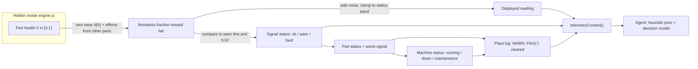
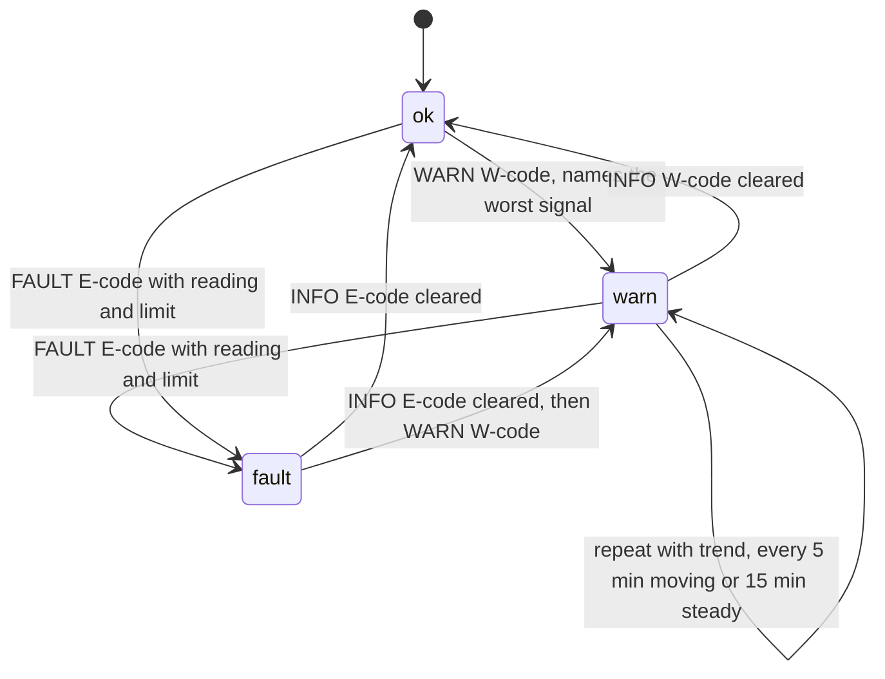
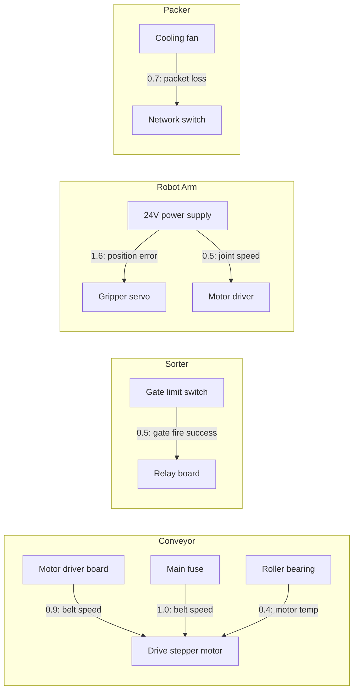

# The plant simulation

Wrench-bot Factory needs a factory that breaks the way real factories do. Parts wear out silently, sensors drift, and an alarm often names the part that tripped, not the part that is broken. The simulation in `server/src/sim/` gives the agent that problem. Every part has a **hidden health**. Health drives **noisy sensor signals**, signals drive **OK / WARN / FAULT status**, and status changes write a **PLC-style plant log**. The agent and the decision model see only the signals and the log, never the health.

> **Docs:** [README](../README.md) · [Architecture](ARCHITECTURE.md) · [Agent](AGENT.md) · [Payments](PAYMENTS.md) · [API](API.md) · **Simulation** · [Judging guide](JUDGING.md)

**Source of truth:** the code. Each claim names a file and a function or constant. Paths are relative to the repository root. All data definitions (machines, parts, signals, effects, presets) live in [`shared/contract.js`](../shared/contract.js). The engine is [`server/src/sim/engine.js`](../server/src/sim/engine.js) and the heuristic prior is [`server/src/sim/diagnostics.js`](../server/src/sim/diagnostics.js). Plant numbers in this document come from the formulas below or from seeded headless runs of the engine; [§12](#12-reproduce-the-numbers) shows how to rerun one. Store prices and model probabilities come from the team's live testing on 9 Oct 2026 and are marked "live" or "observed".

---

## Summary for evaluators

| Claim | Where to verify |
|---|---|
| Hidden health never leaves the engine. The game, the agent and the model get readings, statuses and log lines only. | `engine.js` `snapshot()`, `telemetryContext()`, `history()`: none of them has a `health` field |
| Statuses come from the **noiseless** signal value, so a chip never flickers between OK and WARN because of noise. Displayed readings are noisy but clamped to their status band. | `engine.js` `signalFrac()`, `signalStatus()`, `noisyReading()` |
| 7 cross-part **effects** push one part's signal toward its limit when *another* part degrades. In the Brownout scenario the servo throws the FAULT while the broken 24V supply never faults at all. | `shared/contract.js` `MACHINES[].components[].effects`, `engine.js` `effectIndex`, `signalFrac()` |
| One failure at a time: scripted and random failures wait until the current one is repaired and verified, and chaos requests get HTTP 409. | `engine.js` `busy()`, `advance()`, `injectFault()`; `orchestrator.js` `startMonitor()` (`addBusyCheck`) |
| The game clock stands still while the agent works in real time (model calls, quotes, payment, manager approval). Only real-world waits (shipping, travel, repair, test run) use game minutes. | `engine.js` `hold()`, `start()`; `orchestrator.js` `launch()`, `context().minutes()` |
| Six scenario presets, each built to show one capability. The scripted presets replay the same plant events every run (only sensor noise varies); Free play is randomized. | `shared/contract.js` `PRESETS`; [§11](#11-scenario-presets) |

### At a glance

| Quantity | Value | Defined in |
|---|---|---|
| Machines / parts / signals / cross-part effects | 4 / 15 / 25 / 7 | `shared/contract.js` `MACHINES` |
| Scenario presets | 6 | `shared/contract.js` `PRESETS` |
| Real time per tick | 1 s | `engine.js` `TICK_MS` |
| Game-minutes per tick | 1, 2, 4 or 8 (the speed) | `engine.js` `SPEEDS` |
| Shift clock | 08:00 + t | `engine.js` `SHIFT_START`, `clockAt()` |
| WARN threshold | signal-specific (`warn` in the contract) | `engine.js` `warnFrac()` |
| FAULT threshold | 97% of the way from nominal to fail | `engine.js` `FAULT_FRAC = 0.97` |
| Signal cap | 115% of the way to fail | `engine.js` `MAX_FRAC = 1.15` |
| Sensor noise | σ = 0.8% of the nominal→fail span, bounded at ±2.4% | `engine.js` `NOISE_SIGMA`, `gauss()` |
| Production | 12 units/min × $5 = $60/min while all 4 machines run | `engine.js` `UNITS_PER_MIN`, `PRICE_PER_UNIT` |
| Downtime cost | $30 / $40 / $60 / $35 per minute (Conveyor / Sorter / Robot Arm / Packer) | `contract.js` `downtimeCostPerMin` |
| Plant log kept | last 500 entries | `engine.js` `MAX_LOGS` |
| Signal history kept | last 120 samples per machine, one per game-minute | `engine.js` `MAX_HISTORY`, `recordHistory()` |

---

## Contents

1. [Design goal: an information barrier](#1-design-goal-an-information-barrier)
2. [Time model](#2-time-model)
3. [Part model](#3-part-model)
4. [Production and KPIs](#4-production-and-kpis)
5. [The plant log](#5-the-plant-log)
6. [Machines, parts and signals](#6-machines-parts-and-signals)
7. [Why diagnosis is genuinely hard](#7-why-diagnosis-is-genuinely-hard)
8. [What the decision model receives](#8-what-the-decision-model-receives)
9. [The heuristic prior ("fault-code rule")](#9-the-heuristic-prior-fault-code-rule)
10. [One failure at a time and the failure scheduler](#10-one-failure-at-a-time-and-the-failure-scheduler)
11. [Scenario presets](#11-scenario-presets)
12. [Reproduce the numbers](#12-reproduce-the-numbers)
13. [Where the code differs from SIM_SPEC.md](#13-where-the-code-differs-from-sim_specmd)

---

## 1. Design goal: an information barrier

A real maintenance engineer never sees "health = 0.17". They see a voltage that sags, a temperature that climbs and an alarm code. The simulation keeps that boundary in code.



- **What crosses the barrier:** readings, statuses, thresholds, trends and log lines. The read functions in `engine.js` are `snapshot()`, `telemetryContext()`, `recentLogs()`, `history()` and `warnings()`, plus `machineStatus()` and `isHealthy()`. The last two return a status string and a status-derived boolean. None of them exposes health.
- **What does not:** `health` and active ramps. The effect weights are public in `shared/contract.js` (the game imports it), but they are never put into the model's input (see [AGENT.md §3](AGENT.md#3-what-the-agent-observes-and-what-it-never-sees)).
- **What "fixed" means:** the agent's verify step calls `sim.isHealthy(machineId)`, which checks that **no part is in FAULT status** (`engine.js` `isHealthy()`). It is a status check, not a peek at health.
- **The UI follows the same rule.** The Inspector panel draws each signal with a nominal → warn → fail threshold bar and a 90-sample sparkline, using the same `warnFrac` and 0.97 maths as the engine. Its header comment says it shows "the same data the decision model gets" (`game/src/ui/inspector.js`).

---

## 2. Time model

### 2.1 Ticks, speed and sub-steps

| Rule | Value | Code |
|---|---|---|
| Real time per tick | 1,000 ms | `engine.js` `TICK_MS`, `start()` |
| Game time per tick | `dt = speed` game-minutes, speed ∈ {1, 2, 4, 8} (default 1). `setSpeed()` snaps to the nearest allowed value and resumes. | `SPEEDS`, `setSpeed()` |
| Paused | the tick runs `step(0)`: no game time passes, but a snapshot is still broadcast (`sim.tick` over SSE) | `start()`, `step()` |
| Sub-steps | `step(dt)` advances in slices of at most 1 game-minute, so log timestamps, waits and WARN timers stay exact at 8× | `step()`, `advance()` |
| Early stop | if a `waitMinutes()` finishes or the agent takes a clock hold inside a slice, the rest of that tick's minutes is dropped. At 8× the agent acts in the same game minute as the event, not up to 7 minutes later. | `interrupted` flag in `step()`, `hold()`, `advance()` |
| Clock | `HH:MM`, shift starts at **08:00** and wraps at 24 h | `SHIFT_START`, `clockAt()` |
| Randomness | seeded `mulberry32` PRNG, reseeded on every preset load. The server uses a random seed; `loadPreset(id, { seed })` replays a run exactly. | `mulberry32()`, `reset()` |

### 2.2 Clock holds: real-time work never costs game time

While Wrench-bot works in real time (walking over, calling the decision model, searching the catalog, quoting, paying, waiting for the manager's approval), the game clock **stands still**. At 8× speed, one real second is 8 game-minutes, so a 3-second model call would otherwise cost 24 minutes of downtime. With the hold, slow networks or a slow manager never move the plant.

| Agent activity | Game clock | Code |
|---|---|---|
| Diagnose, search, quote, policy check, pay, manager approval (up to 10 min real time) | **held** | `orchestrator.js` `launch()` → `holdClock(incident, true)` → `sim.hold(id, true)` |
| Shipping: 3 game-min express / 6 standard | runs | `orchestrator.js` `MINUTES`, `deliver()` → `ctx.minutes()` |
| Technician travel: 2 game-min | runs | `repair()` |
| Repair (the machine is in maintenance): 4 game-min | runs | `repair()` |
| Test run before verifying: 2 game-min | runs | `verify()` |

`ctx.minutes(n)` in `orchestrator.js` `context()` releases the hold, awaits `sim.waitMinutes(n)`, and takes the hold back. While any hold is active, the engine's interval calls `step(0)`. The snapshot reports this as `held: true`, so the UI can tell "the agent is working" apart from "the user paused". Short animation pauses in the agent shrink by 1/√speed (`context().pause`), and the game scales the truck's drive time to `etaMinutes / speed` real seconds (`game/src/director.js`, `DELIVERY_DISPATCHED`).

One consequence: KPIs (production, downtime cost) accrue only in game minutes that actually pass. An incident's cost therefore reflects its physical waits, not API latency.

### 2.3 Order of operations inside one game minute

`engine.js` `advance(dt)`:

1. `accrue(dt)`: production and downtime cost, using the statuses that held during the minute ([§4](#4-production-and-kpis)).
2. Apply active health **ramps** (scripted or injected linear declines).
3. `t += dt`.
4. Fire at most **one** due script event, unless the plant is busy ([§10](#10-one-failure-at-a-time-and-the-failure-scheduler)).
5. `evaluate()`: recompute every signal, part status and machine status, write log lines, fire internal events (`part.warn`, `machine.down`, `machine.up`).
6. Update the calm timer (`quietSince`). In Free play, `scheduleFailure()` may start the next failure, followed by a second `evaluate()`.
7. `recordHistory()`: one sample per machine.
8. Advance `waitMinutes()` waiters and fire the internal `minute` event. The agent's monitor uses `minute` to open predictive jobs on time at 8×.

---

## 3. Part model

### 3.1 Hidden health

Each of the 15 parts has `health ∈ [0, 1]` (1 = new) in `engine.js` `makePart()`. Health only changes in these ways:

| Source | Effect on health | Code |
|---|---|---|
| Preset `initial` | starting health per `'machine/component'` (default 1.0) | `reset()` |
| Script `{ at, target, health }` | set immediately | `applyScript()` |
| Script `{ at, target, degradeTo, over }` | linear ramp from the current health to `degradeTo` over `over` game-minutes | `applyScript()`, `addRamp()` |
| Free-play scheduler | 30%: health → 0 at once. 70%: ramp to 0 over 10–16 game-min. | `scheduleFailure()` |
| Chaos panel (`POST /api/sim/fault`) | `sudden`: health → 0. `gradual`: ramp to 0 over 12 game-min. **No log line is written**: the plant shows only the symptoms. | `injectFault()`, `GRADUAL_FAULT_MIN` |
| Technician swap | health → 1, ramps cancelled, WARN timers reset, `INFO MAINT Replaced <part>` | `replaceComponent()` |

There is no background wear: a part that nothing touches stays at its health indefinitely. See [§13](#13-where-the-code-differs-from-sim_specmd).

### 3.2 Degradation curve

```text
d(h) = clamp((0.7 − h) / 0.7, 0, 1) ^ 1.6          engine.js  degradation()
```

| Health h | 1.0 – 0.7 | 0.6 | 0.5 | 0.4 | 0.3 | 0.2 | 0.1 | 0.013 | 0 |
|---|---|---|---|---|---|---|---|---|---|
| d(h) | 0 | 0.044 | 0.135 | 0.258 | 0.408 | 0.584 | 0.781 | 0.970 | 1 |

The top 30% of a part's life is invisible: signals sit at nominal plus noise. After that the curve is convex, so the drift starts slowly and then speeds up. That is why the Grinding-noise scenario shows WARN repeats of +1.0, +1.1, +1.2, +1.3 mm/s per 5 minutes on a linear health ramp ([§11.3](#113-grinding-noise-predictive)). A part's own wear reaches FAULT (d ≥ 0.97) only at **h ≤ 0.013**.

### 3.3 Signal value

For signal `s` of part `c`:

```text
frac  = d(c.health) + Σ weight × d(p.health)        over every part p on the same machine with an effect on (c, s)
frac  = min(frac, 1.15)                             engine.js  signalFrac(), MAX_FRAC
true  = s.nominal + (s.fail − s.nominal) × frac     engine.js  trueValue()
value = round(true + (s.fail − s.nominal) × 0.008 × g, s.digits)
        g = U(−1,1) + U(−1,1) + U(−1,1)   (σ = 1, bounded at ±3)    engine.js  gauss(), noisyReading()
```

Two properties of this formula matter for diagnosis:

- **A part's own wear moves all of its signals by the same fraction.** A servo failing on its own pushes position error *and* servo temperature toward their limits together.
- **An effect moves exactly one signal of another part.** A sagging power supply raises the servo's position error and leaves the servo's temperature at nominal.

The effect index is built once at startup from `contract.js` (`engine.js` `effectIndex`, keyed `machine/target/signal`).

`noisyReading()` clamps the displayed value to the band of its noiseless status. An OK reading never shows past the warn line, a WARN reading always shows at or past warn and short of fail, and a FAULT reading always shows at or past the fail value (`Position error 5.02° (limit 5°)`). Every channel is a non-negative magnitude, and `%` channels are capped at 100.

### 3.4 Status thresholds

Status is computed from the **noiseless** `frac`, so it never flaps (`engine.js` `signalStatus()`):

```text
warnFrac(s) = (s.warn − s.nominal) / (s.fail − s.nominal)
status(s)   = 'fault' if frac ≥ 0.97,  else 'warn' if frac ≥ warnFrac(s),  else 'ok'
part status = worst of its signals
```

`warnFrac` is specific to each signal and ranges from 0.044 (relay gate-fire success: 100 → 96 of a 100 → 10 span) to 0.421 (servo temperature). The per-signal values are in the tables in [§6](#6-machines-parts-and-signals).



### 3.5 Machine status

`engine.js` `evaluate()`:

| Field | Rule |
|---|---|
| `status` | `'maintenance'` if the orchestrator locked the machine out (`setMaintenance`), else `'down'` if any part is in FAULT, else `'running'` |
| `activeCodes` | fault codes of the parts currently in FAULT (several are possible: see the fuse in [§7.3](#73-four-more-traps-in-the-same-model)) |
| `degraded` | some part is in WARN and the machine is not down |

The 3D world maps these to stack-light states: running = green and animated, degraded = amber with smoke, down = blinking red with sparks, maintenance = blue and still (`game/src/world/machines.js` header).

---

## 4. Production and KPIs

`engine.js` `accrue()` and `snapshot().kpis`:

| KPI | Rule |
|---|---|
| Line running | only when **all four** machines are `running`. The line is serial, so one stopped machine stops production (`lineRunning()`). |
| `unitsProduced`, `revenue` | +12 units and +$60 per game-minute while the line runs |
| `downtimeCost` | each machine not `running` (down **or** in maintenance) adds its `downtimeCostPerMin`: Conveyor $30, Sorter $40, Robot Arm $60, Packer $35 |
| `uptimePct` | running minutes / total minutes × 100 for the line |
| `partsSpend`, `laborSpend`, `incidentsResolved` | added by the agent through `sim.bump()` after a completed checkout, a technician payout and a verified fix (`orchestrator.js` `pay()`, `payTechnician()`, `resolve()`) |

Planned maintenance counts as downtime. A predictive swap is therefore not free: it costs the 4-minute repair window. It is still much cheaper than an unplanned stop ([§11.3](#113-grinding-noise-predictive)).

---

## 5. The plant log

Entry shape: `{ id, t, clock, level, machineId, componentId, code, message }`, levels from `LOG_LEVELS = ['INFO', 'AGENT', 'WARN', 'ERROR', 'FAULT']` (`shared/contract.js`). The engine keeps the last 500 entries and emits each one as SSE `log.entry` (`engine.js` `addLog()`). It formats entries as `[08:06] FAULT E-ARM-310 Gripper position error — …` (`formatLogLine()`). The decision model reads this same text.

### 5.1 Rules the engine applies automatically

| Trigger | Level | Code | Message (real examples from seeded runs) | Code path |
|---|---|---|---|---|
| Preset loaded | INFO | `SHIFT` | `Shift started: Brownout` | `reset()` |
| Part ok → warn (or still in warn right after a swap) | WARN | `W` + part code without the `E` | `Position error 1.61° (warn 1.5°)`, naming the signal furthest past its own warn line | `partTransition()`, `worstSignal()` |
| Part still in warn, reading **moving** (changed ≥ 3% of its span since the last line) | WARN | same | `Vibration 5.1 mm/s, up 1.0 mm/s in 5 min`, every **5** game-min | `partTransition()`, `WARN_REPEAT_MIN`, `MOVING_FRAC` |
| Part still in warn, reading **steady** | WARN | same | `<signal> <value>, steady for 15 min`, every **15** game-min | `WARN_REMIND_MIN` |
| Part → fault (or still faulted right after a swap) | FAULT | part code | `Gripper position error — Position error 5.02° (limit 5°)` | `partTransition()` |
| Fault cleared | INFO | part code | `E-ARM-310 cleared — Position error 0.39°` | `partTransition()` |
| Warn cleared | INFO | W-code | `W-ARM-301 cleared — 24V rail 24.09 V` | `partTransition()` |
| Machine → down | ERROR | `M-DOWN` | `Robot Arm stopped: E-ARM-310`, or `Robot Arm down after maintenance: E-ARM-310` when a swap did not fix it | `machineTransition()` |
| Machine → running | INFO | `M-UP` | `Robot Arm running` | `machineTransition()` |
| Machine → maintenance | INFO | `MAINT` | `Robot Arm locked out for maintenance` | `machineTransition()` |
| Part replaced | INFO | `MAINT` | `Replaced Gripper servo` | `replaceComponent()` |

The repeat and trend logic compares **noiseless** values. A plateau therefore reads as "steady" rather than as noise (`partTransition()`, `lastWarnTrue`). Because of the 5- and 15-minute rules, a long alarm produces a readable trend instead of a line every minute.

A swapped part gets a `fresh` flag. If it is still in WARN or FAULT after the swap, the line is written again, so the log shows a new part faulting the moment it goes in (`replaceComponent()`, `fresh`).

### 5.2 Lines written by the agent

The agent writes through the public `sim.log()`:

- Its own actions, at level `AGENT`, with codes `INC`, `PREDICT`, `DIAG`, `SOURCE`, `QUOTE`, `POLICY`, `APPROVAL`, `PAY`, `ORDER`, `SHIP`, `TECH`, `VERIFY`, `PAYOUT`, `RESOLVED` (`orchestrator.js` `agentLog()`, `ctx.log`).
- Stops at level `ERROR`, for example `BLOCKED` with `Purchase blocked: … Waiting for the manager.` (`fail()`).
- At level `WARN` when a store cannot fill an order (`quoteWithFallback()`).

The game's log console has three tabs: ALL, ALERTS (WARN and above) and AGENT. It keeps 400 rows (`game/src/ui/plantlog.js`).

---

## 6. Machines, parts and signals

Generated from `shared/contract.js` `MACHINES`, with derived columns computed from the formulas in [§3](#3-part-model):

- **Free-play odds:** the chance the Free-play scheduler picks this part, proportional to 1/`life` ([§10.2](#102-free-play-failure-scheduler)).
- **WARN at frac (own health):** the signal's `warnFrac`, and the health at which the part's *own* wear reaches it. FAULT from own wear needs h ≤ 0.013 for every signal.
- **`life`:** a relative wear scale in game-minutes. In the current code it only sets the Free-play pick odds.

### 6.1 Conveyor (`conveyor`): not critical, $30/min down

| Part (`id`) | Life · Free-play odds | Fault code: message | Signals: nominal → warn → fail | WARN at frac (own health) | Pushes on |
|---|---|---|---|---|---|
| Drive stepper motor (`drive-motor`) | 900 · 8.0% | `E-CNV-110` Drive motor stalled | Motor temp 45 → 62 → 90 °C<br>Belt speed 0.5 → 0.4 → 0.1 m/s | 0.378 (h ≤ 0.319)<br>0.250 (h ≤ 0.406) | — |
| Motor driver board (`motor-driver`) | 1200 · 6.0% | `E-CNV-120` Motor driver not responding | Driver temp 40 → 58 → 85 °C<br>Step rate 100 → 88 → 20 % | 0.400 (h ≤ 0.305)<br>0.150 (h ≤ 0.486) | Drive motor **belt speed**, weight 0.9 |
| Roller bearing (`roller-bearing`) | 700 · 10.3% | `E-CNV-130` Roller seized | Vibration 1.8 → 4.0 → 9.0 mm/s<br>Noise 62 → 70 → 88 dB | 0.306 (h ≤ 0.366)<br>0.308 (h ≤ 0.365) | Drive motor **motor temp**, weight 0.4 |
| Main fuse (`main-fuse`) | 3000 · 2.4% | `E-CNV-101` Main power lost (fuse open) | Bus voltage 24 → 22.5 → 0 V | 0.063 (h ≤ 0.576) | Drive motor **belt speed**, weight 1.0 |

### 6.2 Sorter (`sorter`): critical, $40/min down

| Part (`id`) | Life · Free-play odds | Fault code: message | Signals: nominal → warn → fail | WARN at frac (own health) | Pushes on |
|---|---|---|---|---|---|
| Inductive proximity sensor (`prox-sensor`) | 800 · 9.0% | `E-SRT-201` Item sensor: no signal | Sensor signal 96 → 70 → 8 %<br>Detect rate 99.5 → 95 → 20 % | 0.295 (h ≤ 0.373)<br>0.057 (h ≤ 0.584) | — |
| Relay board (`relay-board`) | 1000 · 7.2% | `E-SRT-220` Diverter relay not switching | Contact resistance 45 → 140 → 600 mΩ<br>Gate fire success 100 → 96 → 10 % | 0.171 (h ≤ 0.468)<br>0.044 (h ≤ 0.600) | — |
| Gate limit switch (`limit-switch`) | 1100 · 6.6% | `E-SRT-230` Gate position timeout | Switch response 14 → 40 → 250 ms | 0.110 (h ≤ 0.524) | Relay board **gate fire success**, weight 0.5 |
| Status indicator light (`indicator-light`) | 1500 · 4.8% | `E-SRT-240` Status lamp failed | Lamp current 20 → 14 → 0 mA | 0.300 (h ≤ 0.370) | — |

### 6.3 Robot Arm (`arm`): critical, $60/min down

| Part (`id`) | Life · Free-play odds | Fault code: message | Signals: nominal → warn → fail | WARN at frac (own health) | Pushes on |
|---|---|---|---|---|---|
| Gripper servo (`gripper-servo`) | 700 · 10.3% | `E-ARM-310` Gripper position error | Position error 0.4 → 1.5 → 5.0 °<br>Servo temp 42 → 58 → 80 °C | 0.239 (h ≤ 0.414)<br>0.421 (h ≤ 0.292) | — |
| 24V power supply (`arm-psu`) | 1400 · 5.2% | `E-ARM-301` 24V rail collapsed | 24V rail 24.1 → 23.2 → 19.5 V<br>Ripple 35 → 120 → 450 mV | 0.196 (h ≤ 0.447)<br>0.205 (h ≤ 0.440) | Servo **position error**, weight **1.6**<br>Motor driver **joint speed**, weight 0.5 |
| Emergency stop button (`estop`) | 2500 · 2.9% | `E-ARM-350` Safety loop open (E-stop) | Safety loop 100 → 92 → 0 % | 0.080 (h ≤ 0.556) | — |
| Motor driver (`arm-driver`) | 1000 · 7.2% | `E-ARM-320` Base joint driver fault | Driver temp 41 → 60 → 88 °C<br>Joint speed 100 → 85 → 15 % | 0.404 (h ≤ 0.303)<br>0.176 (h ≤ 0.463) | — |

### 6.4 Packer (`packer`): not critical, $35/min down

| Part (`id`) | Life · Free-play odds | Fault code: message | Signals: nominal → warn → fail | WARN at frac (own health) | Pushes on |
|---|---|---|---|---|---|
| Network switch (`net-switch`) | 2000 · 3.6% | `E-PCK-410` Packer controller offline | Packet loss 0.1 → 2 → 40 %<br>Latency 2 → 25 → 400 ms | 0.048 (h ≤ 0.596)<br>0.058 (h ≤ 0.582) | — |
| Cooling fan (`cooling-fan`) | 600 · 12.0% | `E-PCK-420` Cabinet over-temperature | Fan speed 2400 → 1700 → 0 rpm<br>Cabinet temp 34 → 46 → 68 °C | 0.292 (h ≤ 0.376)<br>0.353 (h ≤ 0.335) | Network switch **packet loss**, weight 0.7 |
| Barcode scanner (`barcode-scanner`) | 1600 · 4.5% | `E-PCK-430` Label verification failed | Read rate 99.2 → 94 → 25 % | 0.070 (h ≤ 0.567) | — |

Each part also carries catalog fields (`query`, `keywords`, `maxPrice`, `qty`). The agent uses them to find the part in Reap's live catalog (see [AGENT.md §7](AGENT.md#7-sourcing-from-part-spec-to-one-listing)). `critical: true` (Sorter, Robot Arm) makes the agent ask for express shipping when the machine is stopped, under the default `expressForCriticalOnly` policy (`orchestrator.js` `wantsExpress()`).

### 6.5 Cross-part effects



Solving `weight × d(h_source) = warnFrac(target)` (and `= 0.97` for FAULT) for each effect gives the source health at which the *target* part changes status. Compare it with the source part's own first WARN:

| Source → target signal | Weight | Target WARN when source h ≤ | Target FAULT when source h ≤ | Source's own first WARN at h ≤ | What the log shows |
|---|---|---|---|---|---|
| 24V power supply → servo position error | 1.6 | **0.487** | **0.188** | 0.447 (24V rail) | The servo warns **first** and faults **first**. The supply's own FAULT needs h ≤ 0.013. |
| 24V power supply → arm driver joint speed | 0.5 | 0.335 | never (max 57.5 %) | 0.447 | The driver warns, but its own temperature stays nominal |
| Cooling fan → switch packet loss | 0.7 | **0.570** | never (max 28.0 %) | 0.376 (fan speed) | The **switch** warns well before the fan does. The fan later faults with its own code. |
| Gate limit switch → relay gate fire success | 0.5 | **0.546** | never (max 55 %) | 0.524 | The **relay board** warns before the limit switch |
| Main fuse → drive motor belt speed | 1.0 | 0.406 | 0.013 | 0.576 (bus voltage) | A blown fuse raises **two** FAULT codes in the same minute |
| Motor driver board → drive motor belt speed | 0.9 | 0.386 | never (max 0.14 m/s) | 0.486 (step rate) | The driver faults with its own code; the drive motor shows a belt-speed WARN |
| Roller bearing → drive motor motor temp | 0.4 | 0.025 | never (max 63 °C) | 0.366 (vibration) | A motor-temp WARN appears a minute before the roller seizes |

"Never" means the effect alone cannot push the target past 0.97: the target's frac tops out at the weight. The 1.15 cap applies when own wear and effects add up.

---

## 7. Why diagnosis is genuinely hard

A naive rule says "the fault code names the part, so replace that part". In this plant that rule is wrong in specific, reproducible cases. The cause is the effects table above, not a scripted twist.

### 7.1 The Brownout: the faulting part is not the failing part

The preset (`contract.js` `PRESETS`, `id: 'brownout'`) starts the 24V power supply at health 0.55 and ramps it down to 0.10 between 08:01 and 08:07. Nothing else is wrong. Noiseless values come from the formulas; log lines are from a seeded run (seed 7):

| Game time | PSU health | d(h) | 24V rail | Servo position error | Plant log |
|---|---|---|---|---|---|
| 08:00 | 0.550 | 0.085 | 23.71 V (ok) | 1.03° (ok, already above the 0.4° nominal) | `INFO SHIFT Shift started: Brownout` |
| 08:01 | 0.550 | 0.085 | 23.71 V | 1.03° | (ramp starts: −0.075 health per minute) |
| 08:02 | 0.475 | 0.163 | 23.35 V (ok) | 1.60° (**warn**) | `WARN W-ARM-310 Position error 1.61° (warn 1.5°)` |
| 08:03 | 0.400 | 0.258 | 22.91 V (**warn**) | 2.30° | `WARN W-ARM-301 24V rail 22.97 V (warn 23.2 V)` |
| 08:04 | 0.325 | 0.368 | 22.41 V | 3.11° | `WARN W-ARM-320 Joint speed 85% (warn 85%)` |
| 08:05 | 0.250 | 0.493 | 21.83 V | 4.03° | — |
| 08:06 | 0.175 | 0.631 | 21.20 V | 5.04° (**FAULT**, frac 1.01) | `FAULT E-ARM-310 Gripper position error — Position error 5.02° (limit 5°)`<br>`ERROR M-DOWN Robot Arm stopped: E-ARM-310` |
| 08:07 → | 0.100 | 0.781 | 20.51 V (still only WARN) | 5.69° (capped at frac 1.15) | `WARN W-ARM-301 24V rail 20.52 V, down 2.41 V in 5 min` (08:08) |

When the agent is running, the clock holds at 08:06 while it diagnoses and buys, so the 08:07 row arrives during the first shipping wait.

The plant is deliberately misleading in three ways:

1. **The only FAULT code is the servo's.** The supply never faults in this scenario (that would need h ≤ 0.013; it stops at 0.10).
2. **The first WARN is also the servo's** (08:02, one minute before the rail's). "Which part warned first?" points at the servo too.
3. **Replacing the servo does not help.** A new servo has d = 0, but its position error is `min(1.6 × 0.781, 1.15) = 1.15`, so it faults again in the same game minute. In a headless run: `[08:08] INFO MAINT Replaced Gripper servo` followed by `[08:08] FAULT E-ARM-310 Gripper position error — Position error 5.73° (limit 5°)`.

The evidence that does identify the supply is **relational**, and the formula in [§3.3](#33-signal-value) guarantees it is there:

- **Servo temperature stays at 42 °C (severity 0).** If the servo were failing on its own, both of its signals would move by the same fraction: at its own FAULT, servo temperature would read about 42 + 38 × 0.97 ≈ **79 °C**.
- **The motor driver's joint speed falls (100 → 73%) while the driver's temperature stays at nominal (41 °C).** That is the same signature: one signal moved by something outside the part.
- **The supply's own two signals move together.** At 08:06 the rail has fallen 2.52 V and the ripple has risen 230 mV. Both trends are visible in the telemetry.

Replacing the supply clears everything in the same minute: `E-ARM-310 cleared`, `W-ARM-301 cleared`, `W-ARM-320 cleared`, `M-UP Robot Arm running`.

### 7.2 Who gets it right

| Reader | Pick at 08:06 | Source |
|---|---|---|
| Fault-code heuristic (`scoreComponents`) | Gripper servo **0.879** (supply 0.072) | computed, seed 7; reproduce with [§12](#12-reproduce-the-numbers) |
| `gpt-6-luna` (OpenAI Decisions API), raw logs only | 24V power supply **0.98** | live test, 9 Oct 2026, [docs/DECISIONS_API.md](DECISIONS_API.md) |
| `gpt-6-luna` with the heuristic prior in its input | Gripper servo **0.95**: it copied the prior | live test, 9 Oct 2026 |
| `gpt-6-luna` as shipped (full telemetry + log, prior withheld) | 24V power supply **0.59** | live test, 9 Oct 2026; prior removed in `decide.js` `openaiDecisions()` |
| Spending policy | 0.59 < 0.75 → **ESCALATE** to the manager | `policy.js` `evaluate()`, `confidenceThreshold: 0.75` |

The shipped model finds the right part and is honest about its uncertainty, so the purchase goes to a human instead of being made automatically. The heuristic, given a second chance after a failed servo swap (servo ruled out), picks the supply at 0.65. That is also below the bar. The full agent-side walkthrough, with both paths and their costs, is in [AGENT.md §12](AGENT.md#12-worked-example-the-brownout-scenario).

### 7.3 Four more traps in the same model

All of these happen in Free play or through the chaos panel. Each was checked with a seeded headless run (seed 3, `injectFault`).

| Case | What the plant shows | Why a naive reader fails |
|---|---|---|
| **Blown main fuse** (sudden) | `FAULT E-CNV-110 Drive motor stalled` **and** `FAULT E-CNV-101 Main power lost (fuse open)` in the same minute; `Conveyor stopped: E-CNV-110, E-CNV-101` | Two fault codes, both at severity ≈ 1. The heuristic splits **0.4908 / 0.4907** (motor / fuse): a coin flip, below the 0.75 bar. The tells: bus voltage reads 0.0 V, and the motor's temperature is nominal. |
| **Cooling fan wearing** (gradual, 12 min) | `08:06 WARN W-PCK-410 Packet loss 4.5%`, then `08:08 WARN W-PCK-420 Fan speed 1574 rpm`, `08:12 FAULT E-PCK-420` | The **network switch** warns 2 game-min before the fan. The predictive monitor opens a job for parts in WARN for ≥ 3 min (`orchestrator.js` `checkWarnings()`), so the job opens on the switch. The verify step catches this: a new switch still shows packet loss, so it is ruled out ([AGENT.md §6](AGENT.md#6-re-diagnosis-when-a-fix-does-not-take)). |
| **Gate limit switch wearing** (gradual) | `WARN W-SRT-220 Gate fire success 93.0%` alongside `WARN W-SRT-230 Switch response 45 ms`; at the fault, gate-fire success is 55.5% | The relay board looks sick (gate fire falling 43% in 10 min), but its own contact resistance is nominal (46 mΩ) |
| **Roller bearing near seizure** | `08:29 WARN W-CNV-110 Motor temp 62°C` one minute before `08:30 FAULT E-CNV-130 Roller seized` | A motor-temperature alarm on the drive motor, caused by the bearing |

The rule the model has to learn is the one the formula encodes: **one signal moving while the rest of its part stays nominal means the cause is somewhere else.** The diagnosis prompt states it in one sentence (`decide.js` `DECISIONS_GUIDANCE`). The model has to apply it to numbers it has not seen before.

---

## 8. What the decision model receives

`engine.js` `telemetryContext(machineId)` returns, for one machine:

| Field | Meaning |
|---|---|
| `machine`, `status`, `degraded`, `activeCodes`, `t`, `clock` | machine-level state |
| `parts[].id/name/code/fault/status` | static identity and live status per part |
| `parts[].warnForMinutes` | how long the part has been in WARN (0 if not) |
| `signals[].value` | the displayed (noisy) reading |
| `signals[].nominal/warn/fail/unit/digits` | the thresholds, so the model can reason about distance to the limit |
| `signals[].severity` | `clamp((value − nominal) / (fail − nominal), 0, 1.2)` |
| `signals[].trend10m`, `trendMinutes` | value now minus the history sample about 10 game-min ago (or the oldest sample if the shift is younger) (`pastReading()`) |

The orchestrator adds the last 20 log lines for that machine and the names of parts already ruled out (`orchestrator.js` `diagnose()`, `logLines()`). `decide.js` `compactContext()` turns telemetry into one line per part. Below is the **exact text** sent to `POST /v1/decisions` at 08:06 in the Brownout (seed 7). It is generated by the code path in `decide.js` `openaiDecisions()` → `contextText()`:

```text
machine: Robot Arm

kind: breakdown

telemetry:
Robot Arm: down, active codes E-ARM-310
Gripper servo [fault]: Position error 5.08° (nominal 0.4, warn 1.5, fail 5, severity 1.017, trend +3.97); Servo temp 42°C (nominal 42, warn 58, fail 80, severity 0, trend -1)
24V power supply [warn 3m]: 24V rail 21.2V (nominal 24.1, warn 23.2, fail 19.5, severity 0.63, trend -2.52); Ripple 301mV (nominal 35, warn 120, fail 450, severity 0.641, trend +230)
Emergency stop button [ok]: Safety loop 99% (nominal 100, warn 92, fail 0, severity 0.01)
Motor driver [warn 2m]: Driver temp 41°C (nominal 41, warn 60, fail 88, severity 0); Joint speed 73% (nominal 100, warn 85, fail 15, severity 0.318, trend -23)

log:
[08:02] WARN W-ARM-310 Position error 1.61° (warn 1.5°)
[08:03] WARN W-ARM-301 24V rail 22.97 V (warn 23.2 V)
[08:04] WARN W-ARM-320 Joint speed 85% (warn 85%)
[08:06] FAULT E-ARM-310 Gripper position error — Position error 5.02° (limit 5°)
[08:06] ERROR M-DOWN Robot Arm stopped: E-ARM-310
```

**What is deliberately absent:**

- Hidden health and the effect weights.
- The heuristic prior. `openaiDecisions()` sends `prior: undefined` because, in live tests, the model copied the prior instead of reading the signals.

The prior is still used in three places:

- the UI shows it as a second bar, labelled "fault-code rule", next to the model's probability (`game/src/ui/agentpanel.js`);
- the offline `mock` provider returns it as its answer (`MOCK_AI=1`);
- the `gptStructured` fallback receives it together with an explicit instruction to "Override it when the signals or the log point elsewhere" (`decide.js` `SYSTEM`).

---

## 9. The heuristic prior ("fault-code rule")

`server/src/sim/diagnostics.js` `scoreComponents(machineId, { ruledOut })` is a deliberately naive "System 1" read. It is computed only from `telemetryContext()`, never from health:

```text
score(part)  = 0.6 × max severity over the part's own signals  +  0.4 × [part's code is an active FAULT code]
p(part)      = softmax(score / 0.25)  over candidate parts (ruled-out parts removed)
ties         → higher score, then higher max severity, then contract order
```

| Constant | Value | Meaning |
|---|---|---|
| `TEMPERATURE` | 0.25 | a 0.25 score gap is a factor of e (≈ 2.7) in probability |
| `SIGNIFICANT_TREND` | 0.04 | a 10-minute change of ≥ 4% of the span counts as a trend in the evidence lines |
| `MAX_EVIDENCE` | 4 | evidence lines per part |

**Evidence lines** (`partEvidence()`), most important first: the active FAULT or WARN code, then abnormal signals with their limit and trend, then normal signals (for example `Servo temp 42°C normal`). The panel shows these lines under the diagnosis whichever provider answered (`orchestrator.js` `diagnose()`).

**Worked numbers, Brownout at 08:06 (seed 7):**

| Part | Max severity | Active FAULT code? | Score | Probability |
|---|---|---|---|---|
| Gripper servo | 1.017 | yes | 1.010 | **0.879** |
| 24V power supply | 0.641 | no | 0.385 | 0.072 |
| Motor driver | 0.318 | no | 0.191 | 0.033 |
| Emergency stop button | 0.010 | no | 0.006 | 0.016 |

With the servo ruled out after a failed swap, the same rule gives 24V power supply 0.595 / motor driver 0.274 / e-stop 0.131 at 08:06. Once the supply's decline has finished (from 08:07), it hovers around 0.65 / 0.25 / 0.10 (seed 7, 08:07–08:14: supply between 0.643 and 0.657). Both are below the 0.75 bar, so the second order also goes to the manager.

The rule is right whenever the faulting part is the failing part. On the presets with a single broken part at 08:03 it scores the right part at 0.9465 (proximity sensor), 0.9642 (barcode scanner) and 0.9646 (network switch). It is wrong exactly where the effects table says it will be.

---

## 10. One failure at a time and the failure scheduler

### 10.1 The busy rule

The demo tells one story at a time: one breakdown → one diagnosis → one repair. `engine.js` `busy()` is true while any of these holds:

- any machine is not `running` (down or in maintenance);
- any part is in FAULT;
- any part has an active decline ramp;
- any registered busy check returns true. The orchestrator registers "an incident is still open" (`orchestrator.js` `startMonitor()` → `sim.addBusyCheck()`), so the plant stays busy through the verify step even after `M-UP`.

While the plant is busy:

| What | Behaviour | Code |
|---|---|---|
| Scripted preset events that come due | marked `held`. They fire once the plant has been calm for **2 game-minutes**, with any ramp starting fresh. | `advance()` (`ev.held`, `quietSince`) |
| Script events in general | at most **one** fires per game minute | `advance()` (`break`) |
| Chaos panel (`POST /api/sim/fault`) | refused with HTTP **409** `{ code: 'BUSY', error: 'One failure at a time: wait until the current repair is finished.' }`. The UI shows it as a toast. | `injectFault()`, `game/src/ui/chaos.js` |
| Free-play scheduler | waits | `scheduleFailure()` (`quietSince === null`) |

Example (Month-end crunch, seed 7, run offline through the real orchestrator; the Packer job was open from 08:03 to 08:17): the relay-board failure scripted for 08:14 was held and fired at **08:20**. The calm timer starts on the first calm minute (08:18), and a held event then waits two more calm minutes.

### 10.2 Free-play failure scheduler

Active only when the preset's `wear > 0` (only Free play), in `engine.js` `scheduleFailure()`:

1. When the plant becomes calm, draw a calm gap `U(failureEvery)` = **6–12 game-minutes** (`gapMinutes()`).
2. After the gap, pick **one** part with probability ∝ 1/`life`. The odds are in the [§6](#6-machines-parts-and-signals) tables: cooling fan 12.0%, roller bearing and gripper servo 10.3% each, down to the main fuse at 2.4%.
3. 30%: **sudden** (health → 0, immediate FAULT). 70%: **gradual** (ramp to 0 over 10–16 game-min, so WARN lines come first and predictive maintenance has a chance).
4. The plant is busy again. The next failure is scheduled only after this one is repaired, verified and followed by a new calm gap.

Seeded examples of the first failure: seed 2 gives a sudden arm-driver fault at 08:09 (`FAULT E-ARM-320 Base joint driver fault — Driver temp 88°C`). Seed 1 gives a gradual indicator-lamp failure, WARN at 08:18 and FAULT at 08:22. Seed 3 gives a gradual bearing failure, WARN at 08:17 and seizure at 08:23.

---

## 11. Scenario presets

Loading a preset (`POST /api/sim/preset { id }`) cancels open incidents, resets the spending policy to the preset's overrides and resets the factory, KPIs, log and clock (`server/src/index.js` `loadPreset()` → `engine.js` `reset()`). On boot the server loads `first-failure` and **pauses** until a scenario is picked.

| Preset (`id`) | Setup | Policy overrides | Demonstrates |
|---|---|---|---|
| Sensor burnout (`first-failure`) | proximity sensor health → 0 at 08:03 | limit $60, budget $1,000 | autonomous purchase inside spending limits |
| Brownout (`brownout`) | PSU starts at 0.55 and ramps to 0.10 over 08:01–08:07 | limit $60, budget $1,000 | root-cause diagnosis against a misleading fault code; confidence gate |
| Grinding noise (`predictive`) | bearing starts at 0.5 and ramps to 0 over 30 min from 08:00 | predictive maintenance **on** | fixing a part before it fails |
| Month-end crunch (`budget-crunch`) | network switch → 0 at 08:03, relay board → 0 at 08:14 | budget $150, **$112 already spent** | budget and auto-approve limits, manager escalation |
| Supplier gap (`untrusted`) | barcode scanner → 0 at 08:03 | trusted stores: Switch Electronics, Digitmakers.ca only | store allowlist → BLOCK |
| Free play (`sandbox`) | random failures, one at a time | predictive maintenance on | everything, unscripted |

In the timelines below, plant events come from seeded headless runs of `engine.js`. Agent times are derived from `orchestrator.js` `MINUTES`, because the clock is held during real-time steps ([§2.2](#22-clock-holds-real-time-work-never-costs-game-time)).

### 11.1 Sensor burnout (`first-failure`)

| Game time | Event |
|---|---|
| 08:00 | `INFO SHIFT Shift started: Sensor burnout`. Every part at health 1.0. |
| 08:03 | `FAULT E-SRT-201 Item sensor: no signal — Sensor signal 8% (limit 8%)` · `ERROR M-DOWN Sorter stopped: E-SRT-201`. The line stops: −$60/min revenue, +$40/min downtime. |
| 08:03 (clock held) | The monitor opens a breakdown incident. Fault-code rule: proximity sensor 0.9465. The live sandbox quote observed for this part was **$35.68** (including $24.98 shipping), under the $60 limit, so the verdict is **AUTO** (rail order and settlement in [PAYMENTS.md](PAYMENTS.md)). |
| +3 or +6, +2, +4, +2 game-min | Shipping (express requested because the Sorter is critical and stopped), technician travel, swap with the Sorter in maintenance, 2-minute test run, `M-UP Sorter running`, technician paid, incident resolved |

### 11.2 Brownout (`brownout`)

Plant behaviour is in [§7.1](#71-the-brownout-the-faulting-part-is-not-the-failing-part); the agent's two possible paths are in [AGENT.md §12](AGENT.md#12-worked-example-the-brownout-scenario). In short:

- At 08:06 the Robot Arm stops ($60/min, the most expensive machine) with the servo's code.
- The live model picks the supply at 0.59, so the order escalates to the manager.
- If a servo is fitted anyway, the log shows it fault again in the same minute, the machine reports `down after maintenance`, and the agent rules the servo out and re-diagnoses.
- At live prices the wrong servo order alone was quoted at **$93.15** (2× servo, observed 9 Oct 2026).

### 11.3 Grinding noise (`predictive`)

```mermaid
gantt
  title Grinding noise - planned swap versus seizure
  dateFormat HH:mm
  axisFormat %H:%M
  section Plant without agent
  Bearing wearing with signals OK :a1, 08:00, 9m
  WARN W-CNV-130 every 5 min :a2, 08:09, 21m
  Roller seized and conveyor down :crit, a3, 08:30, 5m
  section Wrench-bot with predictive on
  In WARN for 3 min :b1, 08:09, 3m
  Order then standard shipping :b2, 08:12, 6m
  Technician travel :b3, 08:18, 2m
  Planned repair with conveyor in maintenance :b4, 08:20, 4m
  Test run :b5, 08:24, 2m
```



| Game time | Plant without intervention (seed 7) |
|---|---|
| 08:01 | vibration 2.9 mm/s: above the 1.8 nominal, below the 4.0 warn line |
| 08:09 | `WARN W-CNV-130 Vibration 4.1 mm/s (warn 4 mm/s)` |
| 08:14 / 08:19 / 08:24 | `Vibration 5.1 mm/s, up 1.0 mm/s in 5 min` · `6.3, up 1.1` · `7.4, up 1.2`: the convex curve shows as a speeding-up trend |
| 08:29 | `WARN W-CNV-110 Motor temp 62°C (warn 62°C)`: the bearing's effect on the drive motor · `Vibration 8.7 mm/s, up 1.3 mm/s in 5 min` |
| 08:30 | `FAULT E-CNV-130 Roller seized — Vibration 9.0 mm/s (limit 9 mm/s)` · `ERROR M-DOWN Conveyor stopped: E-CNV-130` |

With predictive maintenance on, the monitor opens a **predictive** incident at 08:12 (WARN for ≥ 3 game-min on a running machine; `orchestrator.js` `checkWarnings()`). Candidates are limited to the warned part. The machine is still running, so no express shipping is requested. The swap lands at about **08:24**, 6 game-minutes before the seizure. The conveyor stops only for the 4-minute planned repair (4 × $30 = $120 of downtime cost). The clock hold means a slow network cannot make the agent lose this race.

### 11.4 Month-end crunch (`budget-crunch`)

| Game time | Event |
|---|---|
| 08:00 | Budget $150 with $112 spent: **$38 left**. Auto-approve limit $60. |
| 08:03 | `FAULT E-PCK-410 Packer controller offline — Packet loss 40.0% (limit 40%)` · `ERROR M-DOWN Packer stopped: E-PCK-410`. Fault-code rule: network switch 0.9646. |
| 08:03 (clock held) | With the observed $64.06 PoE-switch quote, `policy.evaluate()` returns **ESCALATE** with two reasons: `Over remaining budget ($64.06 > $38.00)` and `Over auto-approve limit ($64.06 > $60)`. The manager approves or declines on Reap's hosted page. In Judge mode the checkout is simulated with Approve / Reject buttons. |
| 08:14 | The relay-board failure comes due. While the Packer job is still open it is **held**. |
| three game-minutes after the Packer job closes (08:20 in a seeded offline run) | `FAULT E-SRT-220 Diverter relay not switching — Contact resistance 600 mΩ (limit 600 mΩ)` · `Sorter stopped`. The second order is checked against whatever budget is left after the manager's first decision. |

### 11.5 Supplier gap (`untrusted`)

| Game time | Event |
|---|---|
| 08:03 | `FAULT E-PCK-430 Label verification failed — Read rate 24.2% (limit 25%)` · `ERROR M-DOWN Packer stopped: E-PCK-430`. Fault-code rule: barcode scanner 0.9642. |
| 08:03 (clock held) | The preset's trusted list is Switch Electronics and Digitmakers.ca. The default list also includes Tech For Less, which sells the scanners (Zebra) found in the catalog sweep. The catalog ranks trusted stores first (`catalog.js` `relevance()`, +0.4), but `policy.evaluate()` returns **BLOCK** (`<store> is not an approved store`) before any budget check. The incident goes to `blocked` with `ERROR BLOCKED Purchase blocked: … Waiting for the manager.` |
| when the manager acts | The manager ticks the store on the Manager's Desk (`PUT /api/policy`) and presses Retry (`POST /api/incidents/:id/retry`). The pipeline resumes. |

### 11.6 Free play (`sandbox`)

`wear: 1`, `failureEvery: [6, 12]`, predictive maintenance on. The first failure starts 6–12 game-min after 08:00. 70% of failures are gradual, so the predictive monitor often catches them during the WARN phase. The chaos panel can break any part (`sudden` or `gradual`) whenever the plant is calm. This is where the traps in [§7.3](#73-four-more-traps-in-the-same-model) appear unscripted.

---

## 12. Reproduce the numbers

The engine and the heuristic have no npm dependencies and run headless. From the repository root (Node 20):

```bash
node --input-type=module -e "
import { sim, formatLogLine } from './server/src/sim/engine.js';
import { scoreComponents } from './server/src/sim/diagnostics.js';
sim.loadPreset('brownout', { seed: 7 });
for (let i = 0; i < 6; i++) sim.step(1);           // advance six game-minutes
for (const e of sim.recentLogs({ machineId: 'arm' })) console.log(formatLogLine(e));
console.log(scoreComponents('arm').probabilities);
console.log(scoreComponents('arm', { ruledOut: ['gripper-servo'] }).probabilities);
" | grep -v '^\[event\]'
```

Output (verified 9 Oct 2026):

```text
[08:02] WARN W-ARM-310 Position error 1.61° (warn 1.5°)
[08:03] WARN W-ARM-301 24V rail 22.97 V (warn 23.2 V)
[08:04] WARN W-ARM-320 Joint speed 85% (warn 85%)
[08:06] FAULT E-ARM-310 Gripper position error — Position error 5.02° (limit 5°)
[08:06] ERROR M-DOWN Robot Arm stopped: E-ARM-310
{ 'Gripper servo': 0.879, '24V power supply': 0.072, 'Motor driver': 0.0332, 'Emergency stop button': 0.0158 }
{ '24V power supply': 0.595, 'Motor driver': 0.2741, 'Emergency stop button': 0.1309 }
```

(Node prints the two objects across several lines; they are shown on one line here.)

Change the preset id, the seed or the step count to reproduce any other timeline in this document. To reproduce the traps in §7.3, call `sim.injectFault('<machine>', '<part>', 'sudden' | 'gradual')` on a calm factory. The `[event]` lines that the filter removes are the SSE bus logging each event (`server/src/events.js` `emit()`).

---

## 13. Where the code differs from SIM_SPEC.md

[docs/SIM_SPEC.md](SIM_SPEC.md) was the build spec. Where it and the code disagree, this document describes the code.

| Topic | SIM_SPEC.md | Code |
|---|---|---|
| Background wear | every tick, `health -= dt × wear / life × jitter` | Not implemented. `preset.wear > 0` only turns on the Free-play scheduler (`scheduleFailure()`). A per-part `jitter` in [0.8, 1.2] is drawn in `reset()` but no formula uses it. Health changes only through the sources in [§3.1](#31-hidden-health). |
| WARN repeats | every 5 game-min with a trend | every 5 min while the reading is moving (≥ 3% of span), otherwise a "steady for N min" line every 15 min (`WARN_REPEAT_MIN`, `WARN_REMIND_MIN`, `MOVING_FRAC`) |
| Added in code, not in the spec | — | clock holds (`hold()`), one-failure-at-a-time and held script events (`busy()`), `W-… cleared` lines, the "down after maintenance" message, the `fresh` re-announcement after a swap, noise clamped to the status band, the internal `minute` event, the `held` snapshot flag |
| `preset.randomize` | randomizes initial health | supported in `reset()`, but no current preset uses it |

---

Related: how the agent acts on this plant is in [AGENT.md](AGENT.md). The endpoints that expose the simulation (`/api/sim/*`, SSE `sim.tick` and `log.entry`) are in [API.md](API.md). How the pieces fit together is in [ARCHITECTURE.md](ARCHITECTURE.md). How it all maps to the judging criteria is in [JUDGING.md](JUDGING.md).
